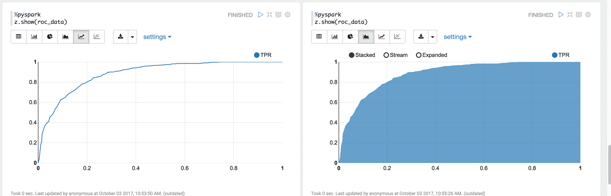
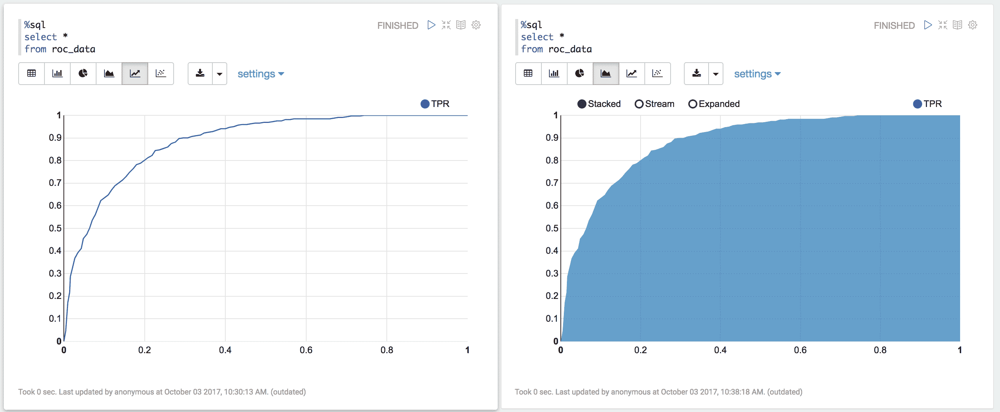

# 10\. Classification

Chinese proverb

**Birds of a feather folock together.** – old Chinese proverb

## 10.1\. Binomial logistic regression

### 10.1.1\. Introduction

### 10.1.2\. Demo

*   The Jupyter notebook can be download from [Logistic Regression](_static/logisticRegression.ipynb).
*   For more details, please visit [Logistic Regression API](http://takwatanabe.me/pyspark/generated/generated/ml.classification.BinaryLogisticRegressionSummary.html) .

Note

In this demo, I introduced a new function `get_dummy` to deal with the categorical data. I highly recommend you to use my `get_dummy` function in the other cases. This function will save a lot of time for you.

1.  Set up spark context and SparkSession

```
from pyspark.sql import SparkSession

        spark = SparkSession \
            .builder \
            .appName("Python Spark Logistic Regression example") \
            .config("spark.some.config.option", "some-value") \
            .getOrCreate()

```

1.  Load dataset

```
df = spark.read.format('com.databricks.spark.csv') \
            .options(header='true', inferschema='true') \
            .load("./data/bank.csv",header=True);
df.drop('day','month','poutcome').show(5)

```

```
+---+------------+-------+---------+-------+-------+-------+----+-------+--------+--------+-----+--------+---+
|age|         job|marital|education|default|balance|housing|loan|contact|duration|campaign|pdays|previous|  y|
+---+------------+-------+---------+-------+-------+-------+----+-------+--------+--------+-----+--------+---+
| 58|  management|married| tertiary|     no|   2143|    yes|  no|unknown|     261|       1|   -1|       0| no|
| 44|  technician| single|secondary|     no|     29|    yes|  no|unknown|     151|       1|   -1|       0| no|
| 33|entrepreneur|married|secondary|     no|      2|    yes| yes|unknown|      76|       1|   -1|       0| no|
| 47| blue-collar|married|  unknown|     no|   1506|    yes|  no|unknown|      92|       1|   -1|       0| no|
| 33|     unknown| single|  unknown|     no|      1|     no|  no|unknown|     198|       1|   -1|       0| no|
+---+------------+-------+---------+-------+-------+-------+----+-------+--------+--------+-----+--------+---+
only showing top 5 rows

```

```
df.printSchema()

```

```
root
 |-- age: integer (nullable = true)
 |-- job: string (nullable = true)
 |-- marital: string (nullable = true)
 |-- education: string (nullable = true)
 |-- default: string (nullable = true)
 |-- balance: integer (nullable = true)
 |-- housing: string (nullable = true)
 |-- loan: string (nullable = true)
 |-- contact: string (nullable = true)
 |-- day: integer (nullable = true)
 |-- month: string (nullable = true)
 |-- duration: integer (nullable = true)
 |-- campaign: integer (nullable = true)
 |-- pdays: integer (nullable = true)
 |-- previous: integer (nullable = true)
 |-- poutcome: string (nullable = true)
 |-- y: string (nullable = true)

```

Note

You are strongly encouraged to try my `get_dummy` function for dealing with the categorical data in complex dataset.

Supervised learning version:

> ```
> def get_dummy(df,indexCol,categoricalCols,continuousCols,labelCol):
> 
>     from pyspark.ml import Pipeline
>     from pyspark.ml.feature import StringIndexer, OneHotEncoder, VectorAssembler
>     from pyspark.sql.functions import col
> 
>     indexers = [ StringIndexer(inputCol=c, outputCol="{0}_indexed".format(c))
>                  for c in categoricalCols ]
> 
>     # default setting: dropLast=True
>     encoders = [ OneHotEncoder(inputCol=indexer.getOutputCol(),
>                  outputCol="{0}_encoded".format(indexer.getOutputCol()))
>                  for indexer in indexers ]
> 
>     assembler = VectorAssembler(inputCols=[encoder.getOutputCol() for encoder in encoders]
>                                 + continuousCols, outputCol="features")
> 
>     pipeline = Pipeline(stages=indexers + encoders + [assembler])
> 
>     model=pipeline.fit(df)
>     data = model.transform(df)
> 
>     data = data.withColumn('label',col(labelCol))
> 
>     return data.select(indexCol,'features','label')
> 
> ```

Unsupervised learning version:

> ```
> def get_dummy(df,indexCol,categoricalCols,continuousCols):
>     '''
>     Get dummy variables and concat with continuous variables for unsupervised learning.
>     :param df: the dataframe
>     :param categoricalCols: the name list of the categorical data
>     :param continuousCols:  the name list of the numerical data
>     :return k: feature matrix
> 
>     :author: Wenqiang Feng
>     :email:  von198@gmail.com
>     '''
> 
>     indexers = [ StringIndexer(inputCol=c, outputCol="{0}_indexed".format(c))
>                  for c in categoricalCols ]
> 
>     # default setting: dropLast=True
>     encoders = [ OneHotEncoder(inputCol=indexer.getOutputCol(),
>                  outputCol="{0}_encoded".format(indexer.getOutputCol()))
>                  for indexer in indexers ]
> 
>     assembler = VectorAssembler(inputCols=[encoder.getOutputCol() for encoder in encoders]
>                                 + continuousCols, outputCol="features")
> 
>     pipeline = Pipeline(stages=indexers + encoders + [assembler])
> 
>     model=pipeline.fit(df)
>     data = model.transform(df)
> 
>     return data.select(indexCol,'features')
> 
> ```

```
def get_dummy(df,categoricalCols,continuousCols,labelCol):

    from pyspark.ml import Pipeline
    from pyspark.ml.feature import StringIndexer, OneHotEncoder, VectorAssembler
    from pyspark.sql.functions import col

    indexers = [ StringIndexer(inputCol=c, outputCol="{0}_indexed".format(c))
                 for c in categoricalCols ]

    # default setting: dropLast=True
    encoders = [ OneHotEncoder(inputCol=indexer.getOutputCol(),
                 outputCol="{0}_encoded".format(indexer.getOutputCol()))
                 for indexer in indexers ]

    assembler = VectorAssembler(inputCols=[encoder.getOutputCol() for encoder in encoders]
                                + continuousCols, outputCol="features")

    pipeline = Pipeline(stages=indexers + encoders + [assembler])

    model=pipeline.fit(df)
    data = model.transform(df)

    data = data.withColumn('label',col(labelCol))

    return data.select('features','label')

```

1.  Deal with categorical data and Convert the data to dense vector

```
catcols = ['job','marital','education','default',
           'housing','loan','contact','poutcome']

num_cols = ['balance', 'duration','campaign','pdays','previous',]
labelCol = 'y'

data = get_dummy(df,catcols,num_cols,labelCol)
data.show(5)

```

```
+--------------------+-----+
|            features|label|
+--------------------+-----+
|(29,[1,11,14,16,1...|   no|
|(29,[2,12,13,16,1...|   no|
|(29,[7,11,13,16,1...|   no|
|(29,[0,11,16,17,1...|   no|
|(29,[12,16,18,20,...|   no|
+--------------------+-----+
only showing top 5 rows

```

1.  Deal with Categorical Label and Variables

```
from pyspark.ml.feature import StringIndexer
# Index labels, adding metadata to the label column
labelIndexer = StringIndexer(inputCol='label',
                             outputCol='indexedLabel').fit(data)
labelIndexer.transform(data).show(5, True)

```

```
+--------------------+-----+------------+
|            features|label|indexedLabel|
+--------------------+-----+------------+
|(29,[1,11,14,16,1...|   no|         0.0|
|(29,[2,12,13,16,1...|   no|         0.0|
|(29,[7,11,13,16,1...|   no|         0.0|
|(29,[0,11,16,17,1...|   no|         0.0|
|(29,[12,16,18,20,...|   no|         0.0|
+--------------------+-----+------------+
only showing top 5 rows

```

```
from pyspark.ml.feature import VectorIndexer
# Automatically identify categorical features, and index them.
# Set maxCategories so features with > 4 distinct values are treated as continuous.
featureIndexer =VectorIndexer(inputCol="features", \
                                  outputCol="indexedFeatures", \
                                  maxCategories=4).fit(data)
featureIndexer.transform(data).show(5, True)

```

```
+--------------------+-----+--------------------+
|            features|label|     indexedFeatures|
+--------------------+-----+--------------------+
|(29,[1,11,14,16,1...|   no|(29,[1,11,14,16,1...|
|(29,[2,12,13,16,1...|   no|(29,[2,12,13,16,1...|
|(29,[7,11,13,16,1...|   no|(29,[7,11,13,16,1...|
|(29,[0,11,16,17,1...|   no|(29,[0,11,16,17,1...|
|(29,[12,16,18,20,...|   no|(29,[12,16,18,20,...|
+--------------------+-----+--------------------+
only showing top 5 rows

```

1.  Split the data to training and test data sets

```
# Split the data into training and test sets (40% held out for testing)
(trainingData, testData) = data.randomSplit([0.6, 0.4])

trainingData.show(5,False)
testData.show(5,False)

```

```
+-------------------------------------------------------------------------------------------------+-----+
|features                                                                                         |label|
+-------------------------------------------------------------------------------------------------+-----+
|(29,[0,11,13,16,17,18,19,21,24,25,26,27],[1.0,1.0,1.0,1.0,1.0,1.0,1.0,1.0,-731.0,401.0,4.0,-1.0])|no   |
|(29,[0,11,13,16,17,18,19,21,24,25,26,27],[1.0,1.0,1.0,1.0,1.0,1.0,1.0,1.0,-723.0,112.0,2.0,-1.0])|no   |
|(29,[0,11,13,16,17,18,19,21,24,25,26,27],[1.0,1.0,1.0,1.0,1.0,1.0,1.0,1.0,-626.0,205.0,1.0,-1.0])|no   |
|(29,[0,11,13,16,17,18,19,21,24,25,26,27],[1.0,1.0,1.0,1.0,1.0,1.0,1.0,1.0,-498.0,357.0,1.0,-1.0])|no   |
|(29,[0,11,13,16,17,18,19,21,24,25,26,27],[1.0,1.0,1.0,1.0,1.0,1.0,1.0,1.0,-477.0,473.0,2.0,-1.0])|no   |
+-------------------------------------------------------------------------------------------------+-----+
only showing top 5 rows

+-------------------------------------------------------------------------------------------------+-----+
|features                                                                                         |label|
+-------------------------------------------------------------------------------------------------+-----+
|(29,[0,11,13,16,17,18,19,21,24,25,26,27],[1.0,1.0,1.0,1.0,1.0,1.0,1.0,1.0,-648.0,280.0,2.0,-1.0])|no   |
|(29,[0,11,13,16,17,18,19,21,24,25,26,27],[1.0,1.0,1.0,1.0,1.0,1.0,1.0,1.0,-596.0,147.0,1.0,-1.0])|no   |
|(29,[0,11,13,16,17,18,19,21,24,25,26,27],[1.0,1.0,1.0,1.0,1.0,1.0,1.0,1.0,-529.0,416.0,4.0,-1.0])|no   |
|(29,[0,11,13,16,17,18,19,21,24,25,26,27],[1.0,1.0,1.0,1.0,1.0,1.0,1.0,1.0,-518.0,46.0,5.0,-1.0]) |no   |
|(29,[0,11,13,16,17,18,19,21,24,25,26,27],[1.0,1.0,1.0,1.0,1.0,1.0,1.0,1.0,-470.0,275.0,2.0,-1.0])|no   |
+-------------------------------------------------------------------------------------------------+-----+
only showing top 5 rows

```

1.  Fit Logistic Regression Model

```
from pyspark.ml.classification import LogisticRegression
logr = LogisticRegression(featuresCol='indexedFeatures', labelCol='indexedLabel')

```

1.  Pipeline Architecture

```
# Convert indexed labels back to original labels.
labelConverter = IndexToString(inputCol="prediction", outputCol="predictedLabel",
                               labels=labelIndexer.labels)

```

```
# Chain indexers and tree in a Pipeline
pipeline = Pipeline(stages=[labelIndexer, featureIndexer, logr,labelConverter])

```

```
# Train model.  This also runs the indexers.
model = pipeline.fit(trainingData)

```

1.  Make predictions

```
# Make predictions.
predictions = model.transform(testData)
# Select example rows to display.
predictions.select("features","label","predictedLabel").show(5)

```

```
+--------------------+-----+--------------+
|            features|label|predictedLabel|
+--------------------+-----+--------------+
|(29,[0,11,13,16,1...|   no|            no|
|(29,[0,11,13,16,1...|   no|            no|
|(29,[0,11,13,16,1...|   no|            no|
|(29,[0,11,13,16,1...|   no|            no|
|(29,[0,11,13,16,1...|   no|            no|
+--------------------+-----+--------------+
only showing top 5 rows

```

1.  Evaluation

```
from pyspark.ml.evaluation import MulticlassClassificationEvaluator

# Select (prediction, true label) and compute test error
evaluator = MulticlassClassificationEvaluator(
    labelCol="indexedLabel", predictionCol="prediction", metricName="accuracy")
accuracy = evaluator.evaluate(predictions)
print("Test Error = %g" % (1.0 - accuracy))

```

```
Test Error = 0.0987688

```

```
lrModel = model.stages[2]
trainingSummary = lrModel.summary

# Obtain the objective per iteration
# objectiveHistory = trainingSummary.objectiveHistory
# print("objectiveHistory:")
# for objective in objectiveHistory:
#     print(objective)

# Obtain the receiver-operating characteristic as a dataframe and areaUnderROC.
trainingSummary.roc.show(5)
print("areaUnderROC: " + str(trainingSummary.areaUnderROC))

# Set the model threshold to maximize F-Measure
fMeasure = trainingSummary.fMeasureByThreshold
maxFMeasure = fMeasure.groupBy().max('F-Measure').select('max(F-Measure)').head(5)
# bestThreshold = fMeasure.where(fMeasure['F-Measure'] == maxFMeasure['max(F-Measure)']) \
#     .select('threshold').head()['threshold']
# lr.setThreshold(bestThreshold)

```

You can use `z.show()` to get the data and plot the ROC curves:



You can also register a TempTable `data.registerTempTable('roc_data')` and then use `sql` to plot the ROC curve:



1.  visualization

```
import matplotlib.pyplot as plt
import numpy as np
import itertools

def plot_confusion_matrix(cm, classes,
                          normalize=False,
                          title='Confusion matrix',
                          cmap=plt.cm.Blues):
    """
    This function prints and plots the confusion matrix.
    Normalization can be applied by setting `normalize=True`.
    """
    if normalize:
        cm = cm.astype('float') / cm.sum(axis=1)[:, np.newaxis]
        print("Normalized confusion matrix")
    else:
        print('Confusion matrix, without normalization')

    print(cm)

    plt.imshow(cm, interpolation='nearest', cmap=cmap)
    plt.title(title)
    plt.colorbar()
    tick_marks = np.arange(len(classes))
    plt.xticks(tick_marks, classes, rotation=45)
    plt.yticks(tick_marks, classes)

    fmt = '.2f' if normalize else 'd'
    thresh = cm.max() / 2.
    for i, j in itertools.product(range(cm.shape[0]), range(cm.shape[1])):
        plt.text(j, i, format(cm[i, j], fmt),
                 horizontalalignment="center",
                 color="white" if cm[i, j] > thresh else "black")

    plt.tight_layout()
    plt.ylabel('True label')
    plt.xlabel('Predicted label')

```

```
class_temp = predictions.select("label").groupBy("label")\
                        .count().sort('count', ascending=False).toPandas()
class_temp = class_temp["label"].values.tolist()
class_names = map(str, class_temp)
# # # print(class_name)
class_names

```

```
['no', 'yes']

```

```
from sklearn.metrics import confusion_matrix
y_true = predictions.select("label")
y_true = y_true.toPandas()

y_pred = predictions.select("predictedLabel")
y_pred = y_pred.toPandas()

cnf_matrix = confusion_matrix(y_true, y_pred,labels=class_names)
cnf_matrix

```

```
array([[15657,   379],
       [ 1410,   667]])

```

```
# Plot non-normalized confusion matrix
plt.figure()
plot_confusion_matrix(cnf_matrix, classes=class_names,
                      title='Confusion matrix, without normalization')
plt.show()

```

```
Confusion matrix, without normalization
[[15657   379]
 [ 1410   667]]

```


```
# Plot normalized confusion matrix
plt.figure()
plot_confusion_matrix(cnf_matrix, classes=class_names, normalize=True,
                      title='Normalized confusion matrix')

plt.show()

```

```
Normalized confusion matrix
[[ 0.97636568  0.02363432]
 [ 0.67886375  0.32113625]]

```


## 10.2\. Multinomial logistic regression

### 10.2.1\. Introduction

### 10.2.2\. Demo

*   The Jupyter notebook can be download from [Logistic Regression](_static/logisticRegression.ipynb).
*   For more details, please visit [Logistic Regression API](http://takwatanabe.me/pyspark/generated/generated/ml.classification.BinaryLogisticRegressionSummary.html) .

Note

In this demo, I introduced a new function `get_dummy` to deal with the categorical data. I highly recommend you to use my `get_dummy` function in the other cases. This function will save a lot of time for you.

1.  Set up spark context and SparkSession

```
from pyspark.sql import SparkSession

spark = SparkSession \
    .builder \
    .appName("Python Spark MultinomialLogisticRegression classification") \
    .config("spark.some.config.option", "some-value") \
    .getOrCreate()

```

1.  Load dataset

```
df = spark.read.format('com.databricks.spark.csv') \
            .options(header='true', inferschema='true') \
            .load("./data/WineData2.csv",header=True);
df.show(5)

```

```
+-----+--------+------+-----+---------+----+-----+-------+----+---------+-------+-------+
|fixed|volatile|citric|sugar|chlorides|free|total|density|  pH|sulphates|alcohol|quality|
+-----+--------+------+-----+---------+----+-----+-------+----+---------+-------+-------+
|  7.4|     0.7|   0.0|  1.9|    0.076|11.0| 34.0| 0.9978|3.51|     0.56|    9.4|      5|
|  7.8|    0.88|   0.0|  2.6|    0.098|25.0| 67.0| 0.9968| 3.2|     0.68|    9.8|      5|
|  7.8|    0.76|  0.04|  2.3|    0.092|15.0| 54.0|  0.997|3.26|     0.65|    9.8|      5|
| 11.2|    0.28|  0.56|  1.9|    0.075|17.0| 60.0|  0.998|3.16|     0.58|    9.8|      6|
|  7.4|     0.7|   0.0|  1.9|    0.076|11.0| 34.0| 0.9978|3.51|     0.56|    9.4|      5|
+-----+--------+------+-----+---------+----+-----+-------+----+---------+-------+-------+
only showing top 5 rows

```

```
df.printSchema()

```

```
root
 |-- fixed: double (nullable = true)
 |-- volatile: double (nullable = true)
 |-- citric: double (nullable = true)
 |-- sugar: double (nullable = true)
 |-- chlorides: double (nullable = true)
 |-- free: double (nullable = true)
 |-- total: double (nullable = true)
 |-- density: double (nullable = true)
 |-- pH: double (nullable = true)
 |-- sulphates: double (nullable = true)
 |-- alcohol: double (nullable = true)
 |-- quality: string (nullable = true)

```

```
# Convert to float format
def string_to_float(x):
    return float(x)

#
def condition(r):
    if (0<= r <= 4):
        label = "low"
    elif(4< r <= 6):
        label = "medium"
    else:
        label = "high"
    return label

from pyspark.sql.functions import udf
from pyspark.sql.types import StringType, DoubleType
string_to_float_udf = udf(string_to_float, DoubleType())
quality_udf = udf(lambda x: condition(x), StringType())

df = df.withColumn("quality", quality_udf("quality"))

df.show(5,True)

```

```
+-----+--------+------+-----+---------+----+-----+-------+----+---------+-------+-------+
|fixed|volatile|citric|sugar|chlorides|free|total|density|  pH|sulphates|alcohol|quality|
+-----+--------+------+-----+---------+----+-----+-------+----+---------+-------+-------+
|  7.4|     0.7|   0.0|  1.9|    0.076|11.0| 34.0| 0.9978|3.51|     0.56|    9.4| medium|
|  7.8|    0.88|   0.0|  2.6|    0.098|25.0| 67.0| 0.9968| 3.2|     0.68|    9.8| medium|
|  7.8|    0.76|  0.04|  2.3|    0.092|15.0| 54.0|  0.997|3.26|     0.65|    9.8| medium|
| 11.2|    0.28|  0.56|  1.9|    0.075|17.0| 60.0|  0.998|3.16|     0.58|    9.8| medium|
|  7.4|     0.7|   0.0|  1.9|    0.076|11.0| 34.0| 0.9978|3.51|     0.56|    9.4| medium|
+-----+--------+------+-----+---------+----+-----+-------+----+---------+-------+-------+
only showing top 5 rows

```

```
df.printSchema()

```

```
root
 |-- fixed: double (nullable = true)
 |-- volatile: double (nullable = true)
 |-- citric: double (nullable = true)
 |-- sugar: double (nullable = true)
 |-- chlorides: double (nullable = true)
 |-- free: double (nullable = true)
 |-- total: double (nullable = true)
 |-- density: double (nullable = true)
 |-- pH: double (nullable = true)
 |-- sulphates: double (nullable = true)
 |-- alcohol: double (nullable = true)
 |-- quality: string (nullable = true)

```

1.  Deal with categorical data and Convert the data to dense vector

Note

You are strongly encouraged to try my `get_dummy` function for dealing with the categorical data in complex dataset.

Supervised learning version:

> ```
> def get_dummy(df,indexCol,categoricalCols,continuousCols,labelCol):
> 
>     from pyspark.ml import Pipeline
>     from pyspark.ml.feature import StringIndexer, OneHotEncoder, VectorAssembler
>     from pyspark.sql.functions import col
> 
>     indexers = [ StringIndexer(inputCol=c, outputCol="{0}_indexed".format(c))
>                  for c in categoricalCols ]
> 
>     # default setting: dropLast=True
>     encoders = [ OneHotEncoder(inputCol=indexer.getOutputCol(),
>                  outputCol="{0}_encoded".format(indexer.getOutputCol()))
>                  for indexer in indexers ]
> 
>     assembler = VectorAssembler(inputCols=[encoder.getOutputCol() for encoder in encoders]
>                                 + continuousCols, outputCol="features")
> 
>     pipeline = Pipeline(stages=indexers + encoders + [assembler])
> 
>     model=pipeline.fit(df)
>     data = model.transform(df)
> 
>     data = data.withColumn('label',col(labelCol))
> 
>     return data.select(indexCol,'features','label')
> 
> ```

Unsupervised learning version:

> ```
> def get_dummy(df,indexCol,categoricalCols,continuousCols):
>     '''
>     Get dummy variables and concat with continuous variables for unsupervised learning.
>     :param df: the dataframe
>     :param categoricalCols: the name list of the categorical data
>     :param continuousCols:  the name list of the numerical data
>     :return k: feature matrix
> 
>     :author: Wenqiang Feng
>     :email:  von198@gmail.com
>     '''
> 
>     indexers = [ StringIndexer(inputCol=c, outputCol="{0}_indexed".format(c))
>                  for c in categoricalCols ]
> 
>     # default setting: dropLast=True
>     encoders = [ OneHotEncoder(inputCol=indexer.getOutputCol(),
>                  outputCol="{0}_encoded".format(indexer.getOutputCol()))
>                  for indexer in indexers ]
> 
>     assembler = VectorAssembler(inputCols=[encoder.getOutputCol() for encoder in encoders]
>                                 + continuousCols, outputCol="features")
> 
>     pipeline = Pipeline(stages=indexers + encoders + [assembler])
> 
>     model=pipeline.fit(df)
>     data = model.transform(df)
> 
>     return data.select(indexCol,'features')
> 
> ```

```
def get_dummy(df,categoricalCols,continuousCols,labelCol):

    from pyspark.ml import Pipeline
    from pyspark.ml.feature import StringIndexer, OneHotEncoder, VectorAssembler
    from pyspark.sql.functions import col

    indexers = [ StringIndexer(inputCol=c, outputCol="{0}_indexed".format(c))
                 for c in categoricalCols ]

    # default setting: dropLast=True
    encoders = [ OneHotEncoder(inputCol=indexer.getOutputCol(),
                 outputCol="{0}_encoded".format(indexer.getOutputCol()))
                 for indexer in indexers ]

    assembler = VectorAssembler(inputCols=[encoder.getOutputCol() for encoder in encoders]
                                + continuousCols, outputCol="features")

    pipeline = Pipeline(stages=indexers + encoders + [assembler])

    model=pipeline.fit(df)
    data = model.transform(df)

    data = data.withColumn('label',col(labelCol))

    return data.select('features','label')

```

1.  Transform the dataset to DataFrame

```
from pyspark.ml.linalg import Vectors # !!!!caution: not from pyspark.mllib.linalg import Vectors
from pyspark.ml import Pipeline
from pyspark.ml.feature import IndexToString,StringIndexer, VectorIndexer
from pyspark.ml.tuning import CrossValidator, ParamGridBuilder
from pyspark.ml.evaluation import MulticlassClassificationEvaluator

def transData(data):
return data.rdd.map(lambda r: [Vectors.dense(r[:-1]),r[-1]]).toDF(['features','label'])

```

```
transformed = transData(df)
transformed.show(5)

```

```
+--------------------+------+
|            features| label|
+--------------------+------+
|[7.4,0.7,0.0,1.9,...|medium|
|[7.8,0.88,0.0,2.6...|medium|
|[7.8,0.76,0.04,2....|medium|
|[11.2,0.28,0.56,1...|medium|
|[7.4,0.7,0.0,1.9,...|medium|
+--------------------+------+
only showing top 5 rows

```

1.  Deal with Categorical Label and Variables

```
# Index labels, adding metadata to the label column
labelIndexer = StringIndexer(inputCol='label',
                             outputCol='indexedLabel').fit(transformed)
labelIndexer.transform(transformed).show(5, True)

```

```
+--------------------+------+------------+
|            features| label|indexedLabel|
+--------------------+------+------------+
|[7.4,0.7,0.0,1.9,...|medium|         0.0|
|[7.8,0.88,0.0,2.6...|medium|         0.0|
|[7.8,0.76,0.04,2....|medium|         0.0|
|[11.2,0.28,0.56,1...|medium|         0.0|
|[7.4,0.7,0.0,1.9,...|medium|         0.0|
+--------------------+------+------------+
only showing top 5 rows

```

```
# Automatically identify categorical features, and index them.
# Set maxCategories so features with > 4 distinct values are treated as continuous.
featureIndexer =VectorIndexer(inputCol="features", \
                              outputCol="indexedFeatures", \
                              maxCategories=4).fit(transformed)
featureIndexer.transform(transformed).show(5, True)

```

```
+--------------------+------+--------------------+
|            features| label|     indexedFeatures|
+--------------------+------+--------------------+
|[7.4,0.7,0.0,1.9,...|medium|[7.4,0.7,0.0,1.9,...|
|[7.8,0.88,0.0,2.6...|medium|[7.8,0.88,0.0,2.6...|
|[7.8,0.76,0.04,2....|medium|[7.8,0.76,0.04,2....|
|[11.2,0.28,0.56,1...|medium|[11.2,0.28,0.56,1...|
|[7.4,0.7,0.0,1.9,...|medium|[7.4,0.7,0.0,1.9,...|
+--------------------+------+--------------------+
only showing top 5 rows

```

1.  Split the data to training and test data sets

```
# Split the data into training and test sets (40% held out for testing)
(trainingData, testData) = data.randomSplit([0.6, 0.4])

trainingData.show(5,False)
testData.show(5,False)

```

```
+---------------------------------------------------------+------+
|features                                                 |label |
+---------------------------------------------------------+------+
|[4.7,0.6,0.17,2.3,0.058,17.0,106.0,0.9932,3.85,0.6,12.9] |medium|
|[5.0,0.38,0.01,1.6,0.048,26.0,60.0,0.99084,3.7,0.75,14.0]|medium|
|[5.0,0.4,0.5,4.3,0.046,29.0,80.0,0.9902,3.49,0.66,13.6]  |medium|
|[5.0,0.74,0.0,1.2,0.041,16.0,46.0,0.99258,4.01,0.59,12.5]|medium|
|[5.1,0.42,0.0,1.8,0.044,18.0,88.0,0.99157,3.68,0.73,13.6]|high  |
+---------------------------------------------------------+------+
only showing top 5 rows

+---------------------------------------------------------+------+
|features                                                 |label |
+---------------------------------------------------------+------+
|[4.6,0.52,0.15,2.1,0.054,8.0,65.0,0.9934,3.9,0.56,13.1]  |low   |
|[4.9,0.42,0.0,2.1,0.048,16.0,42.0,0.99154,3.71,0.74,14.0]|high  |
|[5.0,0.42,0.24,2.0,0.06,19.0,50.0,0.9917,3.72,0.74,14.0] |high  |
|[5.0,1.02,0.04,1.4,0.045,41.0,85.0,0.9938,3.75,0.48,10.5]|low   |
|[5.0,1.04,0.24,1.6,0.05,32.0,96.0,0.9934,3.74,0.62,11.5] |medium|
+---------------------------------------------------------+------+
only showing top 5 rows

```

1.  Fit Multinomial logisticRegression Classification Model

```
from pyspark.ml.classification import LogisticRegression
logr = LogisticRegression(featuresCol='indexedFeatures', labelCol='indexedLabel')

```

1.  Pipeline Architecture

```
# Convert indexed labels back to original labels.
labelConverter = IndexToString(inputCol="prediction", outputCol="predictedLabel",
                               labels=labelIndexer.labels)

```

```
# Chain indexers and tree in a Pipeline
pipeline = Pipeline(stages=[labelIndexer, featureIndexer, logr,labelConverter])

```

```
# Train model.  This also runs the indexers.
model = pipeline.fit(trainingData)

```

1.  Make predictions

```
# Make predictions.
predictions = model.transform(testData)
# Select example rows to display.
predictions.select("features","label","predictedLabel").show(5)

```

```
+--------------------+------+--------------+
|            features| label|predictedLabel|
+--------------------+------+--------------+
|[4.6,0.52,0.15,2....|   low|        medium|
|[4.9,0.42,0.0,2.1...|  high|          high|
|[5.0,0.42,0.24,2....|  high|          high|
|[5.0,1.02,0.04,1....|   low|        medium|
|[5.0,1.04,0.24,1....|medium|        medium|
+--------------------+------+--------------+
only showing top 5 rows

```

1.  Evaluation

```
from pyspark.ml.evaluation import MulticlassClassificationEvaluator

# Select (prediction, true label) and compute test error
evaluator = MulticlassClassificationEvaluator(
    labelCol="indexedLabel", predictionCol="prediction", metricName="accuracy")
accuracy = evaluator.evaluate(predictions)
print("Test Error = %g" % (1.0 - accuracy))

```

```
Test Error = 0.181287

```

```
lrModel = model.stages[2]
trainingSummary = lrModel.summary

# Obtain the objective per iteration
# objectiveHistory = trainingSummary.objectiveHistory
# print("objectiveHistory:")
# for objective in objectiveHistory:
#     print(objective)

# Obtain the receiver-operating characteristic as a dataframe and areaUnderROC.
trainingSummary.roc.show(5)
print("areaUnderROC: " + str(trainingSummary.areaUnderROC))

# Set the model threshold to maximize F-Measure
fMeasure = trainingSummary.fMeasureByThreshold
maxFMeasure = fMeasure.groupBy().max('F-Measure').select('max(F-Measure)').head(5)
# bestThreshold = fMeasure.where(fMeasure['F-Measure'] == maxFMeasure['max(F-Measure)']) \
#     .select('threshold').head()['threshold']
# lr.setThreshold(bestThreshold)

```

You can use `z.show()` to get the data and plot the ROC curves:


You can also register a TempTable `data.registerTempTable('roc_data')` and then use `sql` to plot the ROC curve:


1.  visualization

```
import matplotlib.pyplot as plt
import numpy as np
import itertools

def plot_confusion_matrix(cm, classes,
                          normalize=False,
                          title='Confusion matrix',
                          cmap=plt.cm.Blues):
    """
    This function prints and plots the confusion matrix.
    Normalization can be applied by setting `normalize=True`.
    """
    if normalize:
        cm = cm.astype('float') / cm.sum(axis=1)[:, np.newaxis]
        print("Normalized confusion matrix")
    else:
        print('Confusion matrix, without normalization')

    print(cm)

    plt.imshow(cm, interpolation='nearest', cmap=cmap)
    plt.title(title)
    plt.colorbar()
    tick_marks = np.arange(len(classes))
    plt.xticks(tick_marks, classes, rotation=45)
    plt.yticks(tick_marks, classes)

    fmt = '.2f' if normalize else 'd'
    thresh = cm.max() / 2.
    for i, j in itertools.product(range(cm.shape[0]), range(cm.shape[1])):
        plt.text(j, i, format(cm[i, j], fmt),
                 horizontalalignment="center",
                 color="white" if cm[i, j] > thresh else "black")

    plt.tight_layout()
    plt.ylabel('True label')
    plt.xlabel('Predicted label')

```

```
class_temp = predictions.select("label").groupBy("label")\
                        .count().sort('count', ascending=False).toPandas()
class_temp = class_temp["label"].values.tolist()
class_names = map(str, class_temp)
# # # print(class_name)
class_names

```

```
['medium', 'high', 'low']

```

```
from sklearn.metrics import confusion_matrix
y_true = predictions.select("label")
y_true = y_true.toPandas()

y_pred = predictions.select("predictedLabel")
y_pred = y_pred.toPandas()

cnf_matrix = confusion_matrix(y_true, y_pred,labels=class_names)
cnf_matrix

```

```
array([[526,  11,   2],
       [ 73,  33,   0],
       [ 38,   0,   1]])

```

```
# Plot non-normalized confusion matrix
plt.figure()
plot_confusion_matrix(cnf_matrix, classes=class_names,
                      title='Confusion matrix, without normalization')
plt.show()

```

```
Confusion matrix, without normalization
[[526  11   2]
 [ 73  33   0]
 [ 38   0   1]]

```


```
# Plot normalized confusion matrix
plt.figure()
plot_confusion_matrix(cnf_matrix, classes=class_names, normalize=True,
                      title='Normalized confusion matrix')

plt.show()

```

```
Normalized confusion matrix
[[0.97588126 0.02040816 0.00371058]
 [0.68867925 0.31132075 0\.        ]
 [0.97435897 0\.         0.02564103]]

```


## 10.3\. Decision tree Classification

### 10.3.1\. Introduction

### 10.3.2\. Demo

*   The Jupyter notebook can be download from [Decision Tree Classification](_static/DecisionTreeC.ipynb).
*   For more details, please visit [DecisionTreeClassifier API](http://takwatanabe.me/pyspark/generated/generated/ml.classification.DecisionTreeClassifier.html) .

1.  Set up spark context and SparkSession

```
from pyspark.sql import SparkSession

        spark = SparkSession \
            .builder \
            .appName("Python Spark Decision Tree classification") \
            .config("spark.some.config.option", "some-value") \
            .getOrCreate()

```

1.  Load dataset

```
df = spark.read.format('com.databricks.spark.csv').\
                               options(header='true', \
                               inferschema='true') \
                .load("../data/WineData2.csv",header=True);
df.show(5,True)

```

```
+-----+--------+------+-----+---------+----+-----+-------+----+---------+-------+-------+
|fixed|volatile|citric|sugar|chlorides|free|total|density|  pH|sulphates|alcohol|quality|
+-----+--------+------+-----+---------+----+-----+-------+----+---------+-------+-------+
|  7.4|     0.7|   0.0|  1.9|    0.076|11.0| 34.0| 0.9978|3.51|     0.56|    9.4|      5|
|  7.8|    0.88|   0.0|  2.6|    0.098|25.0| 67.0| 0.9968| 3.2|     0.68|    9.8|      5|
|  7.8|    0.76|  0.04|  2.3|    0.092|15.0| 54.0|  0.997|3.26|     0.65|    9.8|      5|
| 11.2|    0.28|  0.56|  1.9|    0.075|17.0| 60.0|  0.998|3.16|     0.58|    9.8|      6|
|  7.4|     0.7|   0.0|  1.9|    0.076|11.0| 34.0| 0.9978|3.51|     0.56|    9.4|      5|
+-----+--------+------+-----+---------+----+-----+-------+----+---------+-------+-------+
only showing top 5 rows

```

```
# Convert to float format
def string_to_float(x):
    return float(x)

#
def condition(r):
    if (0<= r <= 4):
        label = "low"
    elif(4< r <= 6):
        label = "medium"
    else:
        label = "high"
    return label

```

```
from pyspark.sql.functions import udf
from pyspark.sql.types import StringType, DoubleType
string_to_float_udf = udf(string_to_float, DoubleType())
quality_udf = udf(lambda x: condition(x), StringType())

```

```
df = df.withColumn("quality", quality_udf("quality"))
df.show(5,True)
df.printSchema()

```

```
+-----+--------+------+-----+---------+----+-----+-------+----+---------+-------+-------+
|fixed|volatile|citric|sugar|chlorides|free|total|density|  pH|sulphates|alcohol|quality|
+-----+--------+------+-----+---------+----+-----+-------+----+---------+-------+-------+
|  7.4|     0.7|   0.0|  1.9|    0.076|11.0| 34.0| 0.9978|3.51|     0.56|    9.4| medium|
|  7.8|    0.88|   0.0|  2.6|    0.098|25.0| 67.0| 0.9968| 3.2|     0.68|    9.8| medium|
|  7.8|    0.76|  0.04|  2.3|    0.092|15.0| 54.0|  0.997|3.26|     0.65|    9.8| medium|
| 11.2|    0.28|  0.56|  1.9|    0.075|17.0| 60.0|  0.998|3.16|     0.58|    9.8| medium|
|  7.4|     0.7|   0.0|  1.9|    0.076|11.0| 34.0| 0.9978|3.51|     0.56|    9.4| medium|
+-----+--------+------+-----+---------+----+-----+-------+----+---------+-------+-------+
only showing top 5 rows

```

```
root
 |-- fixed: double (nullable = true)
 |-- volatile: double (nullable = true)
 |-- citric: double (nullable = true)
 |-- sugar: double (nullable = true)
 |-- chlorides: double (nullable = true)
 |-- free: double (nullable = true)
 |-- total: double (nullable = true)
 |-- density: double (nullable = true)
 |-- pH: double (nullable = true)
 |-- sulphates: double (nullable = true)
 |-- alcohol: double (nullable = true)
 |-- quality: string (nullable = true)

```

1.  Convert the data to dense vector

Note

You are strongly encouraged to try my `get_dummy` function for dealing with the categorical data in complex dataset.

Supervised learning version:

> ```
> def get_dummy(df,indexCol,categoricalCols,continuousCols,labelCol):
> 
>     from pyspark.ml import Pipeline
>     from pyspark.ml.feature import StringIndexer, OneHotEncoder, VectorAssembler
>     from pyspark.sql.functions import col
> 
>     indexers = [ StringIndexer(inputCol=c, outputCol="{0}_indexed".format(c))
>                  for c in categoricalCols ]
> 
>     # default setting: dropLast=True
>     encoders = [ OneHotEncoder(inputCol=indexer.getOutputCol(),
>                  outputCol="{0}_encoded".format(indexer.getOutputCol()))
>                  for indexer in indexers ]
> 
>     assembler = VectorAssembler(inputCols=[encoder.getOutputCol() for encoder in encoders]
>                                 + continuousCols, outputCol="features")
> 
>     pipeline = Pipeline(stages=indexers + encoders + [assembler])
> 
>     model=pipeline.fit(df)
>     data = model.transform(df)
> 
>     data = data.withColumn('label',col(labelCol))
> 
>     return data.select(indexCol,'features','label')
> 
> ```

Unsupervised learning version:

> ```
> def get_dummy(df,indexCol,categoricalCols,continuousCols):
>     '''
>     Get dummy variables and concat with continuous variables for unsupervised learning.
>     :param df: the dataframe
>     :param categoricalCols: the name list of the categorical data
>     :param continuousCols:  the name list of the numerical data
>     :return k: feature matrix
> 
>     :author: Wenqiang Feng
>     :email:  von198@gmail.com
>     '''
> 
>     indexers = [ StringIndexer(inputCol=c, outputCol="{0}_indexed".format(c))
>                  for c in categoricalCols ]
> 
>     # default setting: dropLast=True
>     encoders = [ OneHotEncoder(inputCol=indexer.getOutputCol(),
>                  outputCol="{0}_encoded".format(indexer.getOutputCol()))
>                  for indexer in indexers ]
> 
>     assembler = VectorAssembler(inputCols=[encoder.getOutputCol() for encoder in encoders]
>                                 + continuousCols, outputCol="features")
> 
>     pipeline = Pipeline(stages=indexers + encoders + [assembler])
> 
>     model=pipeline.fit(df)
>     data = model.transform(df)
> 
>     return data.select(indexCol,'features')
> 
> ```

```
# !!!!caution: not from pyspark.mllib.linalg import Vectors
from pyspark.ml.linalg import Vectors
from pyspark.ml import Pipeline
from pyspark.ml.feature import IndexToString,StringIndexer, VectorIndexer
from pyspark.ml.tuning import CrossValidator, ParamGridBuilder
from pyspark.ml.evaluation import MulticlassClassificationEvaluator

```

```
def transData(data):
    return data.rdd.map(lambda r: [Vectors.dense(r[:-1]),r[-1]]).toDF(['features','label'])

```

1.  Transform the dataset to DataFrame

```
transformed = transData(df)
transformed.show(5)

```

```
+--------------------+------+
|            features| label|
+--------------------+------+
|[7.4,0.7,0.0,1.9,...|medium|
|[7.8,0.88,0.0,2.6...|medium|
|[7.8,0.76,0.04,2....|medium|
|[11.2,0.28,0.56,1...|medium|
|[7.4,0.7,0.0,1.9,...|medium|
+--------------------+------+
only showing top 5 rows

```

1.  Deal with Categorical Label and Variables

```
# Index labels, adding metadata to the label column
labelIndexer = StringIndexer(inputCol='label',
                             outputCol='indexedLabel').fit(transformed)
labelIndexer.transform(transformed).show(5, True)

```

```
+--------------------+------+------------+
|            features| label|indexedLabel|
+--------------------+------+------------+
|[7.4,0.7,0.0,1.9,...|medium|         0.0|
|[7.8,0.88,0.0,2.6...|medium|         0.0|
|[7.8,0.76,0.04,2....|medium|         0.0|
|[11.2,0.28,0.56,1...|medium|         0.0|
|[7.4,0.7,0.0,1.9,...|medium|         0.0|
+--------------------+------+------------+
only showing top 5 rows

```

```
    # Automatically identify categorical features, and index them.
    # Set maxCategories so features with > 4 distinct values are treated as continuous.
    featureIndexer =VectorIndexer(inputCol="features", \
                                  outputCol="indexedFeatures", \
                                  maxCategories=4).fit(transformed)
featureIndexer.transform(transformed).show(5, True)

```

```
+--------------------+------+--------------------+
|            features| label|     indexedFeatures|
+--------------------+------+--------------------+
|[7.4,0.7,0.0,1.9,...|medium|[7.4,0.7,0.0,1.9,...|
|[7.8,0.88,0.0,2.6...|medium|[7.8,0.88,0.0,2.6...|
|[7.8,0.76,0.04,2....|medium|[7.8,0.76,0.04,2....|
|[11.2,0.28,0.56,1...|medium|[11.2,0.28,0.56,1...|
|[7.4,0.7,0.0,1.9,...|medium|[7.4,0.7,0.0,1.9,...|
+--------------------+------+--------------------+
only showing top 5 rows

```

1.  Split the data to training and test data sets

```
# Split the data into training and test sets (40% held out for testing)
(trainingData, testData) = transformed.randomSplit([0.6, 0.4])

trainingData.show(5)
testData.show(5)

```

```
+--------------------+------+
|            features| label|
+--------------------+------+
|[4.6,0.52,0.15,2....|   low|
|[4.7,0.6,0.17,2.3...|medium|
|[5.0,1.02,0.04,1....|   low|
|[5.0,1.04,0.24,1....|medium|
|[5.1,0.585,0.0,1....|  high|
+--------------------+------+
only showing top 5 rows

+--------------------+------+
|            features| label|
+--------------------+------+
|[4.9,0.42,0.0,2.1...|  high|
|[5.0,0.38,0.01,1....|medium|
|[5.0,0.4,0.5,4.3,...|medium|
|[5.0,0.42,0.24,2....|  high|
|[5.0,0.74,0.0,1.2...|medium|
+--------------------+------+
only showing top 5 rows

```

1.  Fit Decision Tree Classification Model

```
from pyspark.ml.classification import DecisionTreeClassifier

# Train a DecisionTree model
dTree = DecisionTreeClassifier(labelCol='indexedLabel', featuresCol='indexedFeatures')

```

1.  Pipeline Architecture

```
# Convert indexed labels back to original labels.
labelConverter = IndexToString(inputCol="prediction", outputCol="predictedLabel",
                               labels=labelIndexer.labels)

```

```
# Chain indexers and tree in a Pipeline
pipeline = Pipeline(stages=[labelIndexer, featureIndexer, dTree,labelConverter])

```

```
# Train model.  This also runs the indexers.
model = pipeline.fit(trainingData)

```

1.  Make predictions

```
# Make predictions.
predictions = model.transform(testData)
# Select example rows to display.
predictions.select("features","label","predictedLabel").show(5)

```

```
+--------------------+------+--------------+
|            features| label|predictedLabel|
+--------------------+------+--------------+
|[4.9,0.42,0.0,2.1...|  high|          high|
|[5.0,0.38,0.01,1....|medium|        medium|
|[5.0,0.4,0.5,4.3,...|medium|        medium|
|[5.0,0.42,0.24,2....|  high|        medium|
|[5.0,0.74,0.0,1.2...|medium|        medium|
+--------------------+------+--------------+
only showing top 5 rows

```

1.  Evaluation

```
from pyspark.ml.evaluation import MulticlassClassificationEvaluator

# Select (prediction, true label) and compute test error
evaluator = MulticlassClassificationEvaluator(
    labelCol="indexedLabel", predictionCol="prediction", metricName="accuracy")
accuracy = evaluator.evaluate(predictions)
print("Test Error = %g" % (1.0 - accuracy))

rfModel = model.stages[-2]
print(rfModel)  # summary only

```

```
Test Error = 0.45509
DecisionTreeClassificationModel (uid=DecisionTreeClassifier_4545ac8dca9c8438ef2a)
of depth 5 with 59 nodes

```

1.  visualization

```
import matplotlib.pyplot as plt
import numpy as np
import itertools

def plot_confusion_matrix(cm, classes,
                          normalize=False,
                          title='Confusion matrix',
                          cmap=plt.cm.Blues):
    """
    This function prints and plots the confusion matrix.
    Normalization can be applied by setting `normalize=True`.
    """
    if normalize:
        cm = cm.astype('float') / cm.sum(axis=1)[:, np.newaxis]
        print("Normalized confusion matrix")
    else:
        print('Confusion matrix, without normalization')

    print(cm)

    plt.imshow(cm, interpolation='nearest', cmap=cmap)
    plt.title(title)
    plt.colorbar()
    tick_marks = np.arange(len(classes))
    plt.xticks(tick_marks, classes, rotation=45)
    plt.yticks(tick_marks, classes)

    fmt = '.2f' if normalize else 'd'
    thresh = cm.max() / 2.
    for i, j in itertools.product(range(cm.shape[0]), range(cm.shape[1])):
        plt.text(j, i, format(cm[i, j], fmt),
                 horizontalalignment="center",
                 color="white" if cm[i, j] > thresh else "black")

    plt.tight_layout()
    plt.ylabel('True label')
    plt.xlabel('Predicted label')

```

```
class_temp = predictions.select("label").groupBy("label")\
                        .count().sort('count', ascending=False).toPandas()
class_temp = class_temp["label"].values.tolist()
class_names = map(str, class_temp)
# # # print(class_name)
class_names

```

```
['medium', 'high', 'low']

```

```
from sklearn.metrics import confusion_matrix
y_true = predictions.select("label")
y_true = y_true.toPandas()

y_pred = predictions.select("predictedLabel")
y_pred = y_pred.toPandas()

cnf_matrix = confusion_matrix(y_true, y_pred,labels=class_names)
cnf_matrix

```

```
array([[497,  29,   7],
       [ 40,  42,   0],
       [ 22,   0,   2]])

```

```
# Plot non-normalized confusion matrix
plt.figure()
plot_confusion_matrix(cnf_matrix, classes=class_names,
                      title='Confusion matrix, without normalization')
plt.show()

```

```
Confusion matrix, without normalization
[[497  29   7]
 [ 40  42   0]
 [ 22   0   2]]

```


```
# Plot normalized confusion matrix
plt.figure()
plot_confusion_matrix(cnf_matrix, classes=class_names, normalize=True,
                      title='Normalized confusion matrix')

plt.show()

```

```
Normalized confusion matrix
[[ 0.93245779  0.05440901  0.01313321]
 [ 0.48780488  0.51219512  0\.        ]
 [ 0.91666667  0\.          0.08333333]]

```


## 10.4\. Random forest Classification

### 10.4.1\. Introduction

<iframe width="560" height="315" src="https://www.youtube.com/embed/2Mg8QD0F1dQ" frameborder="0" allowfullscreen=""></iframe>

### 10.4.2\. Demo

*   The Jupyter notebook can be download from [Random forest Classification](_static/RandomForestC3.ipynb).
*   For more details, please visit [RandomForestClassifier API](http://takwatanabe.me/pyspark/generated/generated/ml.classification.RandomForestClassifier.html) .

1.  Set up spark context and SparkSession

```
from pyspark.sql import SparkSession

        spark = SparkSession \
            .builder \
            .appName("Python Spark Decision Tree classification") \
            .config("spark.some.config.option", "some-value") \
            .getOrCreate()

```

1.  Load dataset

```
df = spark.read.format('com.databricks.spark.csv').\
                               options(header='true', \
                               inferschema='true') \
                .load("../data/WineData2.csv",header=True);
df.show(5,True)

```

```
+-----+--------+------+-----+---------+----+-----+-------+----+---------+-------+-------+
|fixed|volatile|citric|sugar|chlorides|free|total|density|  pH|sulphates|alcohol|quality|
+-----+--------+------+-----+---------+----+-----+-------+----+---------+-------+-------+
|  7.4|     0.7|   0.0|  1.9|    0.076|11.0| 34.0| 0.9978|3.51|     0.56|    9.4|      5|
|  7.8|    0.88|   0.0|  2.6|    0.098|25.0| 67.0| 0.9968| 3.2|     0.68|    9.8|      5|
|  7.8|    0.76|  0.04|  2.3|    0.092|15.0| 54.0|  0.997|3.26|     0.65|    9.8|      5|
| 11.2|    0.28|  0.56|  1.9|    0.075|17.0| 60.0|  0.998|3.16|     0.58|    9.8|      6|
|  7.4|     0.7|   0.0|  1.9|    0.076|11.0| 34.0| 0.9978|3.51|     0.56|    9.4|      5|
+-----+--------+------+-----+---------+----+-----+-------+----+---------+-------+-------+
only showing top 5 rows

```

```
# Convert to float format
def string_to_float(x):
    return float(x)

#
def condition(r):
    if (0<= r <= 4):
        label = "low"
    elif(4< r <= 6):
        label = "medium"
    else:
        label = "high"
    return label

```

```
from pyspark.sql.functions import udf
from pyspark.sql.types import StringType, DoubleType
string_to_float_udf = udf(string_to_float, DoubleType())
quality_udf = udf(lambda x: condition(x), StringType())

```

```
df = df.withColumn("quality", quality_udf("quality"))
df.show(5,True)
df.printSchema()

```

```
+-----+--------+------+-----+---------+----+-----+-------+----+---------+-------+-------+
|fixed|volatile|citric|sugar|chlorides|free|total|density|  pH|sulphates|alcohol|quality|
+-----+--------+------+-----+---------+----+-----+-------+----+---------+-------+-------+
|  7.4|     0.7|   0.0|  1.9|    0.076|11.0| 34.0| 0.9978|3.51|     0.56|    9.4| medium|
|  7.8|    0.88|   0.0|  2.6|    0.098|25.0| 67.0| 0.9968| 3.2|     0.68|    9.8| medium|
|  7.8|    0.76|  0.04|  2.3|    0.092|15.0| 54.0|  0.997|3.26|     0.65|    9.8| medium|
| 11.2|    0.28|  0.56|  1.9|    0.075|17.0| 60.0|  0.998|3.16|     0.58|    9.8| medium|
|  7.4|     0.7|   0.0|  1.9|    0.076|11.0| 34.0| 0.9978|3.51|     0.56|    9.4| medium|
+-----+--------+------+-----+---------+----+-----+-------+----+---------+-------+-------+
only showing top 5 rows

```

```
root
 |-- fixed: double (nullable = true)
 |-- volatile: double (nullable = true)
 |-- citric: double (nullable = true)
 |-- sugar: double (nullable = true)
 |-- chlorides: double (nullable = true)
 |-- free: double (nullable = true)
 |-- total: double (nullable = true)
 |-- density: double (nullable = true)
 |-- pH: double (nullable = true)
 |-- sulphates: double (nullable = true)
 |-- alcohol: double (nullable = true)
 |-- quality: string (nullable = true)

```

1.  Convert the data to dense vector

Note

You are strongly encouraged to try my `get_dummy` function for dealing with the categorical data in complex dataset.

Supervised learning version:

> ```
> def get_dummy(df,indexCol,categoricalCols,continuousCols,labelCol):
> 
>     from pyspark.ml import Pipeline
>     from pyspark.ml.feature import StringIndexer, OneHotEncoder, VectorAssembler
>     from pyspark.sql.functions import col
> 
>     indexers = [ StringIndexer(inputCol=c, outputCol="{0}_indexed".format(c))
>                  for c in categoricalCols ]
> 
>     # default setting: dropLast=True
>     encoders = [ OneHotEncoder(inputCol=indexer.getOutputCol(),
>                  outputCol="{0}_encoded".format(indexer.getOutputCol()))
>                  for indexer in indexers ]
> 
>     assembler = VectorAssembler(inputCols=[encoder.getOutputCol() for encoder in encoders]
>                                 + continuousCols, outputCol="features")
> 
>     pipeline = Pipeline(stages=indexers + encoders + [assembler])
> 
>     model=pipeline.fit(df)
>     data = model.transform(df)
> 
>     data = data.withColumn('label',col(labelCol))
> 
>     return data.select(indexCol,'features','label')
> 
> ```

Unsupervised learning version:

> ```
> def get_dummy(df,indexCol,categoricalCols,continuousCols):
>     '''
>     Get dummy variables and concat with continuous variables for unsupervised learning.
>     :param df: the dataframe
>     :param categoricalCols: the name list of the categorical data
>     :param continuousCols:  the name list of the numerical data
>     :return k: feature matrix
> 
>     :author: Wenqiang Feng
>     :email:  von198@gmail.com
>     '''
> 
>     indexers = [ StringIndexer(inputCol=c, outputCol="{0}_indexed".format(c))
>                  for c in categoricalCols ]
> 
>     # default setting: dropLast=True
>     encoders = [ OneHotEncoder(inputCol=indexer.getOutputCol(),
>                  outputCol="{0}_encoded".format(indexer.getOutputCol()))
>                  for indexer in indexers ]
> 
>     assembler = VectorAssembler(inputCols=[encoder.getOutputCol() for encoder in encoders]
>                                 + continuousCols, outputCol="features")
> 
>     pipeline = Pipeline(stages=indexers + encoders + [assembler])
> 
>     model=pipeline.fit(df)
>     data = model.transform(df)
> 
>     return data.select(indexCol,'features')
> 
> ```

```
# !!!!caution: not from pyspark.mllib.linalg import Vectors
from pyspark.ml.linalg import Vectors
from pyspark.ml import Pipeline
from pyspark.ml.feature import IndexToString,StringIndexer, VectorIndexer
from pyspark.ml.tuning import CrossValidator, ParamGridBuilder
from pyspark.ml.evaluation import MulticlassClassificationEvaluator

```

```
def transData(data):
    return data.rdd.map(lambda r: [Vectors.dense(r[:-1]),r[-1]]).toDF(['features','label'])

```

1.  Transform the dataset to DataFrame

```
transformed = transData(df)
transformed.show(5)

```

```
+--------------------+------+
|            features| label|
+--------------------+------+
|[7.4,0.7,0.0,1.9,...|medium|
|[7.8,0.88,0.0,2.6...|medium|
|[7.8,0.76,0.04,2....|medium|
|[11.2,0.28,0.56,1...|medium|
|[7.4,0.7,0.0,1.9,...|medium|
+--------------------+------+
only showing top 5 rows

```

1.  Deal with Categorical Label and Variables

```
# Index labels, adding metadata to the label column
labelIndexer = StringIndexer(inputCol='label',
                             outputCol='indexedLabel').fit(transformed)
labelIndexer.transform(transformed).show(5, True)

```

```
+--------------------+------+------------+
|            features| label|indexedLabel|
+--------------------+------+------------+
|[7.4,0.7,0.0,1.9,...|medium|         0.0|
|[7.8,0.88,0.0,2.6...|medium|         0.0|
|[7.8,0.76,0.04,2....|medium|         0.0|
|[11.2,0.28,0.56,1...|medium|         0.0|
|[7.4,0.7,0.0,1.9,...|medium|         0.0|
+--------------------+------+------------+
only showing top 5 rows

```

```
    # Automatically identify categorical features, and index them.
    # Set maxCategories so features with > 4 distinct values are treated as continuous.
    featureIndexer =VectorIndexer(inputCol="features", \
                                  outputCol="indexedFeatures", \
                                  maxCategories=4).fit(transformed)
featureIndexer.transform(transformed).show(5, True)

```

```
+--------------------+------+--------------------+
|            features| label|     indexedFeatures|
+--------------------+------+--------------------+
|[7.4,0.7,0.0,1.9,...|medium|[7.4,0.7,0.0,1.9,...|
|[7.8,0.88,0.0,2.6...|medium|[7.8,0.88,0.0,2.6...|
|[7.8,0.76,0.04,2....|medium|[7.8,0.76,0.04,2....|
|[11.2,0.28,0.56,1...|medium|[11.2,0.28,0.56,1...|
|[7.4,0.7,0.0,1.9,...|medium|[7.4,0.7,0.0,1.9,...|
+--------------------+------+--------------------+
only showing top 5 rows

```

1.  Split the data to training and test data sets

```
# Split the data into training and test sets (40% held out for testing)
(trainingData, testData) = transformed.randomSplit([0.6, 0.4])

trainingData.show(5)
testData.show(5)

```

```
+--------------------+------+
|            features| label|
+--------------------+------+
|[4.6,0.52,0.15,2....|   low|
|[4.7,0.6,0.17,2.3...|medium|
|[5.0,1.02,0.04,1....|   low|
|[5.0,1.04,0.24,1....|medium|
|[5.1,0.585,0.0,1....|  high|
+--------------------+------+
only showing top 5 rows

+--------------------+------+
|            features| label|
+--------------------+------+
|[4.9,0.42,0.0,2.1...|  high|
|[5.0,0.38,0.01,1....|medium|
|[5.0,0.4,0.5,4.3,...|medium|
|[5.0,0.42,0.24,2....|  high|
|[5.0,0.74,0.0,1.2...|medium|
+--------------------+------+
only showing top 5 rows

```

1.  Fit Random Forest Classification Model

```
from pyspark.ml.classification import RandomForestClassifier

# Train a RandomForest model.
rf = RandomForestClassifier(labelCol="indexedLabel", featuresCol="indexedFeatures", numTrees=10)

```

1.  Pipeline Architecture

```
# Convert indexed labels back to original labels.
labelConverter = IndexToString(inputCol="prediction", outputCol="predictedLabel",
                               labels=labelIndexer.labels)

```

```
# Chain indexers and tree in a Pipeline
pipeline = Pipeline(stages=[labelIndexer, featureIndexer, rf,labelConverter])

```

```
# Train model.  This also runs the indexers.
model = pipeline.fit(trainingData)

```

1.  Make predictions

```
# Make predictions.
predictions = model.transform(testData)
# Select example rows to display.
predictions.select("features","label","predictedLabel").show(5)

```

```
+--------------------+------+--------------+
|            features| label|predictedLabel|
+--------------------+------+--------------+
|[4.9,0.42,0.0,2.1...|  high|          high|
|[5.0,0.38,0.01,1....|medium|        medium|
|[5.0,0.4,0.5,4.3,...|medium|        medium|
|[5.0,0.42,0.24,2....|  high|        medium|
|[5.0,0.74,0.0,1.2...|medium|        medium|
+--------------------+------+--------------+
only showing top 5 rows

```

1.  Evaluation

```
from pyspark.ml.evaluation import MulticlassClassificationEvaluator

# Select (prediction, true label) and compute test error
evaluator = MulticlassClassificationEvaluator(
    labelCol="indexedLabel", predictionCol="prediction", metricName="accuracy")
accuracy = evaluator.evaluate(predictions)
print("Test Error = %g" % (1.0 - accuracy))

rfModel = model.stages[-2]
print(rfModel)  # summary only

```

```
Test Error = 0.173502
RandomForestClassificationModel (uid=rfc_a3395531f1d2) with 10 trees

```

1.  visualization

```
import matplotlib.pyplot as plt
import numpy as np
import itertools

def plot_confusion_matrix(cm, classes,
                          normalize=False,
                          title='Confusion matrix',
                          cmap=plt.cm.Blues):
    """
    This function prints and plots the confusion matrix.
    Normalization can be applied by setting `normalize=True`.
    """
    if normalize:
        cm = cm.astype('float') / cm.sum(axis=1)[:, np.newaxis]
        print("Normalized confusion matrix")
    else:
        print('Confusion matrix, without normalization')

    print(cm)

    plt.imshow(cm, interpolation='nearest', cmap=cmap)
    plt.title(title)
    plt.colorbar()
    tick_marks = np.arange(len(classes))
    plt.xticks(tick_marks, classes, rotation=45)
    plt.yticks(tick_marks, classes)

    fmt = '.2f' if normalize else 'd'
    thresh = cm.max() / 2.
    for i, j in itertools.product(range(cm.shape[0]), range(cm.shape[1])):
        plt.text(j, i, format(cm[i, j], fmt),
                 horizontalalignment="center",
                 color="white" if cm[i, j] > thresh else "black")

    plt.tight_layout()
    plt.ylabel('True label')
    plt.xlabel('Predicted label')

```

```
class_temp = predictions.select("label").groupBy("label")\
                        .count().sort('count', ascending=False).toPandas()
class_temp = class_temp["label"].values.tolist()
class_names = map(str, class_temp)
# # # print(class_name)
class_names

```

```
['medium', 'high', 'low']

```

```
from sklearn.metrics import confusion_matrix
y_true = predictions.select("label")
y_true = y_true.toPandas()

y_pred = predictions.select("predictedLabel")
y_pred = y_pred.toPandas()

cnf_matrix = confusion_matrix(y_true, y_pred,labels=class_names)
cnf_matrix

```

```
array([[502,   9,   0],
       [ 73,  22,   0],
       [ 28,   0,   0]])

```

```
# Plot non-normalized confusion matrix
plt.figure()
plot_confusion_matrix(cnf_matrix, classes=class_names,
                      title='Confusion matrix, without normalization')
plt.show()

```

```
Confusion matrix, without normalization
[[502   9   0]
 [ 73  22   0]
 [ 28   0   0]]

```


```
# Plot normalized confusion matrix
plt.figure()
plot_confusion_matrix(cnf_matrix, classes=class_names, normalize=True,
                      title='Normalized confusion matrix')

plt.show()

```

```
Normalized confusion matrix
[[ 0.98238748  0.01761252  0\.        ]
 [ 0.76842105  0.23157895  0\.        ]
 [ 1\.          0\.          0\.        ]]

```


## 10.5\. Gradient-boosted tree Classification

### 10.5.1\. Introduction

<iframe width="560" height="315" src="https://www.youtube.com/embed/GM3CDQfQ4sw" frameborder="0" allowfullscreen=""></iframe>

### 10.5.2\. Demo

*   The Jupyter notebook can be download from [Gradient boosted tree Classification](_static/gbtC3.ipynb).
*   For more details, please visit [GBTClassifier API](http://takwatanabe.me/pyspark/generated/generated/ml.classification.GBTClassifier.html) .

Warning

Unfortunately, the GBTClassifier currently only supports binary labels.

## 10.6\. XGBoost: Gradient-boosted tree Classification

### 10.6.1\. Introduction

### 10.6.2\. Demo

*   The Jupyter notebook can be download from [Gradient boosted tree Classification](_static/gbtC3.ipynb).
*   For more details, please visit [GBTClassifier API](http://takwatanabe.me/pyspark/generated/generated/ml.classification.GBTClassifier.html) .

Warning

Unfortunately, I didn’t find a good way to setup the XGBoost directly in Spark. But I do get the XGBoost work with `pysparkling` on my machine.

1.  Start H2O cluster inside the Spark environment

```
from pysparkling import *
hc = H2OContext.getOrCreate(spark)

```

```
Connecting to H2O server at http://192.168.0.102:54323... successful.
H2O cluster uptime:     07 secs
H2O cluster timezone:   America/Chicago
H2O data parsing timezone:      UTC
H2O cluster version:    3.22.1.3
H2O cluster version age:        20 days
H2O cluster name:       sparkling-water-dt216661_local-1550259209801
H2O cluster total nodes:        1
H2O cluster free memory:        848 Mb
H2O cluster total cores:        8
H2O cluster allowed cores:      8
H2O cluster status:     accepting new members, healthy
H2O connection url:     http://192.168.0.102:54323
H2O connection proxy:   None
H2O internal security:  False
H2O API Extensions:     XGBoost, Algos, AutoML, Core V3, Core V4
Python version: 3.7.1 final

Sparkling Water Context:
 * H2O name: sparkling-water-dt216661_local-1550259209801
 * cluster size: 1
 * list of used nodes:
  (executorId, host, port)
  ------------------------
  (driver,192.168.0.102,54323)
  ------------------------

  Open H2O Flow in browser: http://192.168.0.102:54323 (CMD + click in Mac OSX)

```

1.  Parse the data using H2O and convert them to Spark Frame

```
import h2o
frame = h2o.import_file("https://raw.githubusercontent.com/h2oai/sparkling-water/master/examples/smalldata/prostate/prostate.csv")
spark_frame = hc.as_spark_frame(frame)

```


```
spark_frame.show(4)

```

```
+---+-------+---+----+-----+-----+----+----+-------+
| ID|CAPSULE|AGE|RACE|DPROS|DCAPS| PSA| VOL|GLEASON|
+---+-------+---+----+-----+-----+----+----+-------+
|  1|      0| 65|   1|    2|    1| 1.4| 0.0|      6|
|  2|      0| 72|   1|    3|    2| 6.7| 0.0|      7|
|  3|      0| 70|   1|    1|    2| 4.9| 0.0|      6|
|  4|      0| 76|   2|    2|    1|51.2|20.0|      7|
+---+-------+---+----+-----+-----+----+----+-------+
only showing top 4 rows

```

1.  Train the model

```
from pysparkling.ml import H2OXGBoost
estimator = H2OXGBoost(predictionCol="AGE")
model = estimator.fit(spark_frame)

```

1.  Run Predictions

```
predictions = model.transform(spark_frame)
predictions.show(4)

```

```
+---+-------+---+----+-----+-----+----+----+-------+-------------------+
| ID|CAPSULE|AGE|RACE|DPROS|DCAPS| PSA| VOL|GLEASON|  prediction_output|
+---+-------+---+----+-----+-----+----+----+-------+-------------------+
|  1|      0| 65|   1|    2|    1| 1.4| 0.0|      6|[64.85852813720703]|
|  2|      0| 72|   1|    3|    2| 6.7| 0.0|      7| [72.0611801147461]|
|  3|      0| 70|   1|    1|    2| 4.9| 0.0|      6|[70.26496887207031]|
|  4|      0| 76|   2|    2|    1|51.2|20.0|      7|[75.26521301269531]|
+---+-------+---+----+-----+-----+----+----+-------+-------------------+
only showing top 4 rows

```

## 10.7\. Naive Bayes Classification

### 10.7.1\. Introduction

### 10.7.2\. Demo

*   The Jupyter notebook can be download from [Naive Bayes Classification](_static/NaiveBayes.ipynb).
*   For more details, please visit [NaiveBayes API](http://takwatanabe.me/pyspark/generated/generated/ml.classification.NaiveBayes.html) .

1.  Set up spark context and SparkSession

```
from pyspark.sql import SparkSession

spark = SparkSession \
    .builder \
    .appName("Python Spark  Naive Bayes classification") \
    .config("spark.some.config.option", "some-value") \
    .getOrCreate()

```

1.  Load dataset

```
df = spark.read.format('com.databricks.spark.csv') \
            .options(header='true', inferschema='true') \
            .load("./data/WineData2.csv",header=True);
df.show(5)

```

```
+-----+--------+------+-----+---------+----+-----+-------+----+---------+-------+-------+
|fixed|volatile|citric|sugar|chlorides|free|total|density|  pH|sulphates|alcohol|quality|
+-----+--------+------+-----+---------+----+-----+-------+----+---------+-------+-------+
|  7.4|     0.7|   0.0|  1.9|    0.076|11.0| 34.0| 0.9978|3.51|     0.56|    9.4|      5|
|  7.8|    0.88|   0.0|  2.6|    0.098|25.0| 67.0| 0.9968| 3.2|     0.68|    9.8|      5|
|  7.8|    0.76|  0.04|  2.3|    0.092|15.0| 54.0|  0.997|3.26|     0.65|    9.8|      5|
| 11.2|    0.28|  0.56|  1.9|    0.075|17.0| 60.0|  0.998|3.16|     0.58|    9.8|      6|
|  7.4|     0.7|   0.0|  1.9|    0.076|11.0| 34.0| 0.9978|3.51|     0.56|    9.4|      5|
+-----+--------+------+-----+---------+----+-----+-------+----+---------+-------+-------+
only showing top 5 rows

```

```
df.printSchema()

```

```
root
 |-- fixed: double (nullable = true)
 |-- volatile: double (nullable = true)
 |-- citric: double (nullable = true)
 |-- sugar: double (nullable = true)
 |-- chlorides: double (nullable = true)
 |-- free: double (nullable = true)
 |-- total: double (nullable = true)
 |-- density: double (nullable = true)
 |-- pH: double (nullable = true)
 |-- sulphates: double (nullable = true)
 |-- alcohol: double (nullable = true)
 |-- quality: string (nullable = true)

```

```
# Convert to float format
def string_to_float(x):
    return float(x)

#
def condition(r):
    if (0<= r <= 6):
        label = "low"
    else:
        label = "high"
    return label

from pyspark.sql.functions import udf
from pyspark.sql.types import StringType, DoubleType
string_to_float_udf = udf(string_to_float, DoubleType())
quality_udf = udf(lambda x: condition(x), StringType())

df = df.withColumn("quality", quality_udf("quality"))

df.show(5,True)

```

```
+-----+--------+------+-----+---------+----+-----+-------+----+---------+-------+-------+
|fixed|volatile|citric|sugar|chlorides|free|total|density|  pH|sulphates|alcohol|quality|
+-----+--------+------+-----+---------+----+-----+-------+----+---------+-------+-------+
|  7.4|     0.7|   0.0|  1.9|    0.076|11.0| 34.0| 0.9978|3.51|     0.56|    9.4| medium|
|  7.8|    0.88|   0.0|  2.6|    0.098|25.0| 67.0| 0.9968| 3.2|     0.68|    9.8| medium|
|  7.8|    0.76|  0.04|  2.3|    0.092|15.0| 54.0|  0.997|3.26|     0.65|    9.8| medium|
| 11.2|    0.28|  0.56|  1.9|    0.075|17.0| 60.0|  0.998|3.16|     0.58|    9.8| medium|
|  7.4|     0.7|   0.0|  1.9|    0.076|11.0| 34.0| 0.9978|3.51|     0.56|    9.4| medium|
+-----+--------+------+-----+---------+----+-----+-------+----+---------+-------+-------+
only showing top 5 rows

```

```
df.printSchema()

```

```
root
 |-- fixed: double (nullable = true)
 |-- volatile: double (nullable = true)
 |-- citric: double (nullable = true)
 |-- sugar: double (nullable = true)
 |-- chlorides: double (nullable = true)
 |-- free: double (nullable = true)
 |-- total: double (nullable = true)
 |-- density: double (nullable = true)
 |-- pH: double (nullable = true)
 |-- sulphates: double (nullable = true)
 |-- alcohol: double (nullable = true)
 |-- quality: string (nullable = true)

```

1.  Deal with categorical data and Convert the data to dense vector

Note

You are strongly encouraged to try my `get_dummy` function for dealing with the categorical data in complex dataset.

Supervised learning version:

> ```
> def get_dummy(df,indexCol,categoricalCols,continuousCols,labelCol):
> 
>     from pyspark.ml import Pipeline
>     from pyspark.ml.feature import StringIndexer, OneHotEncoder, VectorAssembler
>     from pyspark.sql.functions import col
> 
>     indexers = [ StringIndexer(inputCol=c, outputCol="{0}_indexed".format(c))
>                  for c in categoricalCols ]
> 
>     # default setting: dropLast=True
>     encoders = [ OneHotEncoder(inputCol=indexer.getOutputCol(),
>                  outputCol="{0}_encoded".format(indexer.getOutputCol()))
>                  for indexer in indexers ]
> 
>     assembler = VectorAssembler(inputCols=[encoder.getOutputCol() for encoder in encoders]
>                                 + continuousCols, outputCol="features")
> 
>     pipeline = Pipeline(stages=indexers + encoders + [assembler])
> 
>     model=pipeline.fit(df)
>     data = model.transform(df)
> 
>     data = data.withColumn('label',col(labelCol))
> 
>     return data.select(indexCol,'features','label')
> 
> ```

Unsupervised learning version:

> ```
> def get_dummy(df,indexCol,categoricalCols,continuousCols):
>     '''
>     Get dummy variables and concat with continuous variables for unsupervised learning.
>     :param df: the dataframe
>     :param categoricalCols: the name list of the categorical data
>     :param continuousCols:  the name list of the numerical data
>     :return k: feature matrix
> 
>     :author: Wenqiang Feng
>     :email:  von198@gmail.com
>     '''
> 
>     indexers = [ StringIndexer(inputCol=c, outputCol="{0}_indexed".format(c))
>                  for c in categoricalCols ]
> 
>     # default setting: dropLast=True
>     encoders = [ OneHotEncoder(inputCol=indexer.getOutputCol(),
>                  outputCol="{0}_encoded".format(indexer.getOutputCol()))
>                  for indexer in indexers ]
> 
>     assembler = VectorAssembler(inputCols=[encoder.getOutputCol() for encoder in encoders]
>                                 + continuousCols, outputCol="features")
> 
>     pipeline = Pipeline(stages=indexers + encoders + [assembler])
> 
>     model=pipeline.fit(df)
>     data = model.transform(df)
> 
>     return data.select(indexCol,'features')
> 
> ```

```
def get_dummy(df,categoricalCols,continuousCols,labelCol):

    from pyspark.ml import Pipeline
    from pyspark.ml.feature import StringIndexer, OneHotEncoder, VectorAssembler
    from pyspark.sql.functions import col

    indexers = [ StringIndexer(inputCol=c, outputCol="{0}_indexed".format(c))
                 for c in categoricalCols ]

    # default setting: dropLast=True
    encoders = [ OneHotEncoder(inputCol=indexer.getOutputCol(),
                 outputCol="{0}_encoded".format(indexer.getOutputCol()))
                 for indexer in indexers ]

    assembler = VectorAssembler(inputCols=[encoder.getOutputCol() for encoder in encoders]
                                + continuousCols, outputCol="features")

    pipeline = Pipeline(stages=indexers + encoders + [assembler])

    model=pipeline.fit(df)
    data = model.transform(df)

    data = data.withColumn('label',col(labelCol))

    return data.select('features','label')

```

1.  Transform the dataset to DataFrame

```
from pyspark.ml.linalg import Vectors # !!!!caution: not from pyspark.mllib.linalg import Vectors
from pyspark.ml import Pipeline
from pyspark.ml.feature import IndexToString,StringIndexer, VectorIndexer
from pyspark.ml.tuning import CrossValidator, ParamGridBuilder
from pyspark.ml.evaluation import MulticlassClassificationEvaluator

def transData(data):
return data.rdd.map(lambda r: [Vectors.dense(r[:-1]),r[-1]]).toDF(['features','label'])

```

```
transformed = transData(df)
transformed.show(5)

```

```
+--------------------+-----+
|            features|label|
+--------------------+-----+
|[7.4,0.7,0.0,1.9,...|  low|
|[7.8,0.88,0.0,2.6...|  low|
|[7.8,0.76,0.04,2....|  low|
|[11.2,0.28,0.56,1...|  low|
|[7.4,0.7,0.0,1.9,...|  low|
+--------------------+-----+
only showing top 5 rows

```

1.  Deal with Categorical Label and Variables

```
# Index labels, adding metadata to the label column
labelIndexer = StringIndexer(inputCol='label',
                             outputCol='indexedLabel').fit(transformed)
labelIndexer.transform(transformed).show(5, True)

```

```
+--------------------+-----+------------+
|            features|label|indexedLabel|
+--------------------+-----+------------+
|[7.4,0.7,0.0,1.9,...|  low|         0.0|
|[7.8,0.88,0.0,2.6...|  low|         0.0|
|[7.8,0.76,0.04,2....|  low|         0.0|
|[11.2,0.28,0.56,1...|  low|         0.0|
|[7.4,0.7,0.0,1.9,...|  low|         0.0|
+--------------------+-----+------------+
only showing top 5 rows

```

```
# Automatically identify categorical features, and index them.
# Set maxCategories so features with > 4 distinct values are treated as continuous.
featureIndexer =VectorIndexer(inputCol="features", \
                              outputCol="indexedFeatures", \
                              maxCategories=4).fit(transformed)
featureIndexer.transform(transformed).show(5, True)

```

```
+--------------------+-----+--------------------+
|            features|label|     indexedFeatures|
+--------------------+-----+--------------------+
|[7.4,0.7,0.0,1.9,...|  low|[7.4,0.7,0.0,1.9,...|
|[7.8,0.88,0.0,2.6...|  low|[7.8,0.88,0.0,2.6...|
|[7.8,0.76,0.04,2....|  low|[7.8,0.76,0.04,2....|
|[11.2,0.28,0.56,1...|  low|[11.2,0.28,0.56,1...|
|[7.4,0.7,0.0,1.9,...|  low|[7.4,0.7,0.0,1.9,...|
+--------------------+-----+--------------------+
only showing top 5 rows

```

1.  Split the data to training and test data sets

```
# Split the data into training and test sets (40% held out for testing)
(trainingData, testData) = data.randomSplit([0.6, 0.4])

trainingData.show(5,False)
testData.show(5,False)

```

```
+---------------------------------------------------------+-----+
|features                                                 |label|
+---------------------------------------------------------+-----+
|[5.0,0.38,0.01,1.6,0.048,26.0,60.0,0.99084,3.7,0.75,14.0]|low  |
|[5.0,0.42,0.24,2.0,0.06,19.0,50.0,0.9917,3.72,0.74,14.0] |high |
|[5.0,0.74,0.0,1.2,0.041,16.0,46.0,0.99258,4.01,0.59,12.5]|low  |
|[5.0,1.02,0.04,1.4,0.045,41.0,85.0,0.9938,3.75,0.48,10.5]|low  |
|[5.0,1.04,0.24,1.6,0.05,32.0,96.0,0.9934,3.74,0.62,11.5] |low  |
+---------------------------------------------------------+-----+
only showing top 5 rows

+---------------------------------------------------------+-----+
|features                                                 |label|
+---------------------------------------------------------+-----+
|[4.6,0.52,0.15,2.1,0.054,8.0,65.0,0.9934,3.9,0.56,13.1]  |low  |
|[4.7,0.6,0.17,2.3,0.058,17.0,106.0,0.9932,3.85,0.6,12.9] |low  |
|[4.9,0.42,0.0,2.1,0.048,16.0,42.0,0.99154,3.71,0.74,14.0]|high |
|[5.0,0.4,0.5,4.3,0.046,29.0,80.0,0.9902,3.49,0.66,13.6]  |low  |
|[5.2,0.49,0.26,2.3,0.09,23.0,74.0,0.9953,3.71,0.62,12.2] |low  |
+---------------------------------------------------------+-----+
only showing top 5 rows

```

1.  Fit Naive Bayes Classification Model

```
from pyspark.ml.classification import NaiveBayes
nb = NaiveBayes(featuresCol='indexedFeatures', labelCol='indexedLabel')

```

1.  Pipeline Architecture

```
# Convert indexed labels back to original labels.
labelConverter = IndexToString(inputCol="prediction", outputCol="predictedLabel",
                               labels=labelIndexer.labels)

```

```
# Chain indexers and tree in a Pipeline
pipeline = Pipeline(stages=[labelIndexer, featureIndexer, nb,labelConverter])

```

```
# Train model.  This also runs the indexers.
model = pipeline.fit(trainingData)

```

1.  Make predictions

```
# Make predictions.
predictions = model.transform(testData)
# Select example rows to display.
predictions.select("features","label","predictedLabel").show(5)

```

```
+--------------------+-----+--------------+
|            features|label|predictedLabel|
+--------------------+-----+--------------+
|[4.6,0.52,0.15,2....|  low|           low|
|[4.7,0.6,0.17,2.3...|  low|           low|
|[4.9,0.42,0.0,2.1...| high|           low|
|[5.0,0.4,0.5,4.3,...|  low|           low|
|[5.2,0.49,0.26,2....|  low|           low|
+--------------------+-----+--------------+
only showing top 5 rows

```

1.  Evaluation

```
from pyspark.ml.evaluation import MulticlassClassificationEvaluator

# Select (prediction, true label) and compute test error
evaluator = MulticlassClassificationEvaluator(
    labelCol="indexedLabel", predictionCol="prediction", metricName="accuracy")
accuracy = evaluator.evaluate(predictions)
print("Test Error = %g" % (1.0 - accuracy))

```

```
Test Error = 0.307339

```

```
lrModel = model.stages[2]
trainingSummary = lrModel.summary

# Obtain the objective per iteration
# objectiveHistory = trainingSummary.objectiveHistory
# print("objectiveHistory:")
# for objective in objectiveHistory:
#     print(objective)

# Obtain the receiver-operating characteristic as a dataframe and areaUnderROC.
trainingSummary.roc.show(5)
print("areaUnderROC: " + str(trainingSummary.areaUnderROC))

# Set the model threshold to maximize F-Measure
fMeasure = trainingSummary.fMeasureByThreshold
maxFMeasure = fMeasure.groupBy().max('F-Measure').select('max(F-Measure)').head(5)
# bestThreshold = fMeasure.where(fMeasure['F-Measure'] == maxFMeasure['max(F-Measure)']) \
#     .select('threshold').head()['threshold']
# lr.setThreshold(bestThreshold)

```

You can use `z.show()` to get the data and plot the ROC curves:


You can also register a TempTable `data.registerTempTable('roc_data')` and then use `sql` to plot the ROC curve:


1.  visualization

```
import matplotlib.pyplot as plt
import numpy as np
import itertools

def plot_confusion_matrix(cm, classes,
                          normalize=False,
                          title='Confusion matrix',
                          cmap=plt.cm.Blues):
    """
    This function prints and plots the confusion matrix.
    Normalization can be applied by setting `normalize=True`.
    """
    if normalize:
        cm = cm.astype('float') / cm.sum(axis=1)[:, np.newaxis]
        print("Normalized confusion matrix")
    else:
        print('Confusion matrix, without normalization')

    print(cm)

    plt.imshow(cm, interpolation='nearest', cmap=cmap)
    plt.title(title)
    plt.colorbar()
    tick_marks = np.arange(len(classes))
    plt.xticks(tick_marks, classes, rotation=45)
    plt.yticks(tick_marks, classes)

    fmt = '.2f' if normalize else 'd'
    thresh = cm.max() / 2.
    for i, j in itertools.product(range(cm.shape[0]), range(cm.shape[1])):
        plt.text(j, i, format(cm[i, j], fmt),
                 horizontalalignment="center",
                 color="white" if cm[i, j] > thresh else "black")

    plt.tight_layout()
    plt.ylabel('True label')
    plt.xlabel('Predicted label')

```

```
class_temp = predictions.select("label").groupBy("label")\
                        .count().sort('count', ascending=False).toPandas()
class_temp = class_temp["label"].values.tolist()
class_names = map(str, class_temp)
# # # print(class_name)
class_names

```

```
['low', 'high']

```

```
from sklearn.metrics import confusion_matrix
y_true = predictions.select("label")
y_true = y_true.toPandas()

y_pred = predictions.select("predictedLabel")
y_pred = y_pred.toPandas()

cnf_matrix = confusion_matrix(y_true, y_pred,labels=class_names)
cnf_matrix

```

```
array([[392, 169],
       [ 32,  61]])

```

```
# Plot non-normalized confusion matrix
plt.figure()
plot_confusion_matrix(cnf_matrix, classes=class_names,
                      title='Confusion matrix, without normalization')
plt.show()

```

```
Confusion matrix, without normalization
[[392 169]
 [ 32  61]]

```


```
# Plot normalized confusion matrix
plt.figure()
plot_confusion_matrix(cnf_matrix, classes=class_names, normalize=True,
                      title='Normalized confusion matrix')

plt.show()

```

```
Normalized confusion matrix
[[0.69875223 0.30124777]
 [0.34408602 0.65591398]]

```

