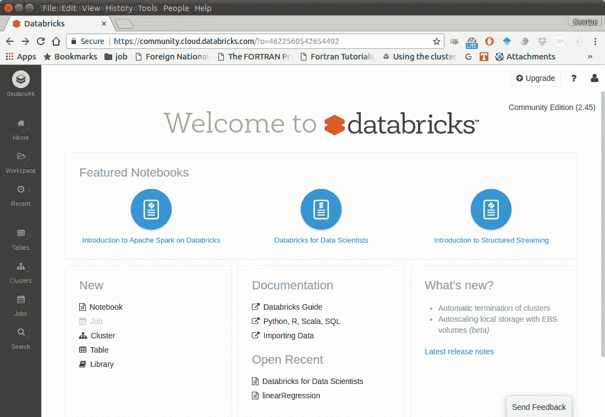
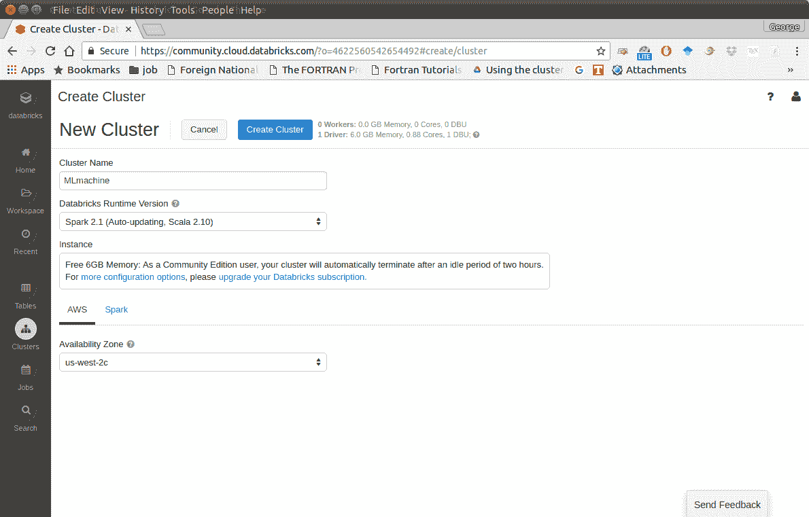
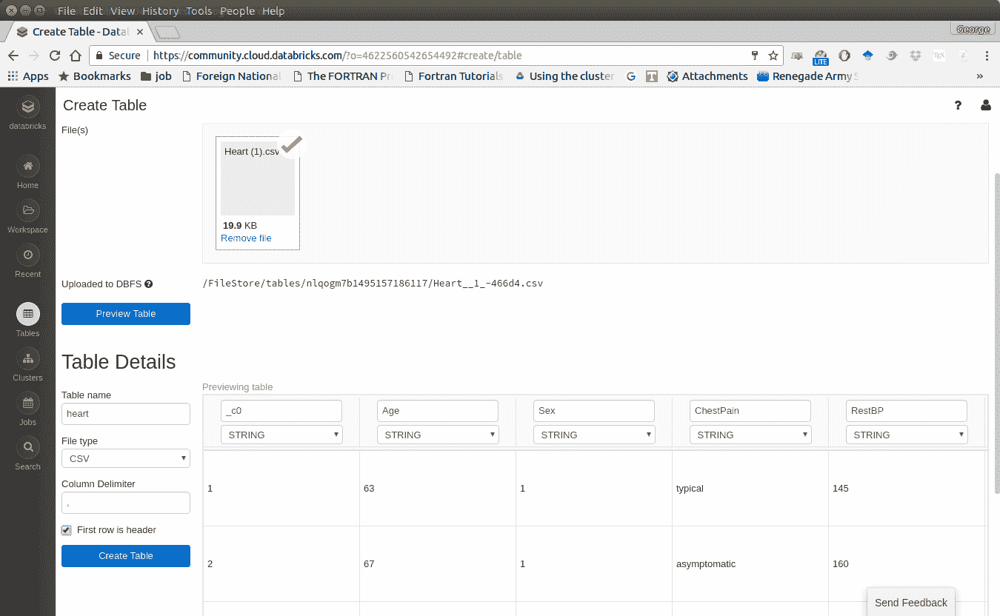
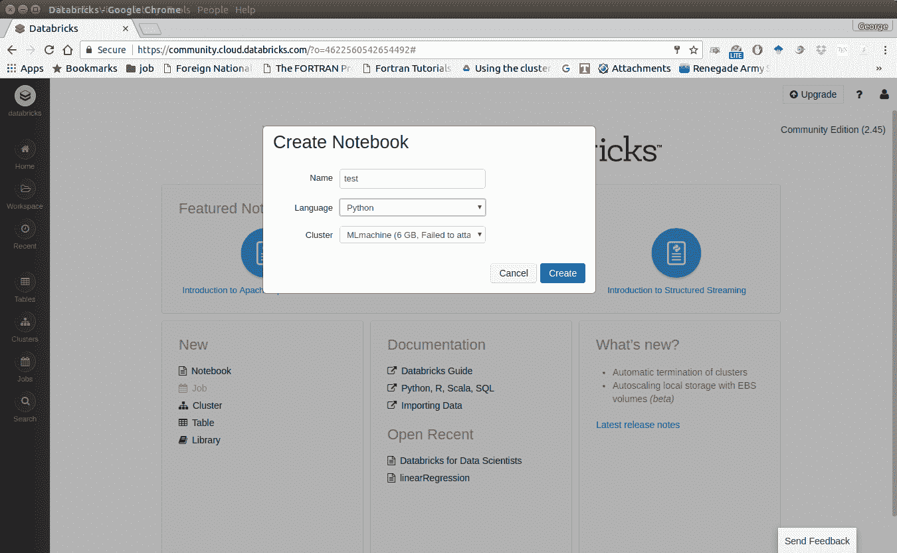
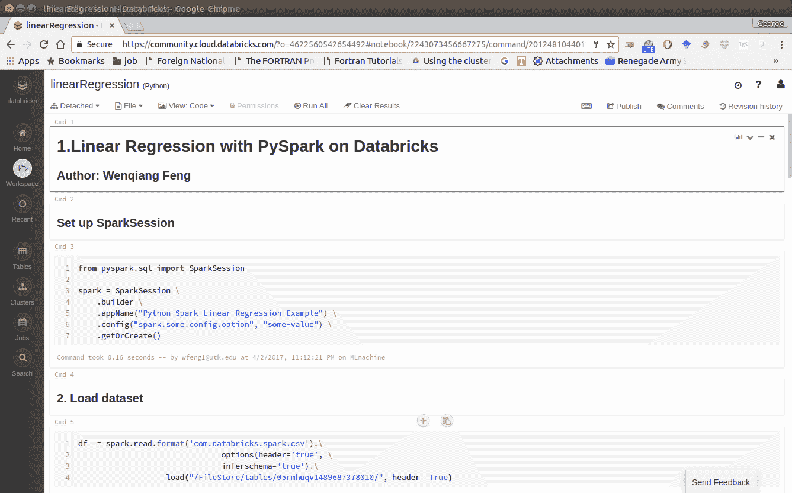
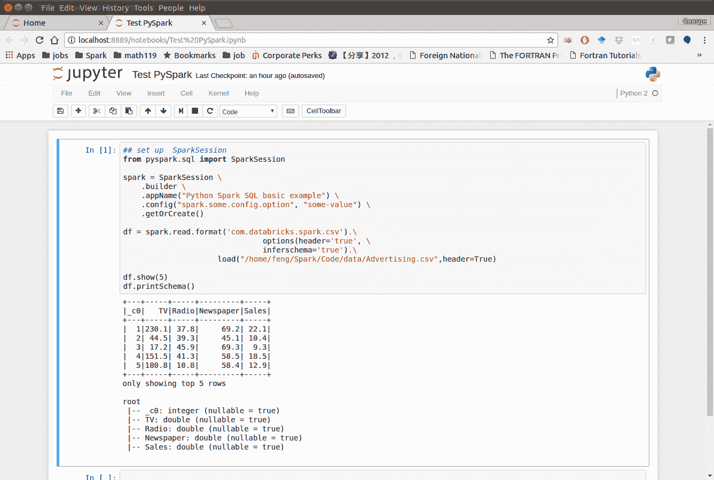
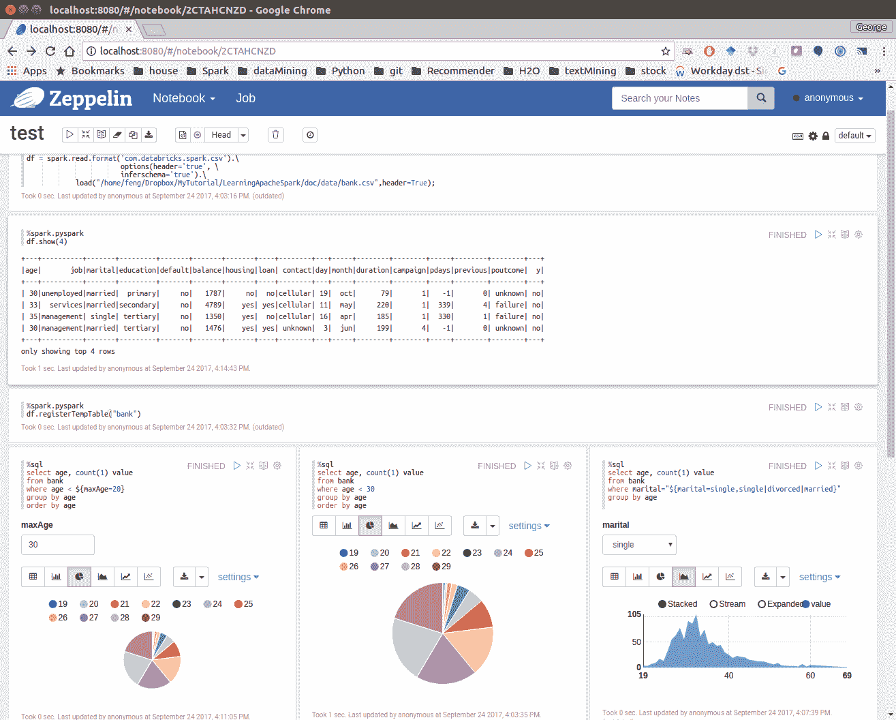
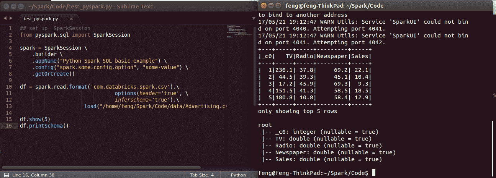
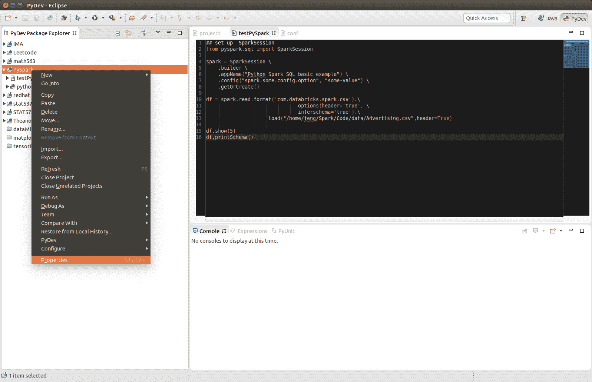
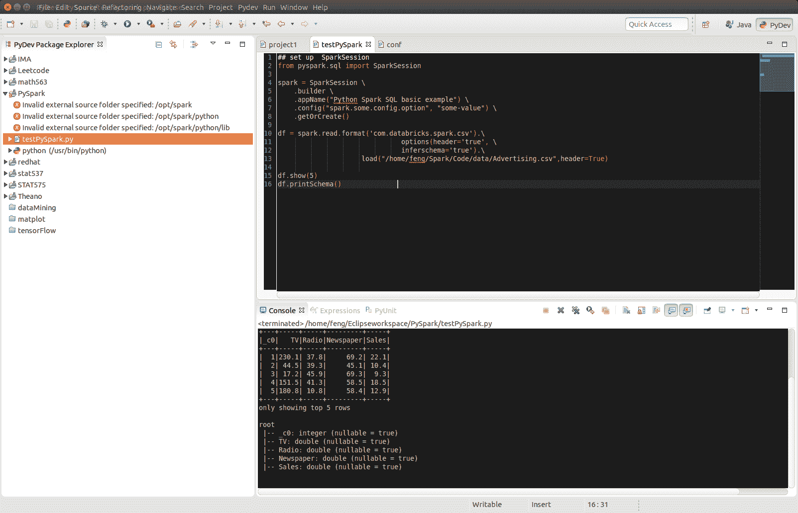

# 3\. Configure Running Platform

Chinese proverb

**Good tools are prerequisite to the successful execution of a job.** – old Chinese proverb

A good programming platform can save you lots of troubles and time. Herein I will only present how to install my favorite programming platform and only show the easiest way which I know to set it up on Linux system. If you want to install on the other operator system, you can Google it. In this section, you may learn how to set up Pyspark on the corresponding programming platform and package.

## 3.1\. Run on Databricks Community Cloud

If you don’t have any experience with Linux or Unix operator system, I would love to recommend you to use Spark on Databricks Community Cloud. Since you do not need to setup the Spark and it’s totally **free** for Community Edition. Please follow the steps listed below.

> 1.  Sign up a account at: [https://community.cloud.databricks.com/login.html](https://community.cloud.databricks.com/login.html)
> 
> &gt; 
> 
> 1.  Sign in with your account, then you can creat your cluster(machine), table(dataset) and notebook(code).
> 
> &gt; 
> 
> 1.  Create your cluster where your code will run
> 
> &gt; 
> 
> 1.  Import your dataset
> 
> &gt;  
> 
> Note
> 
> You need to save the path which appears at Uploaded to DBFS: /FileStore/tables/05rmhuqv1489687378010/. Since we will use this path to load the dataset.

1.  Creat your notebook

>  

After finishing the above 5 steps, you are ready to run your Spark code on Databricks Community Cloud. I will run all the following demos on Databricks Community Cloud. Hopefully, when you run the demo code, you will get the following results:

> ```
> +---+-----+-----+---------+-----+
> |_c0|   TV|Radio|Newspaper|Sales|
> +---+-----+-----+---------+-----+
> |  1|230.1| 37.8|     69.2| 22.1|
> |  2| 44.5| 39.3|     45.1| 10.4|
> |  3| 17.2| 45.9|     69.3|  9.3|
> |  4|151.5| 41.3|     58.5| 18.5|
> |  5|180.8| 10.8|     58.4| 12.9|
> +---+-----+-----+---------+-----+
> only showing top 5 rows
> 
> root
>  |-- _c0: integer (nullable = true)
>  |-- TV: double (nullable = true)
>  |-- Radio: double (nullable = true)
>  |-- Newspaper: double (nullable = true)
>  |-- Sales: double (nullable = true)
> 
> ```

## 3.2\. Configure Spark on Mac and Ubuntu

### 3.2.1\. Installing Prerequisites

I will strongly recommend you to install [Anaconda](https://www.anaconda.com/download/), since it contains most of the prerequisites and support multiple Operator Systems.

1.  **Install Python**

Go to Ubuntu Software Center and follow the following steps:

> 1.  Open Ubuntu Software Center
> 2.  Search for python
> 3.  And click Install

Or Open your terminal and using the following command:

```
sudo apt-get install build-essential checkinstall
sudo apt-get install libreadline-gplv2-dev libncursesw5-dev libssl-dev
                 libsqlite3-dev tk-dev libgdbm-dev libc6-dev libbz2-dev
sudo apt-get install python
sudo easy_install pip
sudo pip install ipython

```

### 3.2.2\. Install Java

Java is used by many other softwares. So it is quite possible that you have already installed it. You can by using the following command in Command Prompt:

```
java -version

```

Otherwise, you can follow the steps in [How do I install Java for my Mac?](https://java.com/en/download/help/mac_install.xml) to install java on Mac and use the following command in Command Prompt to install on Ubuntu:

```
sudo apt-add-repository ppa:webupd8team/java
sudo apt-get update
sudo apt-get install oracle-java8-installer

```

### 3.2.3\. Install Java SE Runtime Environment

I installed ORACLE [Java JDK](http://www.oracle.com/technetwork/java/javase/downloads/index-jsp-138363.html).

Warning

**Installing Java and Java SE Runtime Environment steps are very important, since Spark is a domain-specific language written in Java.**

You can check if your Java is available and find it’s version by using the following command in Command Prompt:

```
java -version

```

If your Java is installed successfully, you will get the similar results as follows:

```
java version "1.8.0_131"
Java(TM) SE Runtime Environment (build 1.8.0_131-b11)
Java HotSpot(TM) 64-Bit Server VM (build 25.131-b11, mixed mode)

```

### 3.2.4\. Install Apache Spark

Actually, the Pre-build version doesn’t need installation. You can use it when you unpack it.

> 1.  Download: You can get the Pre-built Apache Spark™ from [Download Apache Spark™](http://spark.apache.org/downloads.html).
> 2.  Unpack: Unpack the Apache Spark™ to the path where you want to install the Spark.
> 3.  Test: Test the Prerequisites: change the direction `spark-#.#.#-bin-hadoop#.#/bin` and run
> 
> ```
> ./pyspark
> 
> ```
> 
> ```
> Python 2.7.13 |Anaconda 4.4.0 (x86_64)| (default, Dec 20 2016, 23:05:08)
> [GCC 4.2.1 Compatible Apple LLVM 6.0 (clang-600.0.57)] on darwin
> Type "help", "copyright", "credits" or "license" for more information.
> Anaconda is brought to you by Continuum Analytics.
> Please check out: http://continuum.io/thanks and https://anaconda.org
> Using Spark's default log4j profile: org/apache/spark/log4j-defaults.properties
> Setting default log level to "WARN".
> To adjust logging level use sc.setLogLevel(newLevel). For SparkR,
> use setLogLevel(newLevel).
> 17/08/30 13:30:12 WARN NativeCodeLoader: Unable to load native-hadoop
> library for your platform... using builtin-java classes where applicable
> 17/08/30 13:30:17 WARN ObjectStore: Failed to get database global_temp,
> returning NoSuchObjectException
> Welcome to
>        ____              __
>       / __/__  ___ _____/ /__
>      _\ \/ _ \/ _ `/ __/  '_/
>     /__ / .__/\_,_/_/ /_/\_\   version 2.1.1
>        /_/
> 
> Using Python version 2.7.13 (default, Dec 20 2016 23:05:08)
> SparkSession available as 'spark'.
> 
> ```

### 3.2.5\. Configure the Spark

> 1.  **Mac Operator System:** open your `bash_profile` in Terminal
> 
> ```
> vim ~/.bash_profile
> 
> ```
> 
> And add the following lines to your `bash_profile` (remember to change the path)
> 
> ```
> # add for spark
> export SPARK_HOME=your_spark_installation_path
> export PATH=$PATH:$SPARK_HOME/bin:$SPARK_HOME/sbin
> export PATH=$PATH:$SPARK_HOME/bin
> export PYSPARK_DRIVE_PYTHON="jupyter"
> export PYSPARK_DRIVE_PYTHON_OPTS="notebook"
> 
> ```
> 
> At last, remember to source your `bash_profile`
> 
> ```
> source ~/.bash_profile
> 
> ```
> 
> 1.  **Ubuntu Operator Sysytem:** open your `bashrc` in Terminal
> 
> ```
> vim ~/.bashrc
> 
> ```
> 
> And add the following lines to your `bashrc` (remember to change the path)
> 
> ```
> # add for spark
> export SPARK_HOME=your_spark_installation_path
> export PATH=$PATH:$SPARK_HOME/bin:$SPARK_HOME/sbin
> export PATH=$PATH:$SPARK_HOME/bin
> export PYSPARK_DRIVE_PYTHON="jupyter"
> export PYSPARK_DRIVE_PYTHON_OPTS="notebook"
> 
> ```
> 
> At last, remember to source your `bashrc`
> 
> ```
> source ~/.bashrc
> 
> ```

## 3.3\. Configure Spark on Windows

Installing open source software on Windows is always a nightmare for me. Thanks for Deelesh Mandloi. You can follow the detailed procedures in the blog [Getting Started with PySpark on Windows](http://deelesh.github.io/pyspark-windows.html) to install the Apache Spark™ on your Windows Operator System.

## 3.4\. PySpark With Text Editor or IDE

### 3.4.1\. PySpark With Jupyter Notebook

After you finishing the above setup steps in [Configure Spark on Mac and Ubuntu](#set-up-ubuntu), then you should be good to write and run your PySpark Code in Jupyter notebook.

> 

### 3.4.2\. PySpark With Apache Zeppelin

After you finishing the above setup steps in [Configure Spark on Mac and Ubuntu](#set-up-ubuntu), then you should be good to write and run your PySpark Code in Apache Zeppelin.

> 

### 3.4.3\. PySpark With Sublime Text

After you finishing the above setup steps in [Configure Spark on Mac and Ubuntu](#set-up-ubuntu), then you should be good to use Sublime Text to write your PySpark Code and run your code as a normal python code in Terminal.

> ```
> python test_pyspark.py
> 
> ```

Then you should get the output results in your terminal.

> 

### 3.4.4\. PySpark With Eclipse

If you want to run PySpark code on Eclipse, you need to add the paths for the **External Libraries** for your **Current Project** as follows:

> 1.  Open the properties of your project
> 
> &gt; 
> 
> 1.  Add the paths for the **External Libraries**
> 
> &gt; 

And then you should be good to run your code on Eclipse with PyDev.

> 

## 3.5\. PySparkling Water: Spark + H2O

1.  Download `Sparkling Water` from: [https://s3.amazonaws.com/h2o-release/sparkling-water/rel-2.4/5/index.html](https://s3.amazonaws.com/h2o-release/sparkling-water/rel-2.4/5/index.html)
2.  Test PySparking

```
unzip sparkling-water-2.4.5.zip
cd  ~/sparkling-water-2.4.5/bin
./pysparkling

```

If you have a correct setup for PySpark, then you will get the following results:

```
Using Spark defined in the SPARK_HOME=/Users/dt216661/spark environmental property

Python 3.7.1 (default, Dec 14 2018, 13:28:58)
[GCC 4.2.1 Compatible Apple LLVM 6.0 (clang-600.0.57)] on darwin
Type "help", "copyright", "credits" or "license" for more information.
2019-02-15 14:08:30 WARN  NativeCodeLoader:62 - Unable to load native-hadoop library for your platform... using builtin-java classes where applicable
Setting default log level to "WARN".
Using Spark's default log4j profile: org/apache/spark/log4j-defaults.properties
Setting default log level to "WARN".
To adjust logging level use sc.setLogLevel(newLevel). For SparkR, use setLogLevel(newLevel).
2019-02-15 14:08:31 WARN  Utils:66 - Service 'SparkUI' could not bind on port 4040\. Attempting port 4041.
2019-02-15 14:08:31 WARN  Utils:66 - Service 'SparkUI' could not bind on port 4041\. Attempting port 4042.
17/08/30 13:30:12 WARN NativeCodeLoader: Unable to load native-hadoop
library for your platform... using builtin-java classes where applicable
17/08/30 13:30:17 WARN ObjectStore: Failed to get database global_temp,
returning NoSuchObjectException
Welcome to
       ____              __
      / __/__  ___ _____/ /__
     _\ \/ _ \/ _ `/ __/  '_/
    /__ / .__/\_,_/_/ /_/\_\   version 2.4.0
       /_/

Using Python version 3.7.1 (default, Dec 14 2018 13:28:58)
SparkSession available as 'spark'.

```

1.  Setup `pysparkling` with Jupyter notebook

Add the following alias to your `bashrc` (Linux systems) or `bash_profile` (Mac system)

```
alias sparkling="PYSPARK_DRIVER_PYTHON="ipython" PYSPARK_DRIVER_PYTHON_OPTS=    "notebook" /~/~/sparkling-water-2.4.5/bin/pysparkling"

```

1.  Open `pysparkling` in terminal

```
sparkling

```

## 3.6\. Set up Spark on Cloud

Following the setup steps in [Configure Spark on Mac and Ubuntu](#set-up-ubuntu), you can set up your own cluster on the cloud, for example AWS, Google Cloud. Actually, for those clouds, they have their own Big Data tool. Yon can run them directly whitout any setting just like Databricks Community Cloud. If you want more details, please feel free to contact with me.

## 3.7\. Demo Code in this Section

The code for this section is available for download [test_pyspark](static/test_pyspark.py), and the Jupyter notebook can be download from [test_pyspark_ipynb](static/test_pyspark.ipynb).

*   Python Source code

> ```
> ## set up  SparkSession
> from pyspark.sql import SparkSession
> 
> spark = SparkSession \
>     .builder \
>     .appName("Python Spark SQL basic example") \
>     .config("spark.some.config.option", "some-value") \
>     .getOrCreate()
> 
> df = spark.read.format('com.databricks.spark.csv').\
>                                options(header='true', \
>                                inferschema='true').\
>                      load("/home/feng/Spark/Code/data/Advertising.csv",header=True)
> 
> df.show(5)
> df.printSchema()                     
> 
> ```