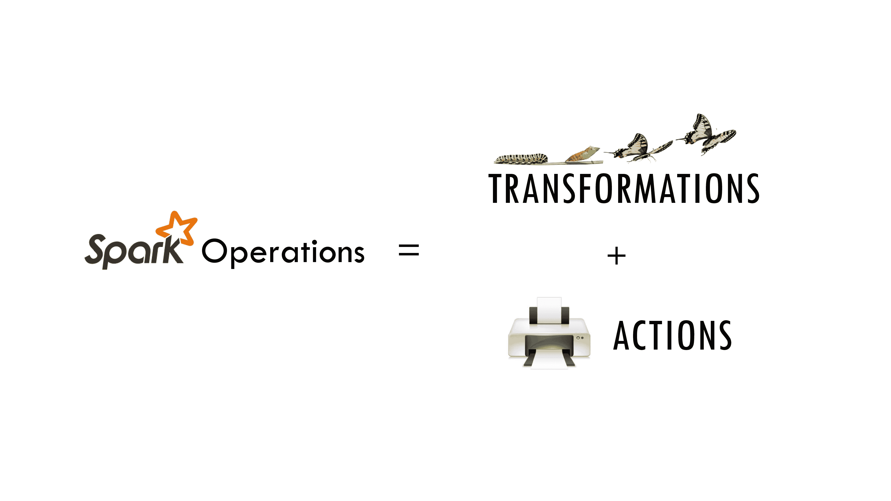

# 5\. Programming with RDDs

Chinese proverb

**If you only know yourself, but not your opponent, you may win or may lose. If you know neither yourself nor your enemy, you will always endanger yourself** – idiom, from Sunzi’s Art of War

RDD represents **Resilient Distributed Dataset**. An RDD in Spark is simply an immutable distributed collection of objects sets. Each RDD is split into multiple partitions (similar pattern with smaller sets), which may be computed on different nodes of the cluster.

## 5.1\. Create RDD

Usually, there are two popular way to create the RDDs: loading an external dataset, or distributing a set of collection of objects. The following examples show some simplest ways to create RDDs by using `parallelize()` fucntion which takes an already existing collection in your program and pass the same to the Spark Context.

1.  By using `parallelize( )` fucntion

```
from pyspark.sql import SparkSession

spark = SparkSession \
    .builder \
    .appName("Python Spark create RDD example") \
    .config("spark.some.config.option", "some-value") \
    .getOrCreate()

df = spark.sparkContext.parallelize([(1, 2, 3, 'a b c'),
             (4, 5, 6, 'd e f'),
             (7, 8, 9, 'g h i')]).toDF(['col1', 'col2', 'col3','col4'])

```

Then you will get the RDD data:

```
df.show()

+----+----+----+-----+
|col1|col2|col3| col4|
+----+----+----+-----+
|   1|   2|   3|a b c|
|   4|   5|   6|d e f|
|   7|   8|   9|g h i|
+----+----+----+-----+

```

```
from pyspark.sql import SparkSession

spark = SparkSession \
    .builder \
    .appName("Python Spark create RDD example") \
    .config("spark.some.config.option", "some-value") \
    .getOrCreate()

myData = spark.sparkContext.parallelize([(1,2), (3,4), (5,6), (7,8), (9,10)])

```

Then you will get the RDD data:

```
myData.collect()

[(1, 2), (3, 4), (5, 6), (7, 8), (9, 10)]

```

1.  By using `createDataFrame( )` function

```
from pyspark.sql import SparkSession

spark = SparkSession \
    .builder \
    .appName("Python Spark create RDD example") \
    .config("spark.some.config.option", "some-value") \
    .getOrCreate()

Employee = spark.createDataFrame([
                        ('1', 'Joe',   '70000', '1'),
                        ('2', 'Henry', '80000', '2'),
                        ('3', 'Sam',   '60000', '2'),
                        ('4', 'Max',   '90000', '1')],
                        ['Id', 'Name', 'Sallary','DepartmentId']
                       )

```

Then you will get the RDD data:

```
+---+-----+-------+------------+
| Id| Name|Sallary|DepartmentId|
+---+-----+-------+------------+
|  1|  Joe|  70000|           1|
|  2|Henry|  80000|           2|
|  3|  Sam|  60000|           2|
|  4|  Max|  90000|           1|
+---+-----+-------+------------+

```

1.  By using `read` and `load` functions

> 1.  **Read dataset from .csv file**
> 
> ```
> ## set up  SparkSession
> from pyspark.sql import SparkSession
> 
> spark = SparkSession \
>     .builder \
>     .appName("Python Spark create RDD example") \
>     .config("spark.some.config.option", "some-value") \
>     .getOrCreate()
> 
> df = spark.read.format('com.databricks.spark.csv').\
>                                options(header='true', \
>                                inferschema='true').\
>                 load("/home/feng/Spark/Code/data/Advertising.csv",header=True)
> 
> df.show(5)
> df.printSchema()
> 
> ```
> 
> Then you will get the RDD data:
> 
> ```
> +---+-----+-----+---------+-----+
> |_c0|   TV|Radio|Newspaper|Sales|
> +---+-----+-----+---------+-----+
> |  1|230.1| 37.8|     69.2| 22.1|
> |  2| 44.5| 39.3|     45.1| 10.4|
> |  3| 17.2| 45.9|     69.3|  9.3|
> |  4|151.5| 41.3|     58.5| 18.5|
> |  5|180.8| 10.8|     58.4| 12.9|
> +---+-----+-----+---------+-----+
> only showing top 5 rows
> 
> root
>  |-- _c0: integer (nullable = true)
>  |-- TV: double (nullable = true)
>  |-- Radio: double (nullable = true)
>  |-- Newspaper: double (nullable = true)
>  |-- Sales: double (nullable = true)
> 
> ```

Once created, RDDs offer two types of operations: transformations and actions.

> 1.  **Read dataset from DataBase**
> 
> ```
> ## set up  SparkSession
> from pyspark.sql import SparkSession
> 
> spark = SparkSession \
>             .builder \
>             .appName("Python Spark create RDD example") \
>             .config("spark.some.config.option", "some-value") \
>             .getOrCreate()
> 
> ## User information
> user = 'your_username'
> pw   = 'your_password'
> 
> ## Database information
> table_name = 'table_name'
> url = 'jdbc:postgresql://##.###.###.##:5432/dataset?user='+user+'&password='+pw
> properties ={'driver': 'org.postgresql.Driver', 'password': pw,'user': user}
> 
> df = spark.read.jdbc(url=url, table=table_name, properties=properties)
> 
> df.show(5)
> df.printSchema()
> 
> ```
> 
> Then you will get the RDD data:
> 
> ```
> +---+-----+-----+---------+-----+
> |_c0|   TV|Radio|Newspaper|Sales|
> +---+-----+-----+---------+-----+
> |  1|230.1| 37.8|     69.2| 22.1|
> |  2| 44.5| 39.3|     45.1| 10.4|
> |  3| 17.2| 45.9|     69.3|  9.3|
> |  4|151.5| 41.3|     58.5| 18.5|
> |  5|180.8| 10.8|     58.4| 12.9|
> +---+-----+-----+---------+-----+
> only showing top 5 rows
> 
> root
>  |-- _c0: integer (nullable = true)
>  |-- TV: double (nullable = true)
>  |-- Radio: double (nullable = true)
>  |-- Newspaper: double (nullable = true)
>  |-- Sales: double (nullable = true)
> 
> ```

Note

Reading tables from Database needs the proper drive for the corresponding Database. For example, the above demo needs `org.postgresql.Driver` and you need to download it and put it in `jars` folder of your spark installation path. I download `postgresql-42.1.1.jar` from the official website and put it in `jars` folder.

1.  **Read dataset from HDFS**

> ```
> from pyspark.conf import SparkConf
> from pyspark.context import SparkContext
> from pyspark.sql import HiveContext
> 
> sc= SparkContext('local','example')
> hc = HiveContext(sc)
> tf1 = sc.textFile("hdfs://cdhstltest/user/data/demo.CSV")
> print(tf1.first())
> 
> hc.sql("use intg_cme_w")
> spf = hc.sql("SELECT * FROM spf LIMIT 100")
> print(spf.show(5))
> 
> ```

## 5.2\. Spark Operations

Warning

All the figures below are from Jeffrey Thompson. The interested reader is referred to [pyspark pictures](https://github.com/jkthompson/pyspark-pictures)

There are two main types of Spark operations: Transformations and Actions [[Karau2015]](reference.html#karau2015).

> 

Note

Some people defined three types of operations: Transformations, Actions and Shuffles.

### 5.2.1\. Spark Transformations

Transformations construct a new RDD from a previous one. For example, one common transformation is filtering data that matches a predicate.

>  

### 5.2.2\. Spark Actions

Actions, on the other hand, compute a result based on an RDD, and either return it to the driver program or save it to an external storage system (e.g., HDFS).

>  

## 5.3\. `rdd.DataFrame` vs `pd.DataFrame`

### 5.3.1\. Create DataFrame

1.  From List

```
my_list = [['a', 1, 2], ['b', 2, 3],['c', 3, 4]]
col_name = ['A', 'B', 'C']

```

`:: Python Code:`

```
# caution for the columns=
pd.DataFrame(my_list,columns= col_name)
#
spark.createDataFrame(my_list, col_name).show()

```

`:: Comparison:`

```
                  +---+---+---+
                  |  A|  B|  C|
   A  B  C        +---+---+---+
0  a  1  2        |  a|  1|  2|
1  b  2  3        |  b|  2|  3|
2  c  3  4        |  c|  3|  4|
                  +---+---+---+

```

Attention

Pay attentation to the parameter `columns=` in `pd.DataFrame`. Since the default value will make the list as rows.

> `:: Python Code:`
> 
> ```
> # caution for the columns=
> pd.DataFrame(my_list, columns= col_name)
> #
> pd.DataFrame(my_list, col_name)
> 
> ```
> 
> `:: Comparison:`
> 
> ```
>    A  B  C             0  1  2
> 0  a  1  2          A  a  1  2
> 1  b  2  3          B  b  2  3
> 2  c  3  4          C  c  3  4
> 
> ```

1.  From Dict

```
d = {'A': [0, 1, 0],
     'B': [1, 0, 1],
     'C': [1, 0, 0]}

```

`:: Python Code:`

```
pd.DataFrame(d)for
# Tedious for PySpark
spark.createDataFrame(np.array(list(d.values())).T.tolist(),list(d.keys())).show()

```

`:: Comparison:`

```
                   +---+---+---+
                   |  A|  B|  C|
   A  B  C         +---+---+---+
0  0  1  1         |  0|  1|  1|
1  1  0  0         |  1|  0|  0|
2  0  1  0         |  0|  1|  0|
                   +---+---+---+

```

### 5.3.2\. Load DataFrame

1.  From DataBase

Most of time, you need to share your code with your colleagues or release your code for Code Review or Quality assurance(QA). You will definitely do not want to have your `User Information` in the code. So you can save them in login.txt:

```
runawayhorse001
PythonTips

```

and use the following code to import your `User Information`:

```
#User Information
try:
    login = pd.read_csv(r'login.txt', header=None)
    user = login[0][0]
    pw = login[0][1]
    print('User information is ready!')
except:
    print('Login information is not available!!!')

#Database information
host = '##.###.###.##'
db_name = 'db_name'
table_name = 'table_name'

```

`:: Comparison:`

```
conn = psycopg2.connect(host=host, database=db_name, user=user, password=pw)
cur = conn.cursor()

sql = """
      select *
      from {table_name}
      """.format(table_name=table_name)
dp = pd.read_sql(sql, conn)

```

```
# connect to database
url = 'jdbc:postgresql://'+host+':5432/'+db_name+'?user='+user+'&password='+pw
properties ={'driver': 'org.postgresql.Driver', 'password': pw,'user': user}
ds = spark.read.jdbc(url=url, table=table_name, properties=properties)

```

Attention

Reading tables from Database with PySpark needs the proper drive for the corresponding Database. For example, the above demo needs org.postgresql.Driver and you need to download it and put it in `jars` folder of your spark installation path. I download postgresql-42.1.1.jar from the official website and put it in jars folder.

1.  From `.csv`

`:: Comparison:`

```
# pd.DataFrame dp: DataFrame pandas
dp = pd.read_csv('Advertising.csv')
#rdd.DataFrame. dp: DataFrame spark
ds = spark.read.csv(path='Advertising.csv',
#                sep=',',
#                encoding='UTF-8',
#                comment=None,
               header=True,
               inferSchema=True)

```

1.  From `.json`

Data from: [http://api.luftdaten.info/static/v1/data.json](http://api.luftdaten.info/static/v1/data.json)

```
dp = pd.read_json("data/data.json")
ds = spark.read.json('data/data.json')

```

`:: Python Code:`

```
dp[['id','timestamp']].head(4)
#
ds[['id','timestamp']].show(4)

```

`:: Comparison:`

```
                                                +----------+-------------------+
                                                |        id|          timestamp|
            id  timestamp                       +----------+-------------------+
0   2994551481  2019-02-28 17:23:52             |2994551481|2019-02-28 17:23:52|
1   2994551482  2019-02-28 17:23:52             |2994551482|2019-02-28 17:23:52|
2   2994551483  2019-02-28 17:23:52             |2994551483|2019-02-28 17:23:52|
3   2994551484  2019-02-28 17:23:52             |2994551484|2019-02-28 17:23:52|
                                                +----------+-------------------+
                                                only showing top 4 rows

```

### 5.3.3\. First `n` Rows

`:: Python Code:`

```
dp.head(4)
#
ds.show(4)

```

`:: Comparison:`

```
                                        +-----+-----+---------+-----+
                                        |   TV|Radio|Newspaper|Sales|
      TV  Radio  Newspaper  Sales       +-----+-----+---------+-----+
0  230.1   37.8       69.2   22.1       |230.1| 37.8|     69.2| 22.1|
1   44.5   39.3       45.1   10.4       | 44.5| 39.3|     45.1| 10.4|
2   17.2   45.9       69.3    9.3       | 17.2| 45.9|     69.3|  9.3|
3  151.5   41.3       58.5   18.5       |151.5| 41.3|     58.5| 18.5|
                                        +-----+-----+---------+-----+
                                        only showing top 4 rows

```

### 5.3.4\. Column Names

`:: Python Code:`

```
dp.columns
#
ds.columns

```

`:: Comparison:`

```
Index(['TV', 'Radio', 'Newspaper', 'Sales'], dtype='object')
['TV', 'Radio', 'Newspaper', 'Sales']

```

### 5.3.5\. Data types

`:: Python Code:`

```
dp.dtypes
#
ds.dtypes

```

`:: Comparison:`

```
TV           float64                    [('TV', 'double'),
Radio        float64                     ('Radio', 'double'),
Newspaper    float64                     ('Newspaper', 'double'),
Sales        float64                     ('Sales', 'double')]
dtype: object

```

### 5.3.6\. Fill Null

```
my_list = [['a', 1, None], ['b', 2, 3],['c', 3, 4]]
dp = pd.DataFrame(my_list,columns=['A', 'B', 'C'])
ds = spark.createDataFrame(my_list, ['A', 'B', 'C'])
#
dp.head()
ds.show()

```

`:: Comparison:`

```
                                        +------+---+----+
                                        |     A|  B|   C|
        A  B    C                       +------+---+----+
0    male  1  NaN                       |  male|  1|null|
1  female  2  3.0                       |female|  2|   3|
2    male  3  4.0                       |  male|  3|   4|
                                        +------+---+----+

```

`:: Python Code:`

```
dp.fillna(-99)
#
ds.fillna(-99).show()

```

`:: Comparison:`

```
                                        +------+---+----+
                                        |     A|  B|   C|
        A  B    C                       +------+---+----+
0    male  1  -99                       |  male|  1| -99|
1  female  2  3.0                       |female|  2|   3|
2    male  3  4.0                       |  male|  3|   4|
                                        +------+---+----+

```

### 5.3.7\. Replace Values

`:: Python Code:`

```
# caution: you need to chose specific col
dp.A.replace(['male', 'female'],[1, 0], inplace=True)
dp
#caution: Mixed type replacements are not supported
ds.na.replace(['male','female'],['1','0']).show()

```

`:: Comparison:`

```
                                +---+---+----+
                                |  A|  B|   C|
   A  B    C                    +---+---+----+
0  1  1  NaN                    |  1|  1|null|
1  0  2  3.0                    |  0|  2|   3|
2  1  3  4.0                    |  1|  3|   4|
                                +---+---+----+

```

### 5.3.8\. Rename Columns

1.  Rename all columns

`:: Python Code:`

```
dp.columns = ['a','b','c','d']
dp.head(4)
#
ds.toDF('a','b','c','d').show(4)

```

`:: Comparison:`

```
                                                +-----+----+----+----+
                                                |    a|   b|   c|   d|
       a     b     c     d                      +-----+----+----+----+
0  230.1  37.8  69.2  22.1                      |230.1|37.8|69.2|22.1|
1   44.5  39.3  45.1  10.4                      | 44.5|39.3|45.1|10.4|
2   17.2  45.9  69.3   9.3                      | 17.2|45.9|69.3| 9.3|
3  151.5  41.3  58.5  18.5                      |151.5|41.3|58.5|18.5|
                                                +-----+----+----+----+
                                                only showing top 4 rows

```

1.  Rename one or more columns

```
mapping = {'Newspaper':'C','Sales':'D'}

```

`:: Python Code:`

```
dp.rename(columns=mapping).head(4)
#
new_names = [mapping.get(col,col) for col in ds.columns]
ds.toDF(*new_names).show(4)

```

`:: Comparison:`

```
                                        +-----+-----+----+----+
                                        |   TV|Radio|   C|   D|
      TV  Radio     C     D             +-----+-----+----+----+
0  230.1   37.8  69.2  22.1             |230.1| 37.8|69.2|22.1|
1   44.5   39.3  45.1  10.4             | 44.5| 39.3|45.1|10.4|
2   17.2   45.9  69.3   9.3             | 17.2| 45.9|69.3| 9.3|
3  151.5   41.3  58.5  18.5             |151.5| 41.3|58.5|18.5|
                                        +-----+-----+----+----+
                                        only showing top 4 rows

```

Note

You can also use `withColumnRenamed` to rename one column in PySpark.

`:: Python Code:`

```
ds.withColumnRenamed('Newspaper','Paper').show(4

```

`:: Comparison:`

```
+-----+-----+-----+-----+
|   TV|Radio|Paper|Sales|
+-----+-----+-----+-----+
|230.1| 37.8| 69.2| 22.1|
| 44.5| 39.3| 45.1| 10.4|
| 17.2| 45.9| 69.3|  9.3|
|151.5| 41.3| 58.5| 18.5|
+-----+-----+-----+-----+
only showing top 4 rows

```

### 5.3.9\. Drop Columns

```
drop_name = ['Newspaper','Sales']

```

`:: Python Code:`

```
dp.drop(drop_name,axis=1).head(4)
#
ds.drop(*drop_name).show(4)

```

`:: Comparison:`

```
                                +-----+-----+
                                |   TV|Radio|
      TV  Radio                 +-----+-----+
0  230.1   37.8                 |230.1| 37.8|
1   44.5   39.3                 | 44.5| 39.3|
2   17.2   45.9                 | 17.2| 45.9|
3  151.5   41.3                 |151.5| 41.3|
                                +-----+-----+
                                only showing top 4 rows

```

### 5.3.10\. Filter

```
dp = pd.read_csv('Advertising.csv')
#
ds = spark.read.csv(path='Advertising.csv',
                    header=True,
                    inferSchema=True)

```

`:: Python Code:`

```
dp[dp.Newspaper<20].head(4)
#
ds[ds.Newspaper<20].show(4)

```

`:: Comparison:`

```
                                                +-----+-----+---------+-----+
                                                |   TV|Radio|Newspaper|Sales|
       TV  Radio  Newspaper  Sales              +-----+-----+---------+-----+
7   120.2   19.6       11.6   13.2              |120.2| 19.6|     11.6| 13.2|
8     8.6    2.1        1.0    4.8              |  8.6|  2.1|      1.0|  4.8|
11  214.7   24.0        4.0   17.4              |214.7| 24.0|      4.0| 17.4|
13   97.5    7.6        7.2    9.7              | 97.5|  7.6|      7.2|  9.7|
                                                +-----+-----+---------+-----+
                                                only showing top 4 rows

```

`:: Python Code:`

```
dp[(dp.Newspaper<20)&(dp.TV>100)].head(4)
#
ds[(ds.Newspaper<20)&(ds.TV>100)].show(4)

```

`:: Comparison:`

```
                                                +-----+-----+---------+-----+
                                                |   TV|Radio|Newspaper|Sales|
       TV  Radio  Newspaper  Sales              +-----+-----+---------+-----+
7   120.2   19.6       11.6   13.2              |120.2| 19.6|     11.6| 13.2|
11  214.7   24.0        4.0   17.4              |214.7| 24.0|      4.0| 17.4|
19  147.3   23.9       19.1   14.6              |147.3| 23.9|     19.1| 14.6|
25  262.9    3.5       19.5   12.0              |262.9|  3.5|     19.5| 12.0|
                                                +-----+-----+---------+-----+
                                                only showing top 4 rows

```

### 5.3.11\. With New Column

`:: Python Code:`

```
dp['tv_norm'] = dp.TV/sum(dp.TV)
dp.head(4)
#
ds.withColumn('tv_norm', ds.TV/ds.groupBy().agg(F.sum("TV")).collect()[0][0]).show(4)

```

`:: Comparison:`

```
                                                +-----+-----+---------+-----+--------------------+
                                                |   TV|Radio|Newspaper|Sales|             tv_norm|
      TV  Radio  Newspaper  Sales   tv_norm     +-----+-----+---------+-----+--------------------+
0  230.1   37.8       69.2   22.1  0.007824     |230.1| 37.8|     69.2| 22.1|0.007824268493802813|
1   44.5   39.3       45.1   10.4  0.001513     | 44.5| 39.3|     45.1| 10.4|0.001513167961643...|
2   17.2   45.9       69.3    9.3  0.000585     | 17.2| 45.9|     69.3|  9.3|5.848649200061207E-4|
3  151.5   41.3       58.5   18.5  0.005152     |151.5| 41.3|     58.5| 18.5|0.005151571824472517|
                                                +-----+-----+---------+-----+--------------------+
                                                only showing top 4 rows

```

`:: Python Code:`

```
dp['cond'] = dp.apply(lambda c: 1 if ((c.TV>100)&(c.Radio<40)) else 2 if c.Sales> 10 else 3,axis=1)
#
ds.withColumn('cond',F.when((ds.TV>100)&(ds.Radio<40),1)\
                      .when(ds.Sales>10, 2)\
                      .otherwise(3)).show(4)

```

`:: Comparison:`

```
                                                +-----+-----+---------+-----+----+
                                                |   TV|Radio|Newspaper|Sales|cond|
      TV  Radio  Newspaper  Sales  cond         +-----+-----+---------+-----+----+
0  230.1   37.8       69.2   22.1     1         |230.1| 37.8|     69.2| 22.1|   1|
1   44.5   39.3       45.1   10.4     2         | 44.5| 39.3|     45.1| 10.4|   2|
2   17.2   45.9       69.3    9.3     3         | 17.2| 45.9|     69.3|  9.3|   3|
3  151.5   41.3       58.5   18.5     2         |151.5| 41.3|     58.5| 18.5|   2|
                                                +-----+-----+---------+-----+----+
                                                only showing top 4 rows

```

`:: Python Code:`

```
dp['log_tv'] = np.log(dp.TV)
dp.head(4)
#
ds.withColumn('log_tv',F.log(ds.TV)).show(4)

```

`:: Comparison:`

```
                                                +-----+-----+---------+-----+------------------+
                                                |   TV|Radio|Newspaper|Sales|            log_tv|
      TV  Radio  Newspaper  Sales    log_tv     +-----+-----+---------+-----+------------------+
0  230.1   37.8       69.2   22.1  5.438514     |230.1| 37.8|     69.2| 22.1|  5.43851399704132|
1   44.5   39.3       45.1   10.4  3.795489     | 44.5| 39.3|     45.1| 10.4|3.7954891891721947|
2   17.2   45.9       69.3    9.3  2.844909     | 17.2| 45.9|     69.3|  9.3|2.8449093838194073|
3  151.5   41.3       58.5   18.5  5.020586     |151.5| 41.3|     58.5| 18.5| 5.020585624949423|
                                                +-----+-----+---------+-----+------------------+
                                                only showing top 4 rows

```

`:: Python Code:`

```
dp['tv+10'] = dp.TV.apply(lambda x: x+10)
dp.head(4)
#
ds.withColumn('tv+10', ds.TV+10).show(4)

```

`:: Comparison:`

```
                                                +-----+-----+---------+-----+-----+
                                                |   TV|Radio|Newspaper|Sales|tv+10|
      TV  Radio  Newspaper  Sales  tv+10        +-----+-----+---------+-----+-----+
0  230.1   37.8       69.2   22.1  240.1        |230.1| 37.8|     69.2| 22.1|240.1|
1   44.5   39.3       45.1   10.4   54.5        | 44.5| 39.3|     45.1| 10.4| 54.5|
2   17.2   45.9       69.3    9.3   27.2        | 17.2| 45.9|     69.3|  9.3| 27.2|
3  151.5   41.3       58.5   18.5  161.5        |151.5| 41.3|     58.5| 18.5|161.5|
                                                +-----+-----+---------+-----+-----+
                                                only showing top 4 rows

```

### 5.3.12\. Join

```
leftp = pd.DataFrame({'A': ['A0', 'A1', 'A2', 'A3'],
                    'B': ['B0', 'B1', 'B2', 'B3'],
                    'C': ['C0', 'C1', 'C2', 'C3'],
                    'D': ['D0', 'D1', 'D2', 'D3']},
                    index=[0, 1, 2, 3])

rightp = pd.DataFrame({'A': ['A0', 'A1', 'A6', 'A7'],
                       'F': ['B4', 'B5', 'B6', 'B7'],
                       'G': ['C4', 'C5', 'C6', 'C7'],
                       'H': ['D4', 'D5', 'D6', 'D7']},
                       index=[4, 5, 6, 7])

lefts = spark.createDataFrame(leftp)
rights = spark.createDataFrame(rightp)

```

```
    A   B   C   D                   A   F   G   H
0  A0  B0  C0  D0               4  A0  B4  C4  D4
1  A1  B1  C1  D1               5  A1  B5  C5  D5
2  A2  B2  C2  D2               6  A6  B6  C6  D6
3  A3  B3  C3  D3               7  A7  B7  C7  D7

```

1.  Left Join

    &gt; `:: Python Code:`
    &gt; 
    &gt; ```
    &gt; leftp.merge(rightp,on='A',how='left')
    &gt; #
    &gt; lefts.join(rights,on='A',how='left')
    &gt;      .orderBy('A',ascending=True).show()
    &gt; 
    &gt; ```
    &gt; 
    &gt; `:: Comparison:`
    &gt; 
    &gt; ```
    &gt;                                         +---+---+---+---+----+----+----+
    &gt;                                         |  A|  B|  C|  D|   F|   G|   H|
    &gt;     A   B   C   D    F    G    H        +---+---+---+---+----+----+----+
    &gt; 0  A0  B0  C0  D0   B4   C4   D4        | A0| B0| C0| D0|  B4|  C4|  D4|
    &gt; 1  A1  B1  C1  D1   B5   C5   D5        | A1| B1| C1| D1|  B5|  C5|  D5|
    &gt; 2  A2  B2  C2  D2  NaN  NaN  NaN        | A2| B2| C2| D2|null|null|null|
    &gt; 3  A3  B3  C3  D3  NaN  NaN  NaN        | A3| B3| C3| D3|null|null|null|
    &gt;                                         +---+---+---+---+----+----+----+
    &gt; 
    &gt; ```

2.  Right Join

    &gt; `:: Python Code:`
    &gt; 
    &gt; ```
    &gt; leftp.merge(rightp,on='A',how='right')
    &gt; #
    &gt; lefts.join(rights,on='A',how='right')
    &gt;      .orderBy('A',ascending=True).show()
    &gt; 
    &gt; ```
    &gt; 
    &gt; `:: Comparison:`
    &gt; 
    &gt; ```
    &gt;                                         +---+----+----+----+---+---+---+
    &gt;                                         |  A|   B|   C|   D|  F|  G|  H|
    &gt;     A    B    C    D   F   G   H        +---+----+----+----+---+---+---+
    &gt; 0  A0   B0   C0   D0  B4  C4  D4        | A0|  B0|  C0|  D0| B4| C4| D4|
    &gt; 1  A1   B1   C1   D1  B5  C5  D5        | A1|  B1|  C1|  D1| B5| C5| D5|
    &gt; 2  A6  NaN  NaN  NaN  B6  C6  D6        | A6|null|null|null| B6| C6| D6|
    &gt; 3  A7  NaN  NaN  NaN  B7  C7  D7        | A7|null|null|null| B7| C7| D7|
    &gt;                                         +---+----+----+----+---+---+---+
    &gt; 
    &gt; ```

3.  Inner Join

    &gt; `:: Python Code:`
    &gt; 
    &gt; ```
    &gt; leftp.merge(rightp,on='A',how='inner')
    &gt; #
    &gt; lefts.join(rights,on='A',how='inner')
    &gt;      .orderBy('A',ascending=True).show()
    &gt; 
    &gt; ```
    &gt; 
    &gt; `:: Comparison:`
    &gt; 
    &gt; ```
    &gt;                                 +---+---+---+---+---+---+---+
    &gt;                                 |  A|  B|  C|  D|  F|  G|  H|
    &gt;     A   B   C   D   F   G   H   +---+---+---+---+---+---+---+
    &gt; 0  A0  B0  C0  D0  B4  C4  D4   | A0| B0| C0| D0| B4| C4| D4|
    &gt; 1  A1  B1  C1  D1  B5  C5  D5   | A1| B1| C1| D1| B5| C5| D5|
    &gt;                                 +---+---+---+---+---+---+---+
    &gt; 
    &gt; ```

4.  Full Join

    &gt; `:: Python Code:`
    &gt; 
    &gt; ```
    &gt; leftp.merge(rightp,on='A',how='full')
    &gt; #
    &gt; lefts.join(rights,on='A',how='full')
    &gt;      .orderBy('A',ascending=True).show()
    &gt; 
    &gt; ```
    &gt; 
    &gt; `:: Comparison:`
    &gt; 
    &gt; ```
    &gt;                                         +---+----+----+----+----+----+----+
    &gt;                                         |  A|   B|   C|   D|   F|   G|   H|
    &gt;     A    B    C    D    F    G    H     +---+----+----+----+----+----+----+
    &gt; 0  A0   B0   C0   D0   B4   C4   D4     | A0|  B0|  C0|  D0|  B4|  C4|  D4|
    &gt; 1  A1   B1   C1   D1   B5   C5   D5     | A1|  B1|  C1|  D1|  B5|  C5|  D5|
    &gt; 2  A2   B2   C2   D2  NaN  NaN  NaN     | A2|  B2|  C2|  D2|null|null|null|
    &gt; 3  A3   B3   C3   D3  NaN  NaN  NaN     | A3|  B3|  C3|  D3|null|null|null|
    &gt; 4  A6  NaN  NaN  NaN   B6   C6   D6     | A6|null|null|null|  B6|  C6|  D6|
    &gt; 5  A7  NaN  NaN  NaN   B7   C7   D7     | A7|null|null|null|  B7|  C7|  D7|
    &gt;                                         +---+----+----+----+----+----+----+
    &gt; 
    &gt; ```

### 5.3.13\. Concat Columns

```
my_list = [('a', 2, 3),
           ('b', 5, 6),
           ('c', 8, 9),
           ('a', 2, 3),
           ('b', 5, 6),
           ('c', 8, 9)]
col_name = ['col1', 'col2', 'col3']
#
dp = pd.DataFrame(my_list,columns=col_name)
ds = spark.createDataFrame(my_list,schema=col_name)

```

```
  col1  col2  col3
0    a     2     3
1    b     5     6
2    c     8     9
3    a     2     3
4    b     5     6
5    c     8     9

```

`:: Python Code:`

```
dp['concat'] = dp.apply(lambda x:'%s%s'%(x['col1'],x['col2']),axis=1)
dp
#
ds.withColumn('concat',F.concat('col1','col2')).show()

```

`:: Comparison:`

```
                                        +----+----+----+------+
                                        |col1|col2|col3|concat|
  col1  col2  col3 concat               +----+----+----+------+
0    a     2     3     a2               |   a|   2|   3|    a2|
1    b     5     6     b5               |   b|   5|   6|    b5|
2    c     8     9     c8               |   c|   8|   9|    c8|
3    a     2     3     a2               |   a|   2|   3|    a2|
4    b     5     6     b5               |   b|   5|   6|    b5|
5    c     8     9     c8               |   c|   8|   9|    c8|
                                        +----+----+----+------+

```

### 5.3.14\. GroupBy

`:: Python Code:`

```
dp.groupby(['col1']).agg({'col2':'min','col3':'mean'})
#
ds.groupBy(['col1']).agg({'col2': 'min', 'col3': 'avg'}).show()

```

`:: Comparison:`

```
                                        +----+---------+---------+
      col2  col3                        |col1|min(col2)|avg(col3)|
col1                                    +----+---------+---------+
a        2     3                        |   c|        8|      9.0|
b        5     6                        |   b|        5|      6.0|
c        8     9                        |   a|        2|      3.0|
                                        +----+---------+---------+

```

### 5.3.15\. Pivot

`:: Python Code:`

```
pd.pivot_table(dp, values='col3', index='col1', columns='col2', aggfunc=np.sum)
#
ds.groupBy(['col1']).pivot('col2').sum('col3').show()

```

`:: Comparison:`

```
                                +----+----+----+----+
col2    2     5     8           |col1|   2|   5|   8|
col1                            +----+----+----+----+
a     6.0   NaN   NaN           |   c|null|null|  18|
b     NaN  12.0   NaN           |   b|null|  12|null|
c     NaN   NaN  18.0           |   a|   6|null|null|
                                +----+----+----+----+

```

### 5.3.16\. Window

```
d = {'A':['a','b','c','d'],'B':['m','m','n','n'],'C':[1,2,3,6]}
dp = pd.DataFrame(d)
ds = spark.createDataFrame(dp)

```

`:: Python Code:`

```
dp['rank'] = dp.groupby('B')['C'].rank('dense',ascending=False)
#
from pyspark.sql.window import Window
w = Window.partitionBy('B').orderBy(ds.C.desc())
ds = ds.withColumn('rank',F.rank().over(w))

```

`:: Comparison:`

```
                        +---+---+---+----+
                        |  A|  B|  C|rank|
   A  B  C  rank        +---+---+---+----+
0  a  m  1   2.0        |  b|  m|  2|   1|
1  b  m  2   1.0        |  a|  m|  1|   2|
2  c  n  3   2.0        |  d|  n|  6|   1|
3  d  n  6   1.0        |  c|  n|  3|   2|
                        +---+---+---+----+

```

### 5.3.17\. `rank` vs `dense_rank`

```
d ={'Id':[1,2,3,4,5,6],
    'Score': [4.00, 4.00, 3.85, 3.65, 3.65, 3.50]}
#
data = pd.DataFrame(d)
dp = data.copy()
ds = spark.createDataFrame(data)

```

```
   Id  Score
0   1   4.00
1   2   4.00
2   3   3.85
3   4   3.65
4   5   3.65
5   6   3.50

```

`:: Python Code:`

```
dp['Rank_dense'] = dp['Score'].rank(method='dense',ascending =False)
dp['Rank'] = dp['Score'].rank(method='min',ascending =False)
dp
#
import pyspark.sql.functions as F
from pyspark.sql.window import Window
w = Window.orderBy(ds.Score.desc())
ds = ds.withColumn('Rank_spark_dense',F.dense_rank().over(w))
ds = ds.withColumn('Rank_spark',F.rank().over(w))
ds.show()

```

`:: Comparison:`

```
                                +---+-----+----------------+----------+
                                | Id|Score|Rank_spark_dense|Rank_spark|
   Id  Score  Rank_dense  Rank  +---+-----+----------------+----------+
0   1   4.00         1.0   1.0  |  1|  4.0|               1|         1|
1   2   4.00         1.0   1.0  |  2|  4.0|               1|         1|
2   3   3.85         2.0   3.0  |  3| 3.85|               2|         3|
3   4   3.65         3.0   4.0  |  4| 3.65|               3|         4|
4   5   3.65         3.0   4.0  |  5| 3.65|               3|         4|
5   6   3.50         4.0   6.0  |  6|  3.5|               4|         6|
                                +---+-----+----------------+----------+

```