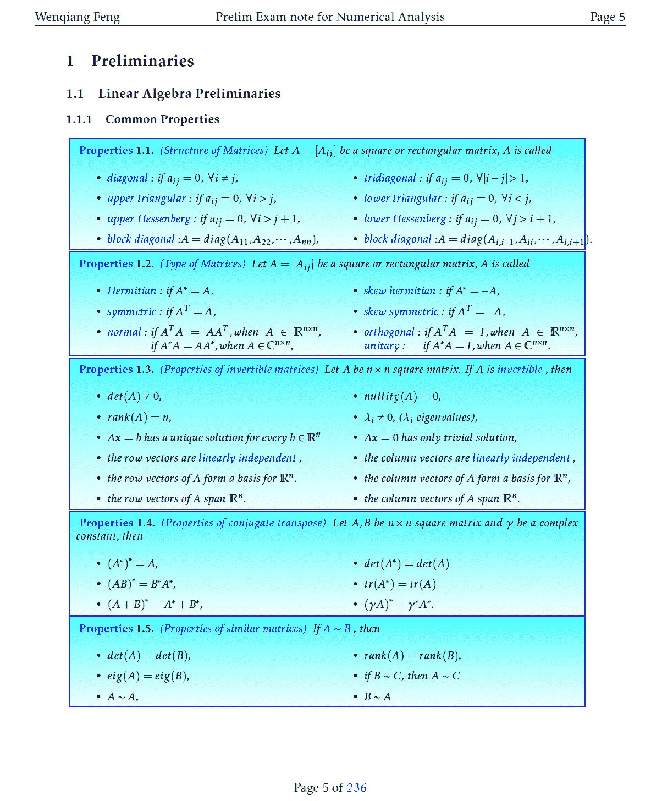
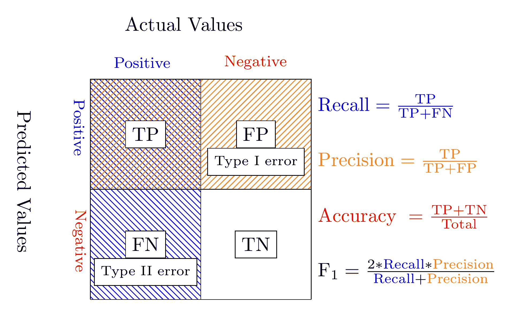

# 6\. 统计与线性代数预备

**知彼知己，百战不殆；不知彼而知己，一胜一负；不知彼，不知己，每战必殆。** – 《孙子兵法》

## 6.1\. 表示法

*   m：样本数
*   n：特征数
*   ：第`i`个标签
*   ：第`i`个预测标签
*   ： 的均值
*   ：标签向量
*   ：预测标签向量

## 6.2\. 线性代数预备

由于我在我的数值分析考试笔记中记录了线性代数预备，有兴趣的读者可以参考 [[Feng2014]](reference.html#feng2014)了解更多细节。

线性代数预备

## 6.3\. 测量公式

### 6.3.1\. 平均绝对误差

在统计学中，**MAE**（[平均绝对误差](https://en.wikipedia.org/wiki/Mean_absolute_error)）衡量两个连续变量间的差异。 平均绝对误差由下式给出：

### 6.3.2\. 均方误差

在统计中，估计器（估计未观测量的过程）的 **MSE**（[均方误差](https://en.wikipedia.org/wiki/Mean_squared_error)）测量了误差或偏差的平方的平均值 - 即估计器与被估计值之间的差异。

### 6.3.3\. 均方根误差

### 6.3.4\. 总体平方和

在统计数据分析中，**TSS**（[总体平方和](https://en.wikipedia.org/wiki/Total_sum_of_squares)）是一个数量，作为呈现此类分析结果的标准方式的一部分。 它被定义为在所有观察中，每个观测值与总体平均值的平方差的总和。

### 6.3.5\. 解释平方和

在统计学中，**ESS**（[解释平方和](https://en.wikipedia.org/wiki/Explained_sum_of_squares)），或者称为模型平方和或回归平方和。

ESS 是预测值和响应变量的均值的差的平方和，由下式给出：

### 6.3.6\. 残差平方和

在统计中，**RSS/SSR**（[残差平方和](https://en.wikipedia.org/wiki/Residual_sum_of_squares)），也称为预测误差平方和 预测（SSE），由下式给出：

### 6.3.7\. 判定系数 

> 注意
> 
> 一般来说，()，总体平方和，等于解释平方和加上残差平方和，也就是：

更多细节可以在[普通最小二乘模型中的分区](https://en.wikipedia.org/wiki/Explained_sum_of_squares)中找到。

## 6.4\. 混淆矩阵

混淆矩阵

### 6.4.1\. 召回率

### 6.4.2\. 精确率

### 6.4.3\. 准确率

### 6.4.4\. F1 得分

## 6.5\. 统计检验

### 6.5.1\. 互相关检验

*   Pearson 互相关: 检验两个连续变量之间的相关度。
*   Spearman 互相关: 检验两个序数变量之间的相关度（不依赖于正态分布数据的假设）。
*   卡方: 检验两个类别变量之间的相关度。

### 6.5.2\. 均值检验的比较

*   配对 T 检验: 检验两个相关变量之间的差异
*   独立 T 检验: 检验两个独立变量之间的差异
*   ANOVA: 在考虑结果变量中的任何其他变化之后，检验组均值之间的差异。

### 6.5.3\. 非配对检验

*   Wilcoxon 秩和检验: 检验两个独立变量之间的差异 - 考虑差异的大小和方向。
*   Wilcoxon 符号秩检验: 检验两个相关变量之间的差异 - 考虑差异的大小和方向。
*   符号检验: 检验两个相关变量是否不同 - 忽略变化大小，仅考虑方向。