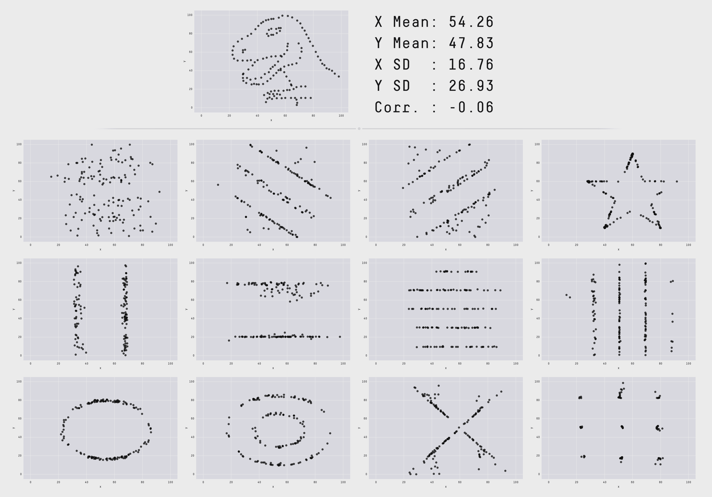

# 7\. 数据探索

**千里之行，始于足下。** – 《老子》

我不是说，理解你的数据集是数据科学中最困难的事情，但它非常重要且耗时。 数据探索是通过统计和可视化技术来描述数据。 我们探索数据来了解特征并将其带到我们的模型。

## 7.1\. 单变量分析

在数学中，单变量是指仅含一个变量的表达式，方程式，函数或多项式。 “Uni”表示“一个”，换句话说，您的数据只有一个变量。 因此，您无需在此步骤中处理原因或关系。单变量分析获取数据，逐个汇总变量（属性）并发现数据中的模式。

单变量数据中发现的模式可以通过多种方式描述，包括集中趋势（均值，众数和中值）和离散度：极差，方差，最大值，最小值，四分位数（包括四分位数极差），方差和标准差。 您还可以使用多个选项来视化和描述单变量数据。 如`频率分布表`，`条形图`，`直方图`，`频率多边形`，`扇形图`。

变量可以是分类变量或数值变量，我将演示不同的统计和可视化技术来研究变量的每种类型。

*   Jupyter 笔记本可以从[数据探索](_static/Data_exploration.ipynb)下载。
*   数据可以从 [German Credit](_static/german_credit.csv) 下载。

### 7.1.1\. 数值变量

**描述**

`pandas`和`spark`中的`describe`函数将给出大部分统计结果，例如最小值，中值，最大值，四分位数和标准差。 借助用户定义的函数，您可以获得更多的统计结果。

```py
# 为选择要展示的变量
num_cols = ['Account Balance','No of dependents']
df.select(num_cols).describe().show()

```

```py
+-------+------------------+-------------------+
|summary|   Account Balance|   No of dependents|
+-------+------------------+-------------------+
|  count|              1000|               1000|
|   mean|             2.577|              1.155|
| stddev|1.2576377271108936|0.36208577175319395|
|    min|                 1|                  1|
|    max|                 4|                  2|
+-------+------------------+-------------------+

```

您可能会发现 PySpark 中的默认函数不包含四分位数。 以下函数将帮助您在 Pandas 中获得相同的结果：

```py
def describe_pd(df_in, columns, deciles=False):
    '''
    Function to union the basic stats results and deciles
    :param df_in: the input dataframe
    :param columns: the cloumn name list of the numerical variable
    :param deciles: the deciles output

    :return : the numerical describe info. of the input dataframe

    :author: Ming Chen and Wenqiang Feng
    :email:  von198@gmail.com
    '''

    if deciles:
        percentiles = np.array(range(0, 110, 10))
    else:
        percentiles = [25, 50, 75]

    percs = np.transpose([np.percentile(df_in.select(x).collect(), percentiles) for x in columns])
    percs = pd.DataFrame(percs, columns=columns)
    percs['summary'] = [str(p) + '%' for p in percentiles]

    spark_describe = df_in.describe().toPandas()
    new_df = pd.concat([spark_describe, percs],ignore_index=True)
    new_df = new_df.round(2)
    return new_df[['summary'] + columns]

```

```py
describe_pd(df,num_cols)

```

```py
+-------+------------------+-----------------+
|summary|   Account Balance| No of dependents|
+-------+------------------+-----------------+
|  count|            1000.0|           1000.0|
|   mean|             2.577|            1.155|
| stddev|1.2576377271108936|0.362085771753194|
|    min|               1.0|              1.0|
|    max|               4.0|              2.0|
|    25%|               1.0|              1.0|
|    50%|               2.0|              1.0|
|    75%|               4.0|              1.0|
+-------+------------------+-----------------+

```

有时，由于机密数据问题，您无法提供真实数据，您的客户可能会请求更多统计结果，例如“十分位数”。 您可以应用以下函数来实现它。

```py
describe_pd(df,num_cols,deciles=True)

```

```py
+-------+------------------+-----------------+
|summary|   Account Balance| No of dependents|
+-------+------------------+-----------------+
|  count|            1000.0|           1000.0|
|   mean|             2.577|            1.155|
| stddev|1.2576377271108936|0.362085771753194|
|    min|               1.0|              1.0|
|    max|               4.0|              2.0|
|     0%|               1.0|              1.0|
|    10%|               1.0|              1.0|
|    20%|               1.0|              1.0|
|    30%|               2.0|              1.0|
|    40%|               2.0|              1.0|
|    50%|               2.0|              1.0|
|    60%|               3.0|              1.0|
|    70%|               4.0|              1.0|
|    80%|               4.0|              1.0|
|    90%|               4.0|              2.0|
|   100%|               4.0|              2.0|
+-------+------------------+-----------------+

```

*   偏度和峰度

    这个小节来自维基百科[偏度](https://en.wikipedia.org/wiki/Skewness)。

    在概率论和统计学中，偏度是实值随机变量概率分布关于其均值的不对称性的度量。 偏度值可以是正数或负数，或者是未定义的。对于单峰分布，负偏度通常表示尾部位于分布的左侧，而正偏度表示尾部位于右侧。

    考虑下图中的两个分布。 在每个图中，分布右侧的值与左侧的值不同。 这些逐渐变细的一端称为尾部，它们提供了一种可视方法来确定分布中的两种偏斜中的哪一种：
    
    1.  负偏度：左尾较长；分布的质量集中在图的右侧。尽管曲线本身看起来是向右倾斜的，但这种分布成为左倾的。左是指尾部向左侧延伸，并且通常，平均值偏向数据的典型中心的左侧。 左倾分布通常表现为右倾曲线。
    2.  正偏度：右尾更长; 分布的质量集中在图的左侧。尽管曲线本身看起来是向左倾斜的，但这种分布成为右倾的。右边是指尾部向右侧延伸，通常，平均值偏向于典型数据中心的右侧。 右倾分布通常表现为左倾曲线。

    这一小节来自维基百科[峰度](https://en.wikipedia.org/wiki/Kurtosis)。

    在概率论和统计学中，峰度（kyrtos 或 kurtos，意思是“弯曲的，拱形的”）是实值随机变量的概率分布的“尾部”的度量。 与偏度概念类似，峰度描述概率分布形状，正如偏度一样，有不同的方法来量化它的理论分布，和相应的方法来估计它来自一个样本总体。


```py
from pyspark.sql.functions import col, skewness, kurtosis
df.select(skewness(var),kurtosis(var)).show()

```

```py
+---------------------+---------------------+
|skewness(Age (years))|kurtosis(Age (years))|
+---------------------+---------------------+
|   1.0231743160548064|   0.6114371688367672|
+---------------------+---------------------+

```

> 警告

**有时统计量可能产生误导！**

F. J. Anscombe 曾经说到执行计算和制作图表。 应研究两种结果；每个都有助于理解。 图[相同统计量的不同图表](#fig-misleading)（Datasaurus，和 12 个其他东西）中的这 13 个数据集各自具有相同的汇总统计量（`x/y`均值，`x/y`标准差和 Pearson 相关性），虽然外观完全不同。 这项工作描述了我们开发的技术，用于创建此数据集，以及其他类似的数据集。 更多细节和有趣的结果可以在[相同统计量和不同图表](https://www.autodeskresearch.com/publications/samestats)中找到。



相同统计量和不同图表

**直方图**

> 警告
> 
> **直方图经常和条形图混淆！**

直方图和条形图之间的根本区别，将帮助您轻松识别两者，条形图中的条形之间存在间隙，但在直方图中，条形彼此相邻。 感兴趣的读者可以参考[直方图和条形图之间的差异](https://keydifferences.com/difference-between-histogram-and-bar-graph.html)。

```py
var = 'Age (years)'
x = data1[var]
bins = np.arange(0, 100, 5.0)

plt.figure(figsize=(10,8))
# 数据直方图
plt.hist(x, bins, alpha=0.8, histtype='bar', color='gold',
         ec='black',weights=np.zeros_like(x) + 100\. / x.size)

plt.xlabel(var)
plt.ylabel('percentage')
plt.xticks(bins)
plt.show()

fig.savefig(var+".pdf", bbox_inches='tight')

```


```py
var = 'Age (years)'
x = data1[var]
bins = np.arange(0, 100, 5.0)

########################################################################
hist, bin_edges = np.histogram(x,bins,
                               weights=np.zeros_like(x) + 100\. / x.size)
# 生成直方图

fig = plt.figure(figsize=(20, 8))
ax = fig.add_subplot(1, 2, 1)

# 绘制高度与 x 轴上的整数的直方图
ax.bar(range(len(hist)),hist,width=1,alpha=0.8,ec ='black', color='gold')
# 将刻度设在条形中间
ax.set_xticks([0.5+i for i,j in enumerate(hist)])
# 将 xticklabels 设置为一个字符串，告诉我们桶的边缘是什么
labels =['{}'.format(int(bins[i+1])) for i,j in enumerate(hist)]
labels.insert(0,'0')
ax.set_xticklabels(labels)
plt.xlabel(var)
plt.ylabel('percentage')

########################################################################

hist, bin_edges = np.histogram(x,bins) # 生成直方图

ax = fig.add_subplot(1, 2, 2)
# 绘制高度与 x 轴上的整数的直方图
ax.bar(range(len(hist)),hist,width=1,alpha=0.8,ec ='black', color='gold')

# 将刻度设在条形中间
ax.set_xticks([0.5+i for i,j in enumerate(hist)])

# 将 xticklabels 设置为一个字符串，告诉我们桶的边缘是什么
labels =['{}'.format(int(bins[i+1])) for i,j in enumerate(hist)]
labels.insert(0,'0')
ax.set_xticklabels(labels)
plt.xlabel(var)
plt.ylabel('count')
plt.suptitle('Histogram of {}: Left with percentage output;Right with count output'
             .format(var), size=16)
plt.show()

fig.savefig(var+".pdf", bbox_inches='tight')

```


有时，有些人会要求您绘制不等宽度的条形（直方图的无效参数）。 你仍然可以通过以下方法实现它。

```py
var = 'Credit Amount'
plot_data = df.select(var).toPandas()
x= plot_data[var]

bins =[0,200,400,600,700,800,900,1000,2000,3000,4000,5000,6000,10000,25000]

hist, bin_edges = np.histogram(x,bins,weights=np.zeros_like(x) + 100\. / x.size) # make the histogram

fig = plt.figure(figsize=(10, 8))
ax = fig.add_subplot(1, 1, 1)
# 绘制高度与 x 轴上的整数的直方图
ax.bar(range(len(hist)),hist,width=1,alpha=0.8,ec ='black',color = 'gold')

# 将刻度设在条形中间
ax.set_xticks([0.5+i for i,j in enumerate(hist)])

# 将 xticklabels 设置为一个字符串，告诉我们桶的边缘是什么
#labels =['{}k'.format(int(bins[i+1]/1000)) for i,j in enumerate(hist)]
labels =['{}'.format(bins[i+1]) for i,j in enumerate(hist)]
labels.insert(0,'0')
ax.set_xticklabels(labels)
#plt.text(-0.6, -1.4,'0')
plt.xlabel(var)
plt.ylabel('percentage')
plt.show()

```


**箱形图和提琴图**

请注意，虽然提琴图与 Tukey（1977）的箱形图密切相关，但提琴图可以显示比箱形图更多的信息。 当我们进行探索性分析时，没有样本的知识。 因此，样本分布不能假设为正态分布，并且通常当您获得大数据时，正态分布将在箱形图中显示一些溢出。

然而，对于较小的样本大小，提琴图可能会产生误导，其中即使在为标准正常数据生成时，密度图也可能显示出有趣的特征（以及其中的分组差异）。 一些作者建议样本量应大于 250（例如，`n> 250`或理想情况甚至更大）。其中核密度图提供了分布的合理准确表示，可能表现诸如双峰性或其他形式的细微差别，它在箱形图中是不可见的或不太清楚。 更多细节可以在[箱形图和小提琴图的简单比较]中找到(https://figshare.com/articles/A_simple_comparison_of_box_plots_and_violin_plots/1544525)。

```py
x = df.select(var).toPandas()

fig = plt.figure(figsize=(20, 8))
ax = fig.add_subplot(1, 2, 1)
ax = sns.boxplot(data=x)

ax = fig.add_subplot(1, 2, 2)
ax = sns.violinplot(data=x)

```


### 7.1.2\. 类别变量

与数值变量相比，分类变量更容易进行探索。

**频率表**

```py
from pyspark.sql import functions as F
from pyspark.sql.functions import rank,sum,col
from pyspark.sql import Window

window = Window.rowsBetween(Window.unboundedPreceding,Window.unboundedFollowing)
# withColumn('Percent %',F.format_string("%5.0f%%\n",col('Credit_num')*100/col('total'))).\
tab = df.select(['age_class','Credit Amount']).\
   groupBy('age_class').\
   agg(F.count('Credit Amount').alias('Credit_num'),
       F.mean('Credit Amount').alias('Credit_avg'),
       F.min('Credit Amount').alias('Credit_min'),
       F.max('Credit Amount').alias('Credit_max')).\
   withColumn('total',sum(col('Credit_num')).over(window)).\
   withColumn('Percent',col('Credit_num')*100/col('total')).\
   drop(col('total'))

```

```py
+---------+----------+------------------+----------+----------+-------+
|age_class|Credit_num|        Credit_avg|Credit_min|Credit_max|Percent|
+---------+----------+------------------+----------+----------+-------+
|    45-54|       120|3183.0666666666666|       338|     12612|   12.0|
|      <25|       150| 2970.733333333333|       276|     15672|   15.0|
|    55-64|        56| 3493.660714285714|       385|     15945|    5.6|
|    35-44|       254| 3403.771653543307|       250|     15857|   25.4|
|    25-34|       397| 3298.823677581864|       343|     18424|   39.7|
|      65+|        23|3210.1739130434785|       571|     14896|    2.3|
+---------+----------+------------------+----------+----------+-------+

```

**扇形图**

```py
# 要绘制的数据
labels = plot_data.age_class
sizes =  plot_data.Percent
colors = ['gold', 'yellowgreen', 'lightcoral','blue', 'lightskyblue','green','red']
explode = (0, 0.1, 0, 0,0,0)  # explode 1st slice

# 绘制
plt.figure(figsize=(10,8))
plt.pie(sizes, explode=explode, labels=labels, colors=colors,
        autopct='%1.1f%%', shadow=True, startangle=140)

plt.axis('equal')
plt.show()

```


**条形图**

```py
labels = plot_data.age_class
missing = plot_data.Percent
ind = [x for x, _ in enumerate(labels)]

plt.figure(figsize=(10,8))
plt.bar(ind, missing, width=0.8, label='missing', color='gold')

plt.xticks(ind, labels)
plt.ylabel("percentage")

plt.show()

```


```py
labels = ['missing', '<25', '25-34', '35-44', '45-54','55-64','65+']
missing = np.array([0.000095, 0.024830, 0.028665, 0.029477, 0.031918,0.037073,0.026699])
man = np.array([0.000147, 0.036311, 0.038684, 0.044761, 0.051269, 0.059542, 0.054259])
women = np.array([0.004035, 0.032935, 0.035351, 0.041778, 0.048437, 0.056236,0.048091])
ind = [x for x, _ in enumerate(labels)]

plt.figure(figsize=(10,8))
plt.bar(ind, women, width=0.8, label='women', color='gold', bottom=man+missing)
plt.bar(ind, man, width=0.8, label='man', color='silver', bottom=missing)
plt.bar(ind, missing, width=0.8, label='missing', color='#CD853F')

plt.xticks(ind, labels)
plt.ylabel("percentage")
plt.legend(loc="upper left")
plt.title("demo")

plt.show()

```


## 7.2\. 多变量分析

在本节中，我将仅演示双变量分析。 由于多变量分析由双变量派生。

### 7.2.1\. 数值 VS 数值

**相关矩阵**

```py
from pyspark.mllib.stat import Statistics
import pandas as pd

corr_data = df.select(num_cols)

col_names = corr_data.columns
features = corr_data.rdd.map(lambda row: row[0:])
corr_mat=Statistics.corr(features, method="pearson")
corr_df = pd.DataFrame(corr_mat)
corr_df.index, corr_df.columns = col_names, col_names

print(corr_df.to_string())

```

```py
+--------------------+--------------------+
|     Account Balance|    No of dependents|
+--------------------+--------------------+
|                 1.0|-0.01414542650320914|
|-0.01414542650320914|                 1.0|
+--------------------+--------------------+

```

**散点图**

```py
import seaborn as sns
sns.set(style="ticks")

df = sns.load_dataset("iris")
sns.pairplot(df, hue="species")
plt.show()

```


### 7.2.2\. 类别 VS 类别

**卡方检验**

> 警告
> 
> `pyspark.ml.stat` 只在 Spark 2.4.0 中可用。

```py
from pyspark.ml.linalg import Vectors
from pyspark.ml.stat import ChiSquareTest

data = [(0.0, Vectors.dense(0.5, 10.0)),
        (0.0, Vectors.dense(1.5, 20.0)),
        (1.0, Vectors.dense(1.5, 30.0)),
        (0.0, Vectors.dense(3.5, 30.0)),
        (0.0, Vectors.dense(3.5, 40.0)),
        (1.0, Vectors.dense(3.5, 40.0))]
df = spark.createDataFrame(data, ["label", "features"])

r = ChiSquareTest.test(df, "features", "label").head()
print("pValues: " + str(r.pValues))
print("degreesOfFreedom: " + str(r.degreesOfFreedom))
print("statistics: " + str(r.statistics))

```

```py
pValues: [0.687289278791,0.682270330336]
degreesOfFreedom: [2, 3]
statistics: [0.75,1.5]

```

**交叉表**

```py
df.stat.crosstab("age_class", "Occupation").show()

```

```py
+--------------------+---+---+---+---+
|age_class_Occupation|  1|  2|  3|  4|
+--------------------+---+---+---+---+
|                 <25|  4| 34|108|  4|
|               55-64|  1| 15| 31|  9|
|               25-34|  7| 61|269| 60|
|               35-44|  4| 58|143| 49|
|                 65+|  5|  3|  6|  9|
|               45-54|  1| 29| 73| 17|
+--------------------+---+---+---+---+

```

**堆栈图**

```py
labels = ['missing', '<25', '25-34', '35-44', '45-54','55-64','65+']
missing = np.array([0.000095, 0.024830, 0.028665, 0.029477, 0.031918,0.037073,0.026699])
man = np.array([0.000147, 0.036311, 0.038684, 0.044761, 0.051269, 0.059542, 0.054259])
women = np.array([0.004035, 0.032935, 0.035351, 0.041778, 0.048437, 0.056236,0.048091])
ind = [x for x, _ in enumerate(labels)]

plt.figure(figsize=(10,8))
plt.bar(ind, women, width=0.8, label='women', color='gold', bottom=man+missing)
plt.bar(ind, man, width=0.8, label='man', color='silver', bottom=missing)
plt.bar(ind, missing, width=0.8, label='missing', color='#CD853F')

plt.xticks(ind, labels)
plt.ylabel("percentage")
plt.legend(loc="upper left")
plt.title("demo")

plt.show()

```


