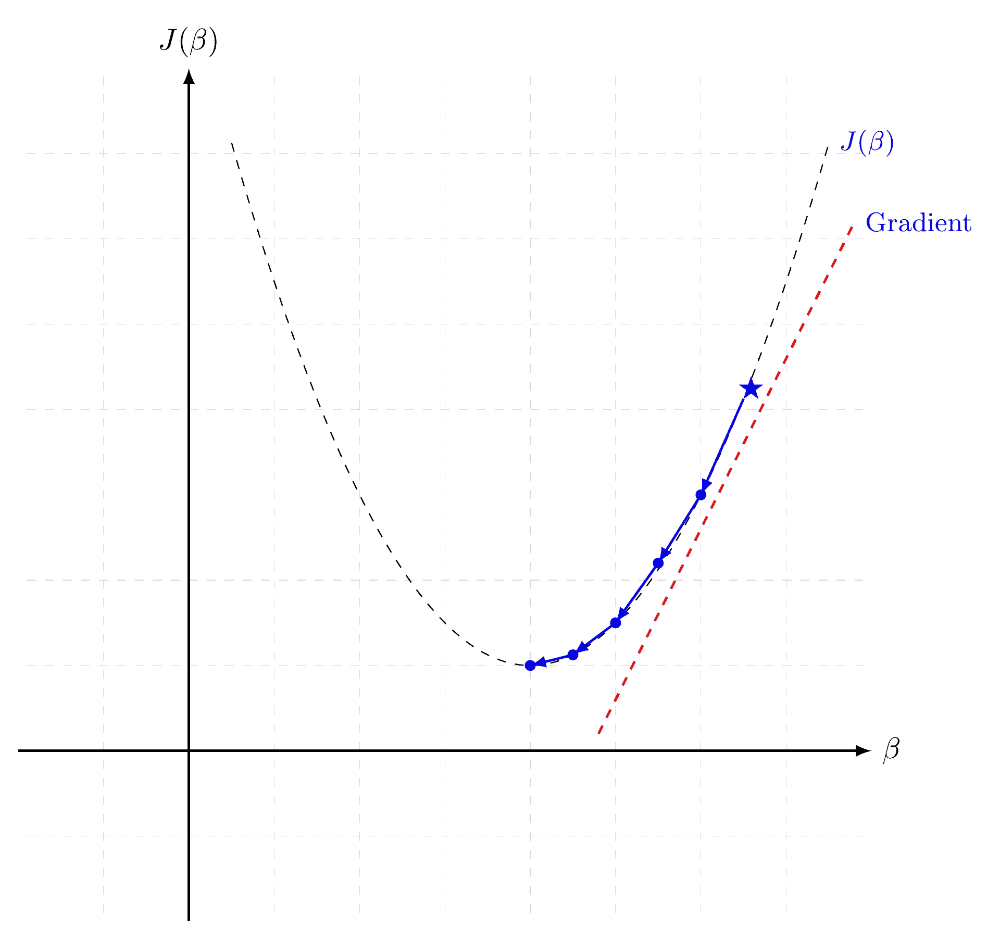
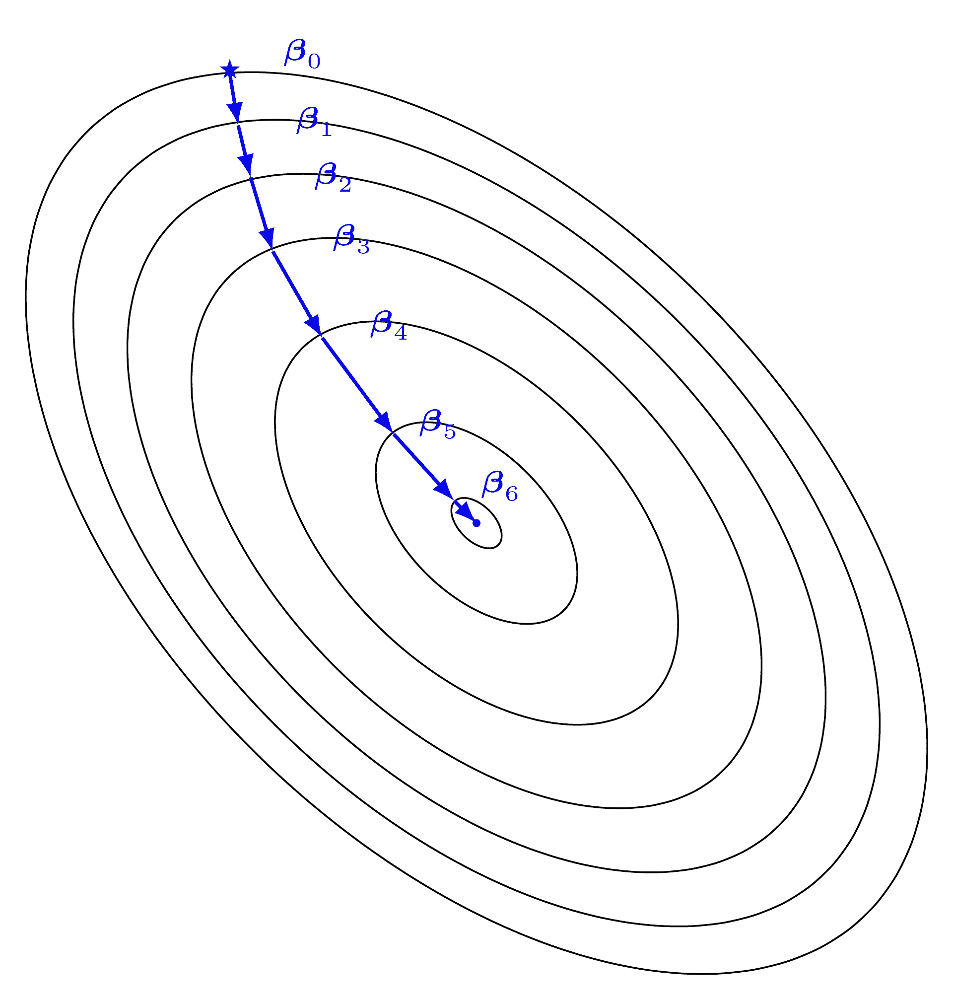
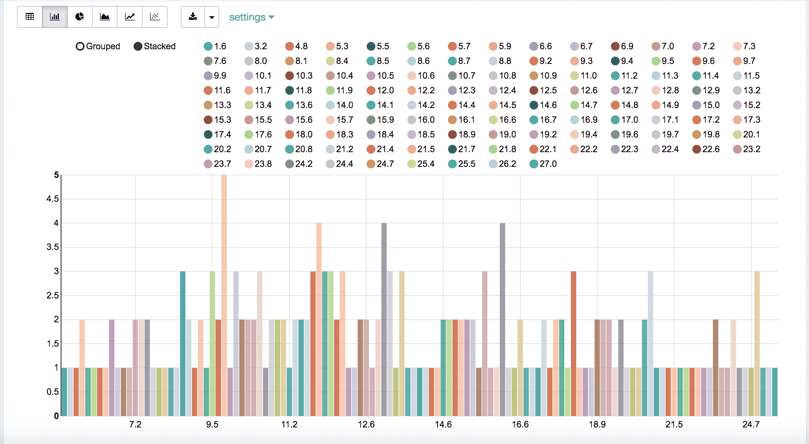

# 8\. Regression

Chinese proverb

**A journey of a thousand miles begins with a single step.** – old Chinese proverb

In statistical modeling, regression analysis focuses on investigating the relationship between a dependent variable and one or more independent variables. [Wikipedia Regression analysis](https://en.wikipedia.org/wiki/Regression_analysis)

In data mining, Regression is a model to represent the relationship between the value of lable ( or target, it is numerical variable) and on one or more features (or predictors they can be numerical and categorical variables).

## 8.1\. Linear Regression

### 8.1.1\. Introduction

Given that a data set  which contains n features (variables) and m samples (data points), in simple linear regression model for modeling  data points with  independent variables: , the formula is given by:

> 

In matrix notation, the data set is written as ![\X = [\x_1,\cdots, \x_n]](img/80a25ad6329d3836f4e625a1c93e7898.jpg) with ,  (see Fig. [Feature matrix and label](#fig-fm)) and . Then the matrix format equation is written as

> (1)


Feature matrix and label

### 8.1.2\. How to solve it?

1.  Direct Methods (For more information please refer to my [Prelim Notes for Numerical Analysis](http://web.utk.edu/~wfeng1/doc/PrelimNum.pdf))

    &gt; *   For squared or rectangular matrices
    &gt;     
    &gt;     
    &gt;     
    &gt;     &gt; *   Singular Value Decomposition
    &gt;     &gt; *   Gram-Schmidt orthogonalization
    &gt;     &gt; *   QR Decomposition
    &gt;     
    &gt;     
    &gt; *   For squared matrices
    &gt;     
    &gt;     
    &gt;     
    &gt;     &gt; *   LU Decomposition
    &gt;     &gt; *   Cholesky Decomposition
    &gt;     &gt; *   Regular Splittings

2.  Iterative Methods

    &gt; *   Stationary cases iterative method
    &gt;     
    &gt;     
    &gt;     
    &gt;     &gt; *   Jacobi Method
    &gt;     &gt; *   Gauss-Seidel Method
    &gt;     &gt; *   Richardson Method
    &gt;     &gt; *   Successive Over Relaxation (SOR) Method
    &gt;     
    &gt;     
    &gt; *   Dynamic cases iterative method
    &gt;     
    &gt;     
    &gt;     
    &gt;     &gt; *   Chebyshev iterative Method
    &gt;     &gt; *   Minimal residuals Method
    &gt;     &gt; *   Minimal correction iterative method
    &gt;     &gt; *   Steepest Descent Method
    &gt;     &gt; *   Conjugate Gradients Method

### 8.1.3\. Ordinary Least Squares

In mathematics, [(1)](#equation-eq-ax) is a overdetermined system. The method of ordinary least squares can be used to find an approximate solution to overdetermined systems. For the system overdetermined system [(1)](#equation-eq-ax), the least squares formula is obtained from the problem

(2)

the solution of which can be written with the normal equations:

(3)

where  indicates a matrix transpose, provided  exists (that is, provided  has full column rank).

Note

Actually, [(3)](#equation-eq-solax) can be derivated by the following way: multiply  on side of [(1)](#equation-eq-ax) and then multiply  on both side of the former result. You may also apply the `Extreme Value Theorem` to [(2)](#equation-eq-minax) and find the solution [(3)](#equation-eq-solax).

### 8.1.4\. Gradient Descent

Let’s use the following hypothesis:


Then, solving [(2)](#equation-eq-minax) is equivalent to minimize the following `cost fucntion` :

### 8.1.5\. Cost Function

(4)

Note

The reason why we prefer to solve [(4)](#equation-eq-lreg-cost) rather than [(2)](#equation-eq-minax) is because [(4)](#equation-eq-lreg-cost) is convex and it has some nice properties, such as it’s uniquely solvable and energy stable for small enough learning rate. the interested reader who has great interest in non-convex cost function (energy) case. is referred to [[Feng2016PSD]](reference.html#feng2016psd) for more details.



Gradient Descent in 1D



Gradient Descent in 2D

### 8.1.6\. Batch Gradient Descent

Gradient descent is a first-order iterative optimization algorithm for finding the minimum of a function. It searchs with the direction of the steepest desscent which is defined by the `negative of the gradient` (see Fig. [Gradient Descent in 1D](#fig-gd1d) and [Gradient Descent in 2D](#fig-gd2d) for 1D and 2D, respectively) and with learning rate (search step) .

### 8.1.7\. Stochastic Dradient Descent

### 8.1.8\. Mini-batch Gradient Descent

### 8.1.9\. Demo

*   The Jupyter notebook can be download from [Linear Regression](_static/LinearRegression.ipynb) which was implemented without using Pipeline.
*   The Jupyter notebook can be download from [Linear Regression with Pipeline](_static/LinearRegressionWpipeline.ipynb) which was implemented with using Pipeline.
*   I will only present the code with pipeline style in the following.
*   For more details about the parameters, please visit [Linear Regression API](http://takwatanabe.me/pyspark/generated/generated/ml.regression.LinearRegression.html) .

建立 spark 上下文和 SparkSession

```
from pyspark.sql import SparkSession

spark = SparkSession \
    .builder \
    .appName("Python Spark regression example") \
    .config("spark.some.config.option", "some-value") \
    .getOrCreate()

```

加载数据集

```
df = spark.read.format('com.databricks.spark.csv').\
                       options(header='true', \
                       inferschema='true').\
            load("../data/Advertising.csv",header=True);

```

检查数据集

```
df.show(5,True)
df.printSchema()

```

之后我们会得到

```
+-----+-----+---------+-----+
|   TV|Radio|Newspaper|Sales|
+-----+-----+---------+-----+
|230.1| 37.8|     69.2| 22.1|
| 44.5| 39.3|     45.1| 10.4|
| 17.2| 45.9|     69.3|  9.3|
|151.5| 41.3|     58.5| 18.5|
|180.8| 10.8|     58.4| 12.9|
+-----+-----+---------+-----+
only showing top 5 rows

root
 |-- TV: double (nullable = true)
 |-- Radio: double (nullable = true)
 |-- Newspaper: double (nullable = true)
 |-- Sales: double (nullable = true)

```

您还可以从数据帧中获取统计结果（不幸的是，它仅适用于数字）。

```
df.describe().show()

```

之后你会得到

```
+-------+-----------------+------------------+------------------+------------------+
|summary|               TV|             Radio|         Newspaper|             Sales|
+-------+-----------------+------------------+------------------+------------------+
|  count|              200|               200|               200|               200|
|   mean|         147.0425|23.264000000000024|30.553999999999995|14.022500000000003|
| stddev|85.85423631490805|14.846809176168728| 21.77862083852283| 5.217456565710477|
|    min|              0.7|               0.0|               0.3|               1.6|
|    max|            296.4|              49.6|             114.0|              27.0|
+-------+-----------------+------------------+------------------+------------------+

```



销售分布

将数据转换为密集向量（**特征**和**标签**）

```
from pyspark.sql import Row
from pyspark.ml.linalg import Vectors

# I provide two ways to build the features and labels

# method 1 (good for small feature):
#def transData(row):
#    return Row(label=row["Sales"],
#               features=Vectors.dense([row["TV"],
#                                       row["Radio"],
#                                       row["Newspaper"]]))

# Method 2 (good for large features):
def transData(data):
return data.rdd.map(lambda r: [Vectors.dense(r[:-1]),r[-1]]).toDF(['features','label'])

```

> 注意
> 
> 强烈建议您尝试使用我的`get_dummy`函数来处理数据集中的分类数据。

监督学习版本：

```
def get_dummy(df,indexCol,categoricalCols,continuousCols,labelCol):

    from pyspark.ml import Pipeline
    from pyspark.ml.feature import StringIndexer, OneHotEncoder, VectorAssembler
    from pyspark.sql.functions import col

    indexers = [ StringIndexer(inputCol=c, outputCol="{0}_indexed".format(c))
                 for c in categoricalCols ]

    # default setting: dropLast=True
    encoders = [ OneHotEncoder(inputCol=indexer.getOutputCol(),
                 outputCol="{0}_encoded".format(indexer.getOutputCol()))
                 for indexer in indexers ]

    assembler = VectorAssembler(inputCols=[encoder.getOutputCol() for encoder in encoders]
                                + continuousCols, outputCol="features")

    pipeline = Pipeline(stages=indexers + encoders + [assembler])

    model=pipeline.fit(df)
    data = model.transform(df)

    data = data.withColumn('label',col(labelCol))

    return data.select(indexCol,'features','label')

```

无监督学习版本：

```
def get_dummy(df,indexCol,categoricalCols,continuousCols):
    '''
    Get dummy variables and concat with continuous variables for unsupervised learning.
    :param df: the dataframe
    :param categoricalCols: the name list of the categorical data
    :param continuousCols:  the name list of the numerical data
    :return k: feature matrix

    :author: Wenqiang Feng
    :email:  von198@gmail.com
    '''

    indexers = [ StringIndexer(inputCol=c, outputCol="{0}_indexed".format(c))
                 for c in categoricalCols ]

    # default setting: dropLast=True
    encoders = [ OneHotEncoder(inputCol=indexer.getOutputCol(),
                 outputCol="{0}_encoded".format(indexer.getOutputCol()))
                 for indexer in indexers ]

    assembler = VectorAssembler(inputCols=[encoder.getOutputCol() for encoder in encoders]
                                + continuousCols, outputCol="features")

    pipeline = Pipeline(stages=indexers + encoders + [assembler])

    model=pipeline.fit(df)
    data = model.transform(df)

    return data.select(indexCol,'features')

```

将数据集转换为数据帧

```
transformed= transData(df)
transformed.show(5)

```

```
+-----------------+-----+
|         features|label|
+-----------------+-----+
|[230.1,37.8,69.2]| 22.1|
| [44.5,39.3,45.1]| 10.4|
| [17.2,45.9,69.3]|  9.3|
|[151.5,41.3,58.5]| 18.5|
|[180.8,10.8,58.4]| 12.9|
+-----------------+-----+
only showing top 5 rows

```

> 注意
> 
> 您会发现 Spark 中所有监督机器学习算法都基于**特征**和**标签**（Spark 中的无监督机器学习算法基于**特征**）。 也就是说，当您在管道架构中准备好**特征**和**标签**时，您可以使用 Spark 中的所有机器学习算法。

处理类别变量

```
from pyspark.ml import Pipeline
from pyspark.ml.regression import LinearRegression
from pyspark.ml.feature import VectorIndexer
from pyspark.ml.evaluation import RegressionEvaluator

# Automatically identify categorical features, and index them.
# We specify maxCategories so features with > 4 distinct values are treated as continuous.

featureIndexer = VectorIndexer(inputCol="features", \
                               outputCol="indexedFeatures",\
                               maxCategories=4).fit(transformed)

data = featureIndexer.transform(transformed)

```

现在你可以这样检查数据集

```
data.show(5,True)

```

你会得到

```
+-----------------+-----+-----------------+
|         features|label|  indexedFeatures|
+-----------------+-----+-----------------+
|[230.1,37.8,69.2]| 22.1|[230.1,37.8,69.2]|
| [44.5,39.3,45.1]| 10.4| [44.5,39.3,45.1]|
| [17.2,45.9,69.3]|  9.3| [17.2,45.9,69.3]|
|[151.5,41.3,58.5]| 18.5|[151.5,41.3,58.5]|
|[180.8,10.8,58.4]| 12.9|[180.8,10.8,58.4]|
+-----------------+-----+-----------------+
only showing top 5 rows

```

将数据分割为训练和测试集（留出 40% 用于测试）

```
# Split the data into training and test sets (40% held out for testing)
(trainingData, testData) = transformed.randomSplit([0.6, 0.4])

```

您可以按照以下方式检查您的训练和测试数据（在我看来，在原型阶段始终跟踪您的数据总是很好）：

```
trainingData.show(5)
testData.show(5)

```

之后你会得到

```
+---------------+-----+---------------+
|       features|label|indexedFeatures|
+---------------+-----+---------------+
| [4.1,11.6,5.7]|  3.2| [4.1,11.6,5.7]|
| [5.4,29.9,9.4]|  5.3| [5.4,29.9,9.4]|
|[7.3,28.1,41.4]|  5.5|[7.3,28.1,41.4]|
|[7.8,38.9,50.6]|  6.6|[7.8,38.9,50.6]|
|  [8.6,2.1,1.0]|  4.8|  [8.6,2.1,1.0]|
+---------------+-----+---------------+
only showing top 5 rows

+----------------+-----+----------------+
|        features|label| indexedFeatures|
+----------------+-----+----------------+
|  [0.7,39.6,8.7]|  1.6|  [0.7,39.6,8.7]|
|  [8.4,27.2,2.1]|  5.7|  [8.4,27.2,2.1]|
|[11.7,36.9,45.2]|  7.3|[11.7,36.9,45.2]|
|[13.2,15.9,49.6]|  5.6|[13.2,15.9,49.6]|
|[16.9,43.7,89.4]|  8.7|[16.9,43.7,89.4]|
+----------------+-----+----------------+
only showing top 5 rows

```

拟合普通最小二乘回归模型

参数的更多信息请见[线性回归 API](http://takwatanabe.me/pyspark/generated/generated/ml.regression.LinearRegression.html)。

```
# Import LinearRegression class
from pyspark.ml.regression import LinearRegression

# Define LinearRegression algorithm
lr = LinearRegression()

```

流水线架构

```
# Chain indexer and tree in a Pipeline
pipeline = Pipeline(stages=[featureIndexer, lr])

model = pipeline.fit(trainingData)

```

模型总结

Spark 不擅长数据和模型的汇总。 我为 PySpark 中线性回归写了一个汇总函数，其格式与 **R** 的输出类似。

```
def modelsummary(model):
    import numpy as np
    print ("Note: the last rows are the information for Intercept")
    print ("##","-------------------------------------------------")
    print ("##","  Estimate   |   Std.Error | t Values  |  P-value")
    coef = np.append(list(model.coefficients),model.intercept)
    Summary=model.summary

    for i in range(len(Summary.pValues)):
        print ("##",'{:10.6f}'.format(coef[i]),\
        '{:10.6f}'.format(Summary.coefficientStandardErrors[i]),\
        '{:8.3f}'.format(Summary.tValues[i]),\
        '{:10.6f}'.format(Summary.pValues[i]))

    print ("##",'---')
    print ("##","Mean squared error: % .6f" \
           % Summary.meanSquaredError, ", RMSE: % .6f" \
           % Summary.rootMeanSquaredError )
    print ("##","Multiple R-squared: %f" % Summary.r2, ", \
            Total iterations: %i"% Summary.totalIterations)

```

```
modelsummary(model.stages[-1])

```

你会得到以下结果：

```
Note: the last rows are the information for Intercept
('##', '-------------------------------------------------')
('##', '  Estimate   |   Std.Error | t Values  |  P-value')
('##', '  0.044186', '  0.001663', '  26.573', '  0.000000')
('##', '  0.206311', '  0.010846', '  19.022', '  0.000000')
('##', '  0.001963', '  0.007467', '   0.263', '  0.793113')
('##', '  2.596154', '  0.379550', '   6.840', '  0.000000')
('##', '---')
('##', 'Mean squared error:  2.588230', ', RMSE:  1.608798')
('##', 'Multiple R-squared: 0.911869', ',             Total iterations: 1')

```

做出预测

```
# Make predictions.
predictions = model.transform(testData)

```

```
# Select example rows to display.
predictions.select("features","label","predictedLabel").show(5)

```

```
+----------------+-----+------------------+
|        features|label|        prediction|
+----------------+-----+------------------+
|  [0.7,39.6,8.7]|  1.6| 10.81405928637388|
|  [8.4,27.2,2.1]|  5.7| 8.583086404079918|
|[11.7,36.9,45.2]|  7.3|10.814712818232422|
|[13.2,15.9,49.6]|  5.6| 6.557106943899219|
|[16.9,43.7,89.4]|  8.7|12.534151375058645|
+----------------+-----+------------------+
only showing top 5 rows

```

评估

```
from pyspark.ml.evaluation import RegressionEvaluator
# Select (prediction, true label) and compute test error
evaluator = RegressionEvaluator(labelCol="label",
                                predictionCol="prediction",
                                metricName="rmse")

rmse = evaluator.evaluate(predictions)
print("Root Mean Squared Error (RMSE) on test data = %g" % rmse)

```

最终的均方根误差（RMSE）如下：

```
Root Mean Squared Error (RMSE) on test data = 1.63114

```

您还可以检查测试数据的 .toPandas()
y_pred = predictions.select("prediction").toPandas()

import sklearn.metrics
r2_score = sklearn.metrics.r2_score(y_true, y_pred)
print('r2_score: {0}'.format(r2_score))

```

之后你会得到

```
r2_score: 0.854486655585

```

> 警告
> 
> 你应该知道，模型不包含截距时，大多数软件使用不同的公式来计算  值。你可以从[ StackExchange 上的讨论](https://stats.stackexchange.com/questions/26176/removal-of-statistically-significant-intercept-term-increases-r2-in-linear-mo)获得更多信息。

## 8.2\. 广义线性回归

### 8.2.1\. 介绍

### 8.2.2\. 如何求解

### 8.2.3\. 示例

*   Jupyter 笔记本可以从[广义线性回归](_static/GLM.ipynb)下载。
*   参数的更多信息请见[广义线性回归 API](http://takwatanabe.me/pyspark/generated/generated/ml.regression.GeneralizedLinearRegression.html)。

建立 spark 上下文和 SparkSession

```
from pyspark.sql import SparkSession

spark = SparkSession \
    .builder \
    .appName("Python Spark regression example") \
    .config("spark.some.config.option", "some-value") \
    .getOrCreate()

```

加载数据集

```
df = spark.read.format('com.databricks.spark.csv').\
                       options(header='true', \
                       inferschema='true').\
            load("../data/Advertising.csv",header=True);

```

查看数据集

```
df.show(5,True)
df.printSchema()

```

之后你会得到


```
+-----+-----+---------+-----+
|   TV|Radio|Newspaper|Sales|
+-----+-----+---------+-----+
|230.1| 37.8|     69.2| 22.1|
| 44.5| 39.3|     45.1| 10.4|
| 17.2| 45.9|     69.3|  9.3|
|151.5| 41.3|     58.5| 18.5|
|180.8| 10.8|     58.4| 12.9|
+-----+-----+---------+-----+
only showing top 5 rows

root
 |-- TV: double (nullable = true)
 |-- Radio: double (nullable = true)
 |-- Newspaper: double (nullable = true)
 |-- Sales: double (nullable = true)

```

您还可以从数据帧中获取统计结果（不幸的是，它仅适用于数字）。

```
df.describe().show()

```

之后你会得到


```
+-------+-----------------+------------------+------------------+------------------+
|summary|               TV|             Radio|         Newspaper|             Sales|
+-------+-----------------+------------------+------------------+------------------+
|  count|              200|               200|               200|               200|
|   mean|         147.0425|23.264000000000024|30.553999999999995|14.022500000000003|
| stddev|85.85423631490805|14.846809176168728| 21.77862083852283| 5.217456565710477|
|    min|              0.7|               0.0|               0.3|               1.6|
|    max|            296.4|              49.6|             114.0|              27.0|
+-------+-----------------+------------------+------------------+------------------+

```

将数据转换为密集向量（**特征**和**标签**）

> 注意

强烈建议您尝试使用我的`get_dummy`函数来处理数据集中的分类数据。

监督学习版本：

```
def get_dummy(df,indexCol,categoricalCols,continuousCols,labelCol):

    from pyspark.ml import Pipeline
    from pyspark.ml.feature import StringIndexer, OneHotEncoder, VectorAssembler
    from pyspark.sql.functions import col

    indexers = [ StringIndexer(inputCol=c, outputCol="{0}_indexed".format(c))
                 for c in categoricalCols ]

    # default setting: dropLast=True
    encoders = [ OneHotEncoder(inputCol=indexer.getOutputCol(),
                 outputCol="{0}_encoded".format(indexer.getOutputCol()))
                 for indexer in indexers ]

    assembler = VectorAssembler(inputCols=[encoder.getOutputCol() for encoder in encoders]
                                + continuousCols, outputCol="features")

    pipeline = Pipeline(stages=indexers + encoders + [assembler])

    model=pipeline.fit(df)
    data = model.transform(df)

    data = data.withColumn('label',col(labelCol))

    return data.select(indexCol,'features','label')

```

无监督学习版本：

```
def get_dummy(df,indexCol,categoricalCols,continuousCols):
    '''
    Get dummy variables and concat with continuous variables for unsupervised learning.
    :param df: the dataframe
    :param categoricalCols: the name list of the categorical data
    :param continuousCols:  the name list of the numerical data
    :return k: feature matrix

    :author: Wenqiang Feng
    :email:  von198@gmail.com
    '''

    indexers = [ StringIndexer(inputCol=c, outputCol="{0}_indexed".format(c))
                 for c in categoricalCols ]

    # default setting: dropLast=True
    encoders = [ OneHotEncoder(inputCol=indexer.getOutputCol(),
                 outputCol="{0}_encoded".format(indexer.getOutputCol()))
                 for indexer in indexers ]

    assembler = VectorAssembler(inputCols=[encoder.getOutputCol() for encoder in encoders]
                                + continuousCols, outputCol="features")

    pipeline = Pipeline(stages=indexers + encoders + [assembler])

    model=pipeline.fit(df)
    data = model.transform(df)

    return data.select(indexCol,'features')

```

```
from pyspark.sql import Row
from pyspark.ml.linalg import Vectors

# I provide two ways to build the features and labels

# method 1 (good for small feature):
#def transData(row):
#    return Row(label=row["Sales"],
#               features=Vectors.dense([row["TV"],
#                                       row["Radio"],
#                                       row["Newspaper"]]))

# Method 2 (good for large features):
def transData(data):
return data.rdd.map(lambda r: [Vectors.dense(r[:-1]),r[-1]]).toDF(['features','label'])

```

```
transformed= transData(df)
transformed.show(5)

```

```
+-----------------+-----+
|         features|label|
+-----------------+-----+
|[230.1,37.8,69.2]| 22.1|
| [44.5,39.3,45.1]| 10.4|
| [17.2,45.9,69.3]|  9.3|
|[151.5,41.3,58.5]| 18.5|
|[180.8,10.8,58.4]| 12.9|
+-----------------+-----+
only showing top 5 rows

```

> 注意
> 
> 您会发现 Spark 中所有监督机器学习算法都基于**特征**和**标签**（Spark 中的无监督机器学习算法基于**特征**）。 也就是说，当您在管道架构中准备好**特征**和**标签**时，您可以使用 Spark 中的所有机器学习算法。

将数据转换为密集向量

```
# convert the data to dense vector
def transData(data):
    return data.rdd.map(lambda r: [r[-1], Vectors.dense(r[:-1])]).\
           toDF(['label','features'])

from pyspark.sql import Row
from pyspark.ml.linalg import Vectors

data= transData(df)
data.show()

```

处理类别变量

```
from pyspark.ml import Pipeline
from pyspark.ml.regression import LinearRegression
from pyspark.ml.feature import VectorIndexer
from pyspark.ml.evaluation import RegressionEvaluator

# Automatically identify categorical features, and index them.
# We specify maxCategories so features with > 4
# distinct values are treated as continuous.

featureIndexer = VectorIndexer(inputCol="features", \
                               outputCol="indexedFeatures",\
                               maxCategories=4).fit(transformed)

data = featureIndexer.transform(transformed)

```

When you check you data at this point, you will get

```
+-----------------+-----+-----------------+
|         features|label|  indexedFeatures|
+-----------------+-----+-----------------+
|[230.1,37.8,69.2]| 22.1|[230.1,37.8,69.2]|
| [44.5,39.3,45.1]| 10.4| [44.5,39.3,45.1]|
| [17.2,45.9,69.3]|  9.3| [17.2,45.9,69.3]|
|[151.5,41.3,58.5]| 18.5|[151.5,41.3,58.5]|
|[180.8,10.8,58.4]| 12.9|[180.8,10.8,58.4]|
+-----------------+-----+-----------------+
only showing top 5 rows

```

将数据分割为训练和测试集（留出 40% 用于测试）

```
# Split the data into training and test sets (40% held out for testing)
(trainingData, testData) = transformed.randomSplit([0.6, 0.4])

```

您可以按照以下方式检查您的训练和测试数据（在我看来，在原型阶段始终跟踪您的数据总是很好）：

```
trainingData.show(5)
testData.show(5)

```

之后你会得到


```
+----------------+-----+----------------+
|        features|label| indexedFeatures|
+----------------+-----+----------------+
|  [5.4,29.9,9.4]|  5.3|  [5.4,29.9,9.4]|
| [7.8,38.9,50.6]|  6.6| [7.8,38.9,50.6]|
|  [8.4,27.2,2.1]|  5.7|  [8.4,27.2,2.1]|
| [8.7,48.9,75.0]|  7.2| [8.7,48.9,75.0]|
|[11.7,36.9,45.2]|  7.3|[11.7,36.9,45.2]|
+----------------+-----+----------------+
only showing top 5 rows

+---------------+-----+---------------+
|       features|label|indexedFeatures|
+---------------+-----+---------------+
| [0.7,39.6,8.7]|  1.6| [0.7,39.6,8.7]|
| [4.1,11.6,5.7]|  3.2| [4.1,11.6,5.7]|
|[7.3,28.1,41.4]|  5.5|[7.3,28.1,41.4]|
|  [8.6,2.1,1.0]|  4.8|  [8.6,2.1,1.0]|
|[17.2,4.1,31.6]|  5.9|[17.2,4.1,31.6]|
+---------------+-----+---------------+
only showing top 5 rows

```

拟合广义线性回归模型

```
# Import LinearRegression class
from pyspark.ml.regression import GeneralizedLinearRegression

# Define LinearRegression algorithm
glr = GeneralizedLinearRegression(family="gaussian", link="identity",\
                                  maxIter=10, regParam=0.3)

```

流水线架构

```
# Chain indexer and tree in a Pipeline
pipeline = Pipeline(stages=[featureIndexer, glr])

model = pipeline.fit(trainingData)

```

模型总结

Spark 不擅长数据和模型的汇总。 我为 PySpark 中线性回归写了一个汇总函数，其格式与 **R** 输出类似。

```
def modelsummary(model):
    import numpy as np
    print ("Note: the last rows are the information for Intercept")
    print ("##","-------------------------------------------------")
    print ("##","  Estimate   |   Std.Error | t Values  |  P-value")
    coef = np.append(list(model.coefficients),model.intercept)
    Summary=model.summary

    for i in range(len(Summary.pValues)):
        print ("##",'{:10.6f}'.format(coef[i]),\
        '{:10.6f}'.format(Summary.coefficientStandardErrors[i]),\
        '{:8.3f}'.format(Summary.tValues[i]),\
        '{:10.6f}'.format(Summary.pValues[i]))

    print ("##",'---')
#     print ("##","Mean squared error: % .6f" \
#            % Summary.meanSquaredError, ", RMSE: % .6f" \
#            % Summary.rootMeanSquaredError )
#     print ("##","Multiple R-squared: %f" % Summary.r2, ", \
#             Total iterations: %i"% Summary.totalIterations)

```

```
modelsummary(model.stages[-1])

```

你会得到以下结果：

```
Note: the last rows are the information for Intercept
('##', '-------------------------------------------------')
('##', '  Estimate   |   Std.Error | t Values  |  P-value')
('##', '  0.042857', '  0.001668', '  25.692', '  0.000000')
('##', '  0.199922', '  0.009881', '  20.232', '  0.000000')
('##', ' -0.001957', '  0.006917', '  -0.283', '  0.777757')
('##', '  3.007515', '  0.406389', '   7.401', '  0.000000')
('##', '---')

```

做出预测

```
# Make predictions.
predictions = model.transform(testData)

```

```
# Select example rows to display.
predictions.select("features","label","predictedLabel").show(5)

```

```
+---------------+-----+------------------+
|       features|label|        prediction|
+---------------+-----+------------------+
| [0.7,39.6,8.7]|  1.6|10.937383732327625|
| [4.1,11.6,5.7]|  3.2| 5.491166258750164|
|[7.3,28.1,41.4]|  5.5|   8.8571603947873|
|  [8.6,2.1,1.0]|  4.8| 3.793966281660073|
|[17.2,4.1,31.6]|  5.9| 4.502507124763654|
+---------------+-----+------------------+
only showing top 5 rows

```

评估

```
from pyspark.ml.evaluation import RegressionEvaluator
from pyspark.ml.evaluation import RegressionEvaluator
# Select (prediction, true label) and compute test error
evaluator = RegressionEvaluator(labelCol="label",
                                predictionCol="prediction",
                                metricName="rmse")

rmse = evaluator.evaluate(predictions)
print("Root Mean Squared Error (RMSE) on test data = %g" % rmse)

```

最终的均方根误差（RMSE）如下：

```
Root Mean Squared Error (RMSE) on test data = 1.89857

```

```
y_true = predictions.select("label").toPandas()
y_pred = predictions.select("prediction").toPandas()

import sklearn.metrics
r2_score = sklearn.metrics.r2_score(y_true, y_pred)
print('r2_score: {0}'.format(r2_score))

```

之后你会得到  值：

```
r2_score: 0.87707391843

```

## 8.3\. 决策树回归

### 8.3.1\. 介绍

### 8.3.2\. 如何求解

### 8.3.3\. 示例

*   Jupyter 笔记本可以从[决策树回归](_static/DecisionTreeR.ipynb)下载。
*   参数的更多信息请见[决策树回归 API](http://takwatanabe.me/pyspark/generated/generated/ml.regression.DecisionTreeRegressor.html)。

建立 spark 上下文和 SparkSession

```
from pyspark.sql import SparkSession

spark = SparkSession \
    .builder \
    .appName("Python Spark regression example") \
    .config("spark.some.config.option", "some-value") \
    .getOrCreate()

```

加载数据集

```
df = spark.read.format('com.databricks.spark.csv').\
                       options(header='true', \
                       inferschema='true').\
            load("../data/Advertising.csv",header=True);

```

检查数据集

```
df.show(5,True)
df.printSchema()

```

之后你会得到


```
+-----+-----+---------+-----+
|   TV|Radio|Newspaper|Sales|
+-----+-----+---------+-----+
|230.1| 37.8|     69.2| 22.1|
| 44.5| 39.3|     45.1| 10.4|
| 17.2| 45.9|     69.3|  9.3|
|151.5| 41.3|     58.5| 18.5|
|180.8| 10.8|     58.4| 12.9|
+-----+-----+---------+-----+
only showing top 5 rows

root
 |-- TV: double (nullable = true)
 |-- Radio: double (nullable = true)
 |-- Newspaper: double (nullable = true)
 |-- Sales: double (nullable = true)

```

您还可以从数据帧中获取统计结果（不幸的是，它仅适用于数字）。

```
df.describe().show()

```

之后你会得到


```
+-------+-----------------+------------------+------------------+------------------+
|summary|               TV|             Radio|         Newspaper|             Sales|
+-------+-----------------+------------------+------------------+------------------+
|  count|              200|               200|               200|               200|
|   mean|         147.0425|23.264000000000024|30.553999999999995|14.022500000000003|
| stddev|85.85423631490805|14.846809176168728| 21.77862083852283| 5.217456565710477|
|    min|              0.7|               0.0|               0.3|               1.6|
|    max|            296.4|              49.6|             114.0|              27.0|
+-------+-----------------+------------------+------------------+------------------+

```

将数据转换为密集向量（**特征**和**标签**）

> 注意
> 
> 强烈建议您尝试使用我的`get_dummy`函数来处理数据集中的分类数据。

监督学习版本：

```
def get_dummy(df,indexCol,categoricalCols,continuousCols,labelCol):

    from pyspark.ml import Pipeline
    from pyspark.ml.feature import StringIndexer, OneHotEncoder, VectorAssembler
    from pyspark.sql.functions import col

    indexers = [ StringIndexer(inputCol=c, outputCol="{0}_indexed".format(c))
                 for c in categoricalCols ]

    # default setting: dropLast=True
    encoders = [ OneHotEncoder(inputCol=indexer.getOutputCol(),
                 outputCol="{0}_encoded".format(indexer.getOutputCol()))
                 for indexer in indexers ]

    assembler = VectorAssembler(inputCols=[encoder.getOutputCol() for encoder in encoders]
                                + continuousCols, outputCol="features")

    pipeline = Pipeline(stages=indexers + encoders + [assembler])

    model=pipeline.fit(df)
    data = model.transform(df)

    data = data.withColumn('label',col(labelCol))

    return data.select(indexCol,'features','label')

```

无监督学习版本：

```
def get_dummy(df,indexCol,categoricalCols,continuousCols):
    '''
    Get dummy variables and concat with continuous variables for unsupervised learning.
    :param df: the dataframe
    :param categoricalCols: the name list of the categorical data
    :param continuousCols:  the name list of the numerical data
    :return k: feature matrix

    :author: Wenqiang Feng
    :email:  von198@gmail.com
    '''

    indexers = [ StringIndexer(inputCol=c, outputCol="{0}_indexed".format(c))
                 for c in categoricalCols ]

    # default setting: dropLast=True
    encoders = [ OneHotEncoder(inputCol=indexer.getOutputCol(),
                 outputCol="{0}_encoded".format(indexer.getOutputCol()))
                 for indexer in indexers ]

    assembler = VectorAssembler(inputCols=[encoder.getOutputCol() for encoder in encoders]
                                + continuousCols, outputCol="features")

    pipeline = Pipeline(stages=indexers + encoders + [assembler])

    model=pipeline.fit(df)
    data = model.transform(df)

    return data.select(indexCol,'features')

```

```
from pyspark.sql import Row
from pyspark.ml.linalg import Vectors

# I provide two ways to build the features and labels

# method 1 (good for small feature):
#def transData(row):
#    return Row(label=row["Sales"],
#               features=Vectors.dense([row["TV"],
#                                       row["Radio"],
#                                       row["Newspaper"]]))

# Method 2 (good for large features):
def transData(data):
return data.rdd.map(lambda r: [Vectors.dense(r[:-1]),r[-1]]).toDF(['features','label'])

```

```
transformed= transData(df)
transformed.show(5)

```

```
+-----------------+-----+
|         features|label|
+-----------------+-----+
|[230.1,37.8,69.2]| 22.1|
| [44.5,39.3,45.1]| 10.4|
| [17.2,45.9,69.3]|  9.3|
|[151.5,41.3,58.5]| 18.5|
|[180.8,10.8,58.4]| 12.9|
+-----------------+-----+
only showing top 5 rows

```

> 注意
> 
> 您会发现 Spark 中所有监督机器学习算法都基于**特征**和**标签**（Spark 中的无监督机器学习算法基于**特征**）。 也就是说，当您在管道架构中准备好**特征**和**标签**时，您可以使用 Spark 中的所有机器学习算法。

将数据转换为密集向量

```
# convert the data to dense vector
def transData(data):
    return data.rdd.map(lambda r: [r[-1], Vectors.dense(r[:-1])]).\
           toDF(['label','features'])

transformed = transData(df)
transformed.show(5)

```

处理类别变量

```
from pyspark.ml import Pipeline
from pyspark.ml.regression import LinearRegression
from pyspark.ml.feature import VectorIndexer
from pyspark.ml.evaluation import RegressionEvaluator

# Automatically identify categorical features, and index them.
# We specify maxCategories so features with > 4
# distinct values are treated as continuous.

featureIndexer = VectorIndexer(inputCol="features", \
                               outputCol="indexedFeatures",\
                               maxCategories=4).fit(transformed)

data = featureIndexer.transform(transformed)

```

When you check you data at this point, you will get

```
+-----------------+-----+-----------------+
|         features|label|  indexedFeatures|
+-----------------+-----+-----------------+
|[230.1,37.8,69.2]| 22.1|[230.1,37.8,69.2]|
| [44.5,39.3,45.1]| 10.4| [44.5,39.3,45.1]|
| [17.2,45.9,69.3]|  9.3| [17.2,45.9,69.3]|
|[151.5,41.3,58.5]| 18.5|[151.5,41.3,58.5]|
|[180.8,10.8,58.4]| 12.9|[180.8,10.8,58.4]|
+-----------------+-----+-----------------+
only showing top 5 rows

```

将数据分割为训练和测试集（留出 40% 用于测试）

```
# Split the data into training and test sets (40% held out for testing)
(trainingData, testData) = transformed.randomSplit([0.6, 0.4])

```

您可以按照以下方式检查您的训练和测试数据（在我看来，在原型阶段始终跟踪您的数据总是很好）：

```
trainingData.show(5)
testData.show(5)

```

之后你会得到


```
+---------------+-----+---------------+
|       features|label|indexedFeatures|
+---------------+-----+---------------+
| [4.1,11.6,5.7]|  3.2| [4.1,11.6,5.7]|
|[7.3,28.1,41.4]|  5.5|[7.3,28.1,41.4]|
| [8.4,27.2,2.1]|  5.7| [8.4,27.2,2.1]|
|  [8.6,2.1,1.0]|  4.8|  [8.6,2.1,1.0]|
|[8.7,48.9,75.0]|  7.2|[8.7,48.9,75.0]|
+---------------+-----+---------------+
only showing top 5 rows

+----------------+-----+----------------+
|        features|label| indexedFeatures|
+----------------+-----+----------------+
|  [0.7,39.6,8.7]|  1.6|  [0.7,39.6,8.7]|
|  [5.4,29.9,9.4]|  5.3|  [5.4,29.9,9.4]|
| [7.8,38.9,50.6]|  6.6| [7.8,38.9,50.6]|
|[17.2,45.9,69.3]|  9.3|[17.2,45.9,69.3]|
|[18.7,12.1,23.4]|  6.7|[18.7,12.1,23.4]|
+----------------+-----+----------------+
only showing top 5 rows

```

拟合决策树回归模型

```
from pyspark.ml.regression import DecisionTreeRegressor

# Train a DecisionTree model.
dt = DecisionTreeRegressor(featuresCol="indexedFeatures")

```

流水线架构

```
# Chain indexer and tree in a Pipeline
pipeline = Pipeline(stages=[featureIndexer, dt])

model = pipeline.fit(trainingData)

```

做出预测

```
# Make predictions.
predictions = model.transform(testData)

```

```
# Select example rows to display.
predictions.select("features","label","predictedLabel").show(5)

```

```
+----------+-----+----------------+
|prediction|label|        features|
+----------+-----+----------------+
|       7.2|  1.6|  [0.7,39.6,8.7]|
|       7.3|  5.3|  [5.4,29.9,9.4]|
|       7.2|  6.6| [7.8,38.9,50.6]|
|      8.64|  9.3|[17.2,45.9,69.3]|
|      6.45|  6.7|[18.7,12.1,23.4]|
+----------+-----+----------------+
only showing top 5 rows

```

评估

```
from pyspark.ml.evaluation import RegressionEvaluator
from pyspark.ml.evaluation import RegressionEvaluator
# Select (prediction, true label) and compute test error
evaluator = RegressionEvaluator(labelCol="label",
                                predictionCol="prediction",
                                metricName="rmse")

rmse = evaluator.evaluate(predictions)
print("Root Mean Squared Error (RMSE) on test data = %g" % rmse)

```

最终的均方根误差（RMSE）如下：

```
Root Mean Squared Error (RMSE) on test data = 1.50999

```

```
y_true = predictions.select("label").toPandas()
y_pred = predictions.select("prediction").toPandas()

import sklearn.metrics
r2_score = sklearn.metrics.r2_score(y_true, y_pred)
print('r2_score: {0}'.format(r2_score))

```

之后你会得到  值：

```
r2_score: 0.911024318967

```

你可以检查特征上的重要性

```
model.stages[1].featureImportances

```

您将获得每个特征的权重

```
SparseVector(3, {0: 0.6811, 1: 0.3187, 2: 0.0002})

```

## 8.4\. 随机森林回归

### 8.4.1\. 简介

### 8.4.2\. 如何求解

### 8.4.3\. 示例

*   Jupyter 笔记本可以从[随机森林回归](_static/RandomForestR.ipynb)下载。
*   参数的更多信息请见[随机森林回归 API](http://takwatanabe.me/pyspark/generated/generated/ml.regression.RandomForestRegressor.html)。

建立 spark 上下文和 SparkSession

```
from pyspark.sql import SparkSession

spark = SparkSession \
    .builder \
    .appName("Python Spark RandomForest Regression example") \
    .config("spark.some.config.option", "some-value") \
    .getOrCreate()

```

加载数据集

```
df = spark.read.format('com.databricks.spark.csv').\
                               options(header='true', \
                               inferschema='true').\
                               load("../data/Advertising.csv",header=True);

df.show(5,True)
df.printSchema()

```

```
+-----+-----+---------+-----+
|   TV|Radio|Newspaper|Sales|
+-----+-----+---------+-----+
|230.1| 37.8|     69.2| 22.1|
| 44.5| 39.3|     45.1| 10.4|
| 17.2| 45.9|     69.3|  9.3|
|151.5| 41.3|     58.5| 18.5|
|180.8| 10.8|     58.4| 12.9|
+-----+-----+---------+-----+
only showing top 5 rows

root
 |-- TV: double (nullable = true)
 |-- Radio: double (nullable = true)
 |-- Newspaper: double (nullable = true)
 |-- Sales: double (nullable = true)

```

```
df.describe().show()

+-------+-----------------+------------------+------------------+------------------+
|summary|               TV|             Radio|         Newspaper|             Sales|
+-------+-----------------+------------------+------------------+------------------+
|  count|              200|               200|               200|               200|
|   mean|         147.0425|23.264000000000024|30.553999999999995|14.022500000000003|
| stddev|85.85423631490805|14.846809176168728| 21.77862083852283| 5.217456565710477|
|    min|              0.7|               0.0|               0.3|               1.6|
|    max|            296.4|              49.6|             114.0|              27.0|
+-------+-----------------+------------------+------------------+------------------+

```

将数据转换为密集向量（**特征**和**标签**）

> 注意
> 
> 强烈建议您尝试使用我的`get_dummy`函数来处理数据集中的分类数据。

监督学习版本：

```
def get_dummy(df,indexCol,categoricalCols,continuousCols,labelCol):

    from pyspark.ml import Pipeline
    from pyspark.ml.feature import StringIndexer, OneHotEncoder, VectorAssembler
    from pyspark.sql.functions import col

    indexers = [ StringIndexer(inputCol=c, outputCol="{0}_indexed".format(c))
                 for c in categoricalCols ]

    # default setting: dropLast=True
    encoders = [ OneHotEncoder(inputCol=indexer.getOutputCol(),
                 outputCol="{0}_encoded".format(indexer.getOutputCol()))
                 for indexer in indexers ]

    assembler = VectorAssembler(inputCols=[encoder.getOutputCol() for encoder in encoders]
                                + continuousCols, outputCol="features")

    pipeline = Pipeline(stages=indexers + encoders + [assembler])

    model=pipeline.fit(df)
    data = model.transform(df)

    data = data.withColumn('label',col(labelCol))

    return data.select(indexCol,'features','label')

```

无监督学习版本：

```
def get_dummy(df,indexCol,categoricalCols,continuousCols):
    '''
    Get dummy variables and concat with continuous variables for unsupervised learning.
    :param df: the dataframe
    :param categoricalCols: the name list of the categorical data
    :param continuousCols:  the name list of the numerical data
    :return k: feature matrix

    :author: Wenqiang Feng
    :email:  von198@gmail.com
    '''

    indexers = [ StringIndexer(inputCol=c, outputCol="{0}_indexed".format(c))
                 for c in categoricalCols ]

    # default setting: dropLast=True
    encoders = [ OneHotEncoder(inputCol=indexer.getOutputCol(),
                 outputCol="{0}_encoded".format(indexer.getOutputCol()))
                 for indexer in indexers ]

    assembler = VectorAssembler(inputCols=[encoder.getOutputCol() for encoder in encoders]
                                + continuousCols, outputCol="features")

    pipeline = Pipeline(stages=indexers + encoders + [assembler])

    model=pipeline.fit(df)
    data = model.transform(df)

    return data.select(indexCol,'features')

```

```
from pyspark.sql import Row
from pyspark.ml.linalg import Vectors

# convert the data to dense vector
#def transData(row):
#    return Row(label=row["Sales"],
#               features=Vectors.dense([row["TV"],
#                                       row["Radio"],
#                                       row["Newspaper"]]))
def transData(data):
    return data.rdd.map(lambda r: [Vectors.dense(r[:-1]),r[-1]]).toDF(['features','label'])

```

将数据转换为密集向量

```
transformed= transData(df)
transformed.show(5)

```

```
+-----------------+-----+
|         features|label|
+-----------------+-----+
|[230.1,37.8,69.2]| 22.1|
| [44.5,39.3,45.1]| 10.4|
| [17.2,45.9,69.3]|  9.3|
|[151.5,41.3,58.5]| 18.5|
|[180.8,10.8,58.4]| 12.9|
+-----------------+-----+
only showing top 5 rows

```

处理类别变量

```
from pyspark.ml import Pipeline
from pyspark.ml.regression import LinearRegression
from pyspark.ml.feature import VectorIndexer
from pyspark.ml.evaluation import RegressionEvaluator

featureIndexer = VectorIndexer(inputCol="features", \
                               outputCol="indexedFeatures",\
                               maxCategories=4).fit(transformed)

data = featureIndexer.transform(transformed)
data.show(5,True)

```

```
+-----------------+-----+-----------------+
|         features|label|  indexedFeatures|
+-----------------+-----+-----------------+
|[230.1,37.8,69.2]| 22.1|[230.1,37.8,69.2]|
| [44.5,39.3,45.1]| 10.4| [44.5,39.3,45.1]|
| [17.2,45.9,69.3]|  9.3| [17.2,45.9,69.3]|
|[151.5,41.3,58.5]| 18.5|[151.5,41.3,58.5]|
|[180.8,10.8,58.4]| 12.9|[180.8,10.8,58.4]|
+-----------------+-----+-----------------+
only showing top 5 rows

```

将数据分割为训练和测试集（留出 40% 用于测试）

```
# Split the data into training and test sets (40% held out for testing)
(trainingData, testData) = data.randomSplit([0.6, 0.4])

trainingData.show(5)
testData.show(5)

```

```
+----------------+-----+----------------+
|        features|label| indexedFeatures|
+----------------+-----+----------------+
|  [0.7,39.6,8.7]|  1.6|  [0.7,39.6,8.7]|
|   [8.6,2.1,1.0]|  4.8|   [8.6,2.1,1.0]|
| [8.7,48.9,75.0]|  7.2| [8.7,48.9,75.0]|
|[11.7,36.9,45.2]|  7.3|[11.7,36.9,45.2]|
|[13.2,15.9,49.6]|  5.6|[13.2,15.9,49.6]|
+----------------+-----+----------------+
only showing top 5 rows

+---------------+-----+---------------+
|       features|label|indexedFeatures|
+---------------+-----+---------------+
| [4.1,11.6,5.7]|  3.2| [4.1,11.6,5.7]|
| [5.4,29.9,9.4]|  5.3| [5.4,29.9,9.4]|
|[7.3,28.1,41.4]|  5.5|[7.3,28.1,41.4]|
|[7.8,38.9,50.6]|  6.6|[7.8,38.9,50.6]|
| [8.4,27.2,2.1]|  5.7| [8.4,27.2,2.1]|
+---------------+-----+---------------+
only showing top 5 rows

```

拟合随机森林回归模型

```
# Import LinearRegression class
from pyspark.ml.regression import RandomForestRegressor

# Define LinearRegression algorithm
rf = RandomForestRegressor() # featuresCol="indexedFeatures",numTrees=2, maxDepth=2, seed=42

```

> 注意
> 
> 如果你决定使用`indexedFeatures`特征，你需要添加参数`featuresCol="indexedFeatures"`。

流水线架构

```
# Chain indexer and tree in a Pipeline
pipeline = Pipeline(stages=[featureIndexer, rf])
model = pipeline.fit(trainingData)

```

做出预测

```
predictions = model.transform(testData)

# Select example rows to display.
predictions.select("features","label", "prediction").show(5)

```

```
+---------------+-----+------------------+
|       features|label|        prediction|
+---------------+-----+------------------+
| [4.1,11.6,5.7]|  3.2| 8.155439814814816|
| [5.4,29.9,9.4]|  5.3|10.412769901394899|
|[7.3,28.1,41.4]|  5.5| 12.13735648148148|
|[7.8,38.9,50.6]|  6.6|11.321796703296704|
| [8.4,27.2,2.1]|  5.7|12.071421957671957|
+---------------+-----+------------------+
only showing top 5 rows

```

评估

```
# Select (prediction, true label) and compute test error
evaluator = RegressionEvaluator(
    labelCol="label", predictionCol="prediction", metricName="rmse")
rmse = evaluator.evaluate(predictions)
print("Root Mean Squared Error (RMSE) on test data = %g" % rmse)

```

```
Root Mean Squared Error (RMSE) on test data = 2.35912

```

```
import sklearn.metrics
r2_score = sklearn.metrics.r2_score(y_true, y_pred)
print('r2_score: {:4.3f}'.format(r2_score))

```

```
r2_score: 0.831

```

特征重要性

```
model.stages[-1].featureImportances

```

```
SparseVector(3, {0: 0.4994, 1: 0.3196, 2: 0.181})

```

```
model.stages[-1].trees

```

```
[DecisionTreeRegressionModel (uid=dtr_c75f1c75442c) of depth 5 with 43 nodes,
 DecisionTreeRegressionModel (uid=dtr_70fc2d441581) of depth 5 with 45 nodes,
 DecisionTreeRegressionModel (uid=dtr_bc8464f545a7) of depth 5 with 31 nodes,
 DecisionTreeRegressionModel (uid=dtr_a8a7e5367154) of depth 5 with 59 nodes,
 DecisionTreeRegressionModel (uid=dtr_3ea01314fcbc) of depth 5 with 47 nodes,
 DecisionTreeRegressionModel (uid=dtr_be9a04ac22a6) of depth 5 with 45 nodes,
 DecisionTreeRegressionModel (uid=dtr_38610d47328a) of depth 5 with 51 nodes,
 DecisionTreeRegressionModel (uid=dtr_bf14aea0ad3b) of depth 5 with 49 nodes,
 DecisionTreeRegressionModel (uid=dtr_cde24ebd6bb6) of depth 5 with 39 nodes,
 DecisionTreeRegressionModel (uid=dtr_a1fc9bd4fbeb) of depth 5 with 57 nodes,
 DecisionTreeRegressionModel (uid=dtr_37798d6db1ba) of depth 5 with 41 nodes,
 DecisionTreeRegressionModel (uid=dtr_c078b73ada63) of depth 5 with 41 nodes,
 DecisionTreeRegressionModel (uid=dtr_fd00e3a070ad) of depth 5 with 55 nodes,
 DecisionTreeRegressionModel (uid=dtr_9d01d5fb8604) of depth 5 with 45 nodes,
 DecisionTreeRegressionModel (uid=dtr_8bd8bdddf642) of depth 5 with 41 nodes,
 DecisionTreeRegressionModel (uid=dtr_e53b7bae30f8) of depth 5 with 49 nodes,
 DecisionTreeRegressionModel (uid=dtr_808a869db21c) of depth 5 with 47 nodes,
 DecisionTreeRegressionModel (uid=dtr_64d0916bceb0) of depth 5 with 33 nodes,
 DecisionTreeRegressionModel (uid=dtr_0891055fff94) of depth 5 with 55 nodes,
 DecisionTreeRegressionModel (uid=dtr_19c8bbad26c2) of depth 5 with 51 nodes]

```

## 8.5\. 梯度提升树回归

### 8.5.1\. 简介

### 8.5.2\. 如何求解

### 8.5.3\. 示例

*   Jupyter 笔记本可以从[梯度提升树回归](_static/GLM.ipynb)。
*   参数的更多信息请见[梯度提升树回归 API](http://takwatanabe.me/pyspark/generated/generated/ml.regression.GBTRegressor.html)。

建立 spark 上下文和 SparkSession

```
from pyspark.sql import SparkSession

spark = SparkSession \
    .builder \
    .appName("Python Spark GBTRegressor example") \
    .config("spark.some.config.option", "some-value") \
    .getOrCreate()

```

加载数据集

```
df = spark.read.format('com.databricks.spark.csv').\
                               options(header='true', \
                               inferschema='true').\
                               load("../data/Advertising.csv",header=True);

df.show(5,True)
df.printSchema()

```

```
+-----+-----+---------+-----+
|   TV|Radio|Newspaper|Sales|
+-----+-----+---------+-----+
|230.1| 37.8|     69.2| 22.1|
| 44.5| 39.3|     45.1| 10.4|
| 17.2| 45.9|     69.3|  9.3|
|151.5| 41.3|     58.5| 18.5|
|180.8| 10.8|     58.4| 12.9|
+-----+-----+---------+-----+
only showing top 5 rows

root
 |-- TV: double (nullable = true)
 |-- Radio: double (nullable = true)
 |-- Newspaper: double (nullable = true)
 |-- Sales: double (nullable = true)

```

```
df.describe().show()

+-------+-----------------+------------------+------------------+------------------+
|summary|               TV|             Radio|         Newspaper|             Sales|
+-------+-----------------+------------------+------------------+------------------+
|  count|              200|               200|               200|               200|
|   mean|         147.0425|23.264000000000024|30.553999999999995|14.022500000000003|
| stddev|85.85423631490805|14.846809176168728| 21.77862083852283| 5.217456565710477|
|    min|              0.7|               0.0|               0.3|               1.6|
|    max|            296.4|              49.6|             114.0|              27.0|
+-------+-----------------+------------------+------------------+------------------+

```

将数据转换为密集向量（**特征**和**标签**）

> 注意
> 
> 强烈建议您尝试使用我的`get_dummy`函数来处理数据集中的分类数据。

监督学习版本：

```
def get_dummy(df,indexCol,categoricalCols,continuousCols,labelCol):

    from pyspark.ml import Pipeline
    from pyspark.ml.feature import StringIndexer, OneHotEncoder, VectorAssembler
    from pyspark.sql.functions import col

    indexers = [ StringIndexer(inputCol=c, outputCol="{0}_indexed".format(c))
                 for c in categoricalCols ]

    # default setting: dropLast=True
    encoders = [ OneHotEncoder(inputCol=indexer.getOutputCol(),
                 outputCol="{0}_encoded".format(indexer.getOutputCol()))
                 for indexer in indexers ]

    assembler = VectorAssembler(inputCols=[encoder.getOutputCol() for encoder in encoders]
                                + continuousCols, outputCol="features")

    pipeline = Pipeline(stages=indexers + encoders + [assembler])

    model=pipeline.fit(df)
    data = model.transform(df)

    data = data.withColumn('label',col(labelCol))

    return data.select(indexCol,'features','label')

```

无监督学习版本：

```
def get_dummy(df,indexCol,categoricalCols,continuousCols):
    '''
    Get dummy variables and concat with continuous variables for unsupervised learning.
    :param df: the dataframe
    :param categoricalCols: the name list of the categorical data
    :param continuousCols:  the name list of the numerical data
    :return k: feature matrix

    :author: Wenqiang Feng
    :email:  von198@gmail.com
    '''

    indexers = [ StringIndexer(inputCol=c, outputCol="{0}_indexed".format(c))
                 for c in categoricalCols ]

    # default setting: dropLast=True
    encoders = [ OneHotEncoder(inputCol=indexer.getOutputCol(),
                 outputCol="{0}_encoded".format(indexer.getOutputCol()))
                 for indexer in indexers ]

    assembler = VectorAssembler(inputCols=[encoder.getOutputCol() for encoder in encoders]
                                + continuousCols, outputCol="features")

    pipeline = Pipeline(stages=indexers + encoders + [assembler])

    model=pipeline.fit(df)
    data = model.transform(df)

    return data.select(indexCol,'features')

```

```
from pyspark.sql import Row
from pyspark.ml.linalg import Vectors

# convert the data to dense vector
#def transData(row):
#    return Row(label=row["Sales"],
#               features=Vectors.dense([row["TV"],
#                                       row["Radio"],
#                                       row["Newspaper"]]))
def transData(data):
    return data.rdd.map(lambda r: [Vectors.dense(r[:-1]),r[-1]]).toDF(['features','label'])

```

将数据转换为密集向量

```
transformed= transData(df)
transformed.show(5)

```

```
+-----------------+-----+
|         features|label|
+-----------------+-----+
|[230.1,37.8,69.2]| 22.1|
| [44.5,39.3,45.1]| 10.4|
| [17.2,45.9,69.3]|  9.3|
|[151.5,41.3,58.5]| 18.5|
|[180.8,10.8,58.4]| 12.9|
+-----------------+-----+
only showing top 5 rows

```

处理类别变量

```
from pyspark.ml import Pipeline
from pyspark.ml.regression import GBTRegressor
from pyspark.ml.feature import VectorIndexer
from pyspark.ml.evaluation import RegressionEvaluator

featureIndexer = VectorIndexer(inputCol="features", \
                               outputCol="indexedFeatures",\
                               maxCategories=4).fit(transformed)

data = featureIndexer.transform(transformed)
data.show(5,True)

```

```
+-----------------+-----+-----------------+
|         features|label|  indexedFeatures|
+-----------------+-----+-----------------+
|[230.1,37.8,69.2]| 22.1|[230.1,37.8,69.2]|
| [44.5,39.3,45.1]| 10.4| [44.5,39.3,45.1]|
| [17.2,45.9,69.3]|  9.3| [17.2,45.9,69.3]|
|[151.5,41.3,58.5]| 18.5|[151.5,41.3,58.5]|
|[180.8,10.8,58.4]| 12.9|[180.8,10.8,58.4]|
+-----------------+-----+-----------------+
only showing top 5 rows

```

将数据分割为训练和测试集（留出 40% 用于测试）

```
# Split the data into training and test sets (40% held out for testing)
(trainingData, testData) = data.randomSplit([0.6, 0.4])

trainingData.show(5)
testData.show(5)

```

```
+----------------+-----+----------------+
|        features|label| indexedFeatures|
+----------------+-----+----------------+
|  [0.7,39.6,8.7]|  1.6|  [0.7,39.6,8.7]|
|   [8.6,2.1,1.0]|  4.8|   [8.6,2.1,1.0]|
| [8.7,48.9,75.0]|  7.2| [8.7,48.9,75.0]|
|[11.7,36.9,45.2]|  7.3|[11.7,36.9,45.2]|
|[13.2,15.9,49.6]|  5.6|[13.2,15.9,49.6]|
+----------------+-----+----------------+
only showing top 5 rows

+---------------+-----+---------------+
|       features|label|indexedFeatures|
+---------------+-----+---------------+
| [4.1,11.6,5.7]|  3.2| [4.1,11.6,5.7]|
| [5.4,29.9,9.4]|  5.3| [5.4,29.9,9.4]|
|[7.3,28.1,41.4]|  5.5|[7.3,28.1,41.4]|
|[7.8,38.9,50.6]|  6.6|[7.8,38.9,50.6]|
| [8.4,27.2,2.1]|  5.7| [8.4,27.2,2.1]|
+---------------+-----+---------------+
only showing top 5 rows

```

拟合梯度提升树模型

```
# Import LinearRegression class
from pyspark.ml.regression import GBTRegressor

# Define LinearRegression algorithm
rf = GBTRegressor() #numTrees=2, maxDepth=2, seed=42

```

> 注意
> 
> 如果你决定使用`indexedFeatures`特征，你需要添加参数`featuresCol="indexedFeatures"`。

流水线架构

```
# Chain indexer and tree in a Pipeline
pipeline = Pipeline(stages=[featureIndexer, rf])
model = pipeline.fit(trainingData)

```

做出预测

```
predictions = model.transform(testData)

# Select example rows to display.
predictions.select("features","label", "prediction").show(5)

```

```
+----------------+-----+------------------+
|        features|label|        prediction|
+----------------+-----+------------------+
| [7.8,38.9,50.6]|  6.6| 6.836040343319862|
|   [8.6,2.1,1.0]|  4.8| 5.652202764688849|
| [8.7,48.9,75.0]|  7.2| 6.908750296855572|
| [13.1,0.4,25.6]|  5.3| 5.784020210692574|
|[19.6,20.1,17.0]|  7.6|6.8678921062629295|
+----------------+-----+------------------+
only showing top 5 rows

```

评估

```
# Select (prediction, true label) and compute test error
evaluator = RegressionEvaluator(
    labelCol="label", predictionCol="prediction", metricName="rmse")
rmse = evaluator.evaluate(predictions)
print("Root Mean Squared Error (RMSE) on test data = %g" % rmse)

```

```
Root Mean Squared Error (RMSE) on test data = 1.36939

```

```
import sklearn.metrics
r2_score = sklearn.metrics.r2_score(y_true, y_pred)
print('r2_score: {:4.3f}'.format(r2_score))

```

```
r2_score: 0.932

```

特征重要性

```
model.stages[-1].featureImportances

```

```
SparseVector(3, {0: 0.3716, 1: 0.3525, 2: 0.2759})

```

```
model.stages[-1].trees

```

```
[DecisionTreeRegressionModel (uid=dtr_7f5cd2ef7cb6) of depth 5 with 61 nodes,
 DecisionTreeRegressionModel (uid=dtr_ef3ab6baeac9) of depth 5 with 39 nodes,
 DecisionTreeRegressionModel (uid=dtr_07c6e3cf3819) of depth 5 with 45 nodes,
 DecisionTreeRegressionModel (uid=dtr_ce724af79a2b) of depth 5 with 47 nodes,
 DecisionTreeRegressionModel (uid=dtr_d149ecc71658) of depth 5 with 55 nodes,
 DecisionTreeRegressionModel (uid=dtr_d3a79bdea516) of depth 5 with 43 nodes,
 DecisionTreeRegressionModel (uid=dtr_7abc1a337844) of depth 5 with 51 nodes,
 DecisionTreeRegressionModel (uid=dtr_480834b46d8f) of depth 5 with 33 nodes,
 DecisionTreeRegressionModel (uid=dtr_0cbd1eaa3874) of depth 5 with 39 nodes,
 DecisionTreeRegressionModel (uid=dtr_8088ac71a204) of depth 5 with 57 nodes,
 DecisionTreeRegressionModel (uid=dtr_2ceb9e8deb45) of depth 5 with 47 nodes,
 DecisionTreeRegressionModel (uid=dtr_cc334e84e9a2) of depth 5 with 57 nodes,
 DecisionTreeRegressionModel (uid=dtr_a665c562929e) of depth 5 with 41 nodes,
 DecisionTreeRegressionModel (uid=dtr_2999b1ffd2dc) of depth 5 with 45 nodes,
 DecisionTreeRegressionModel (uid=dtr_29965cbe8cfc) of depth 5 with 55 nodes,
 DecisionTreeRegressionModel (uid=dtr_731df51bf0ad) of depth 5 with 41 nodes,
 DecisionTreeRegressionModel (uid=dtr_354cf33424da) of depth 5 with 51 nodes,
 DecisionTreeRegressionModel (uid=dtr_4230f200b1c0) of depth 5 with 41 nodes,
 DecisionTreeRegressionModel (uid=dtr_3279cdc1ce1d) of depth 5 with 45 nodes,
 DecisionTreeRegressionModel (uid=dtr_f474a99ff06e) of depth 5 with 55 nodes]

```